# About the Dataset
**Describe the dataset and why it is interesting.**
I chose to analyze the Social Determinants of Health (SDOH) dataset, which is a large collection of data collected by different federal entities conjoined together and managed by the Agency for Healthcare Research and Quality (AHRQ). The SDOH has been published from 2010-2020 and consists of almost 1,000 variable from differing federal survies for every county, zip code, and census tract in the US [1]. I chose to analyze on a county level. I also used the Rural-Urban Classification Code (RUCC) that assigns a classification to every county in the United States. Overall, I think the SDOH is interesting because it pulls so many variables from all the federal agencies and is a nice way to do comprehensive research. And I thought it was interesting to dive into the RUCC classifications and understand how the US population is distributed. Within the SDOH, I specifically pulled variables from the Provider of Service (POS) dataset and the Area Health Resources Files (AHRF) dataset. 

For the variables from the POS section of the dataset, I used the maximum, median, and mean distance to emergency rooms (ER), medical-surgical ICUs (ICU), and designated trauma center (trauma) in miles for every county. The POS data is collected by the Centers of Medicaid and Medicare quarterly. The POS must be completed during the provider recertification process that happens every 5 years at risk of not receiving full Medicare funding, so the dataset is very robust. It caluclates the distances based on the population centroid of each census tract to ensure it is not measuring the "farthest distance" as a place where no one lives [2]. 

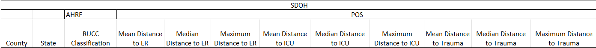

I chose to look at all three methods of measuring/classifying distance (mean, median, maximum) to ensure my analyses were robust. Means can easily be skewed by outliers so sometimes median is better at actually telling a more truthful story. I also thought maximum would be an interesting metric, especially surrounding the question of if distance needed to travel is increasing, it might be able to show us if acccess is decreasing in that county. 
By using three methods of measurements, I could appreciate if the results were in a different using a different method and thus there was information loss disguising a significant value. 

From the AHRF dataset, I used the Rural-Urban Continuum Codes (RUCC) from 2013. These codes are developed and collected by the USDA every decade. The codes for each county in the USA are on a scale from 1-9 with 1 being the most metro and 9 being the most rural. They codes are reanalyzed every 10 years following the census, so there are updated codes from 2023, but they changed the classification level (higher population required for each level) so I decided to continue using the 2013 codes when they would have been in effect for the data collected. The SDOH dataset has data from 2010-2020, but for the same reason, I only analyzed data from 2013-2020. While there are codes for Puerto Rico and some other territories, I only analyzed data from the 50 states and DC. 

The 2013 RUCC codes have the following classifications:

1-Metro: Areas of 1+ million population

2-Metro: Areas of 250,000 -1,000,000 population

3-Metro: Areas of fewer than 250,000 population

4-Urban: 20,000+ population, adjacent to a metro area

5-Urban: 20,000+ population, not adjacent to a metro area

6-Urban: 2,500-19,999, adjacent to a metro area

7-Urban: 2,500-19,999 population, not adjacent to a metro area

8-Rural: less than 2,500, adjacent to a metro area

9-Rural: less than 2,5000, not adjacent to a metro area [3]

 [4]

Ultimately, I thought this data and question was interesting following research I conducted to answer the final question in our problem set #2 about why one cannot/should not use technology to fix every problem. I found an article from the Government Accountability Office that said rural counties were seeing their healthcare centers close at a higher rate than metro counties, leading to rural populations who are already typically older and have more chronic disease to travel further for healthcare [5]. I wanted to see if we could see this same trend in the publically available datasets. 

All raw data is available either as an Excel upon request or in a paraquet version in GitHub.

**Explain how you acquired it (e.g. via an API, file download, etc).**
I acquired my data via a file download. On the SDOH website (https://www.ahrq.gov/sdoh/data-analytics/sdoh-data.html), they offer a direct file download of a xlsx file for every year at each level (county, zip, census tract), making it easy to access the whole dataset. Because it is so large, it does create a big datafile for use. I downloaded all the raw data as Excel files from 2013-2020 and then only called in the columns I was initially interested in to create a new, large dataframe in Python. Callling in the data even as the dataframe to my Flask was still extremely slow even as a pickled file, so I made the file a paraquet. I have it load one time at the top of my server so it is not continually having to reload every time an analysis is requested. 

# FAIR Data
**Discuss the FAIRness of the data provider.**
**FAIR is a journey not a destination, so when considering each aspect find something that it does well and something that could be done better**
**Include: Was the data well-annotated with metadata? Was the license clear?**
Overall I found the data to be very FAIR.

F -
SDOH is a well-known dataset and it is posted in a easy to acces format on the AHRQ SDOH website. I will say, that I'm not sure if it is a personal issue, but I sometimes have a hard  time finding the actual raw data. While it is easy to find AHRQ and their work on SDOH, when you Google AHRQ SDOH data, it brings you to their homepage with already built analyses and tools. I have come to just bookmarking the page because the raw data is not obvious on their website (but again that could be a personal issue).

A -
The data is very accessible as it is open to anyone wanting to research SDOHs or even just curious. It is also available as a simple Excel download, so no complex software is required making it a more accessible system for the general public. One downside is that they lack an API to query, which would be helpful for such a multi-year large dataset. 

I -
The dataset retains very good standard naming procedures: they start with the entity that orginally collected the data then a full variable name and that remains consistent across all levels (county, zip code, and census tract) and years leading it to be very ineroperable, especially for longitudinal analyses. It is only available in an Excel file, so it is not interopable with other computer systems to the degree it would be if it were also available as a CSV or JSON download.

R -
Again, the dataset uses very clean and clear variables that stay consistent throughout all years, thereby easing any repetition of analyses. There are no standards shared about data collection or methods, however. To find these, you would have to go back to the original source and inquiry with them and their information, which adds another level of research to any project.  

Metadata/License -
Each year has a very detailed code notebook that consists of which social determinant a variable is concerned with, who collected the data, the variable name, what it actually is about, and the years it was collected. This and the very clear nameing systems leads to very good metadata, but as stated they lack any of the information about how, who, where, or when the actual data was collected without going back to the orignial source. 
Because the data is from federal agencies it is free and available to use. There are stipulations if one is wanting to publish a large amount, but it is mostly about how to cite them. 


# Data Cleaning
**Describe any data cleaning or other preprocessing.**
**e.g. If some data was missing, how did you handle it?**
The datasets I chose within the SDOH were very comprehensive and required little cleaning or imputations.

After pulling in the wanted columns for each year from the raw excel file, I dropped any rows that were not from the 50 states or DC. I did this by creating a variable called "allowed states" and consistently called that variable for each year so only the rows where 'state' was one of the allowed states it was kept. I then had the data print all values in STATE and the length so I could visually ensure only all 50 states and DC were kept and thus the length would be 51. 

For each year, I printed any rows which were missing. Overall, the only rows with missing data were from Alaska. The Alaska Aleutians West county did not have values to a designated-trauma center or ICU for any years. I attempted to do outside research to determine if this county has any healthcare that was being overlooked, but I was not able to determine with any confidence what their healthcare availability is like. I validated that the data did not require the healthcare entitiy to be within the county borders using a county in Tennessee and a list of locations of designated trauma centers in Tennessee and it is not required [6]. Because of this I am not sure why the Alaskan Aleutians West county would not have metrics of distance, except this county is the little line of islands that make the arm of Alaska, so they are very remote. Because of this data collection or distance measuring could be an issue. The only other missing data was from other counties in Alaska that would randomly not have a value for distance to either a designated trauma center or an ICU (the specific counties, years, and variables that were missing can be seen in data_cleaning.ipynb). When this happened, I left the values blank and they would not be included in the analyses for that year. 

Because the RUCC codes are created once in 2013, they stay consistent throughout the dataset and would only appear missing if a county was created. Alaska did create two new counties - Chugach Census and Copper River - in 2019 from the Valdez-Crodova Census Area. Because of this the two new counties did not have RUCC classification but they did have distance to ER, designated trauma centers, and ICUs because there are 4 hospitals in Chugach county and 1 in Copper River. Because of the reclassification however, Valdez-Cordova did not have any information about ER, ICU, or trauma centers. Because the new counties were not classified and the ratings of classification changed in 2023, I chose to leave them blank as well and not include them in the analysis when they appear, which was only for 2020. 


You can see the little islands that comprise the Aleutians West county as well as the previous Valdez-Cordova county [7]. 

None of the data was standardized prior to analysis. The RUCC scores are categorical so they could not be standardized. Difference within the distance variables is what is telling the story - standardizing it would take away any insights we might be able to see. For the main analyses (regression and ANOVA), the variables were not being compared in way that expressing them in different units would have a meaningful impact on how they are interpretted. 

# Summary Statistics
**Discuss summary statistics and how they do or do not reflect the characteristics of the data. (e.g. are they skewed by outliers, is missing data a problem? are they misleading because of non-continuous variables? etc?)**

All summary statistics can be found in data_cleaning.ipynb

I first looked at the number of counties within each classification and the population residing within each classification. The metric for population was pulled from the SDOH database and was collected by the American Community Survey. I used the population from 2013 when the RUCC classifications were created. This helped conceptualize how many people would be affected by the healthcare metrics of that classification and also how many people would indirectly be contributing to the datapoints. We can see from the table below that overall there are 3,141 counties in the 50 United States (fun fact the most common county name is Washington County). We can see that the most common county classifications are 1 (Metro - 1+ million population), 7 (Urban - 2,500-19,999 population, not adjacent to a metro area), and 9 (Rural - less than 2,5000, not adjacent to a metro area) each with about 430 counties classified as each. The rarest classification is 5 (Urban - 20,000+ not adjacent to metro area) with only 92 counties. The largest amount of people live in classification 1, meaning the availability of healthcare within this county classification will affect the largest amount of people. 

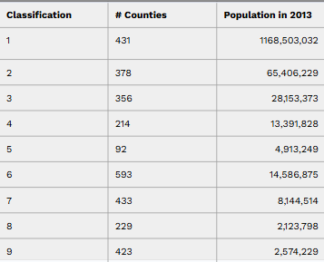

To analyze if there were any outliers I made interactive box and whisker plots with Plotly of each variable considered for each county classification for every year. The hover ability allowed me to ensure there were no random outliers that would have made me question the data integrity or if there was a potential data input error because if a value was very oddly high for only one year, this would be odd to me. The majority of the outliers were from Alaska. Because Alaska is so rural, they had some of the largest distances to travel to healthcare, especially in the rural counties. I did not change or drop these outliers because it is the story for Alaska - that they have to travel that far to healthcare - so I think they are beneficial to leave. This is what inspired me to add the stratification based on region, because if one wanted an analysis with potentially less outliers, they could focus on the South, Midwest, or Northeast regions only. 

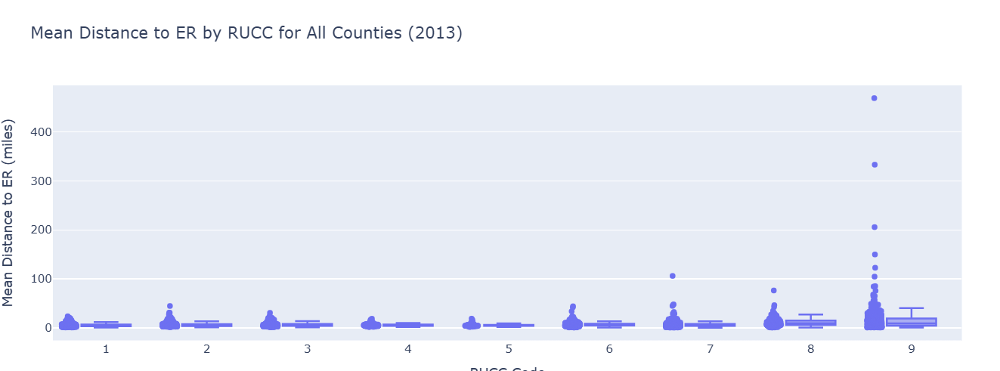
Here is an example of one of the box and whisker plots caputuring the classifications within one year for mean distance to ER. All the high outlying points are Alaska. 

I also analyzed the equivilent of the box and whisker plots in full number format by doing .describe() on each variable while they were stratified by classification. 
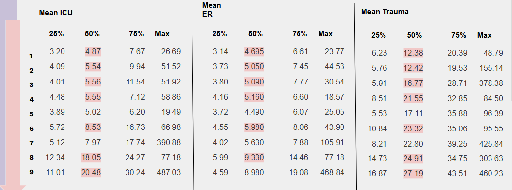

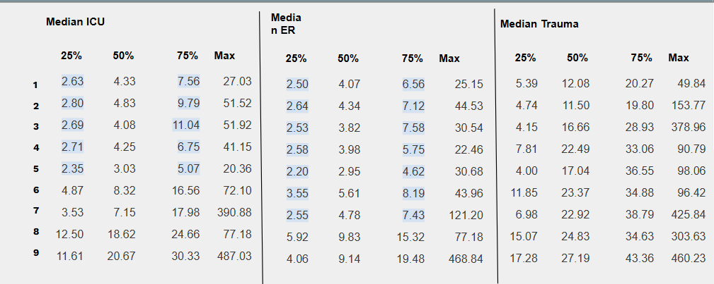

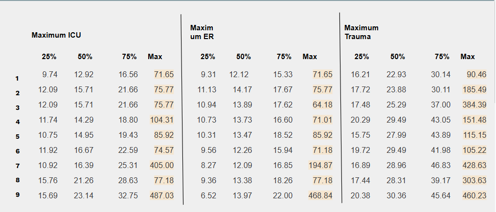

Looking at the mean of each classification, we see that the average distance to each healthcare entity increases as you move from the metro to the more rural classification, as is expected. 

In this view, I was also able to appreciate the real world significance of the values. For example, looking at median distances, the differences between the 25th and 75th quartile are actually very small for distance to ER and ICU specifically, which is great for healthcare availability. With median distance, we can also see that the distance to ER for RUCC classifications for counties 1-7 are similar and the difference between the 75th quartile of classification 1 and classification 7 is less than 1 mile. Again, while these are different they are not quite as meaningful as I expected to see, nor are the values themselves as large as I expected. 

We do still see maximum numbers that get quite high and would be a meaningful distance to cross in case of emergency, however, so we cannot discount that these exist as well. We can especially appreciate these in the maximum distances to healthcare. Looking at the maximum values, we start to see well large numbers that would create a barrier to people accessing healthcare especially in emergency. 

Across the measurement methods, we see similar numbers for the ICU and ER and usually increased values for trauma, meaning ER and ICUs are generally more available for access than trauma centers. 

# Analysis 
**Discuss the analyses you chose to run. Why these questions? What were the results? Any surprises?**

Due to the categorical nature of RUCC categories, I chose to run a two-way ANOVA that analyzed the difference in years, difference in classifications, and ultimately, the interaction between both that would answer the intital research question of if rural hospitals are having a drastic increase in distance needed to travel to access healthcare compared to metro counties.

The first aspect of the ANOVA looks at the main effect of year, so if there is a statistically significant difference in distance needed to travel to reach healthcare between years. It is worth nothing that doing an ANOVA causes the years to be treated as categorical rather than continuous. Ultimately, for many of the analyses, year was not significant, meaning there was not a difference of distance throughout the years. There were some analyses that returned significant specifically for the trauma variables in which the distance to trauma centers actually decreased, meaning the trauma centers were closer and easier to access. This was suprising to me as it is totally contrary to the hypothesis. I am curious if this is due to more trauma centers being built or expanded or if there is some background reason relating to the trauma center designation that is causing existing centers to be upgraded to trauma centers.

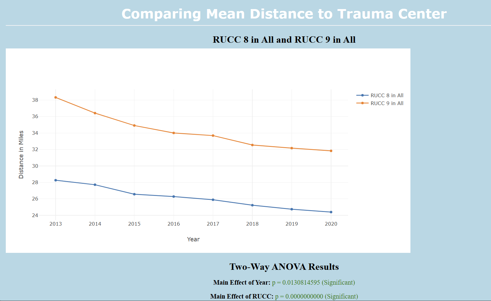

The second aspect of the ANOVA looks at the main effect of the RUCC classification, so if there is a significant difference in distance needed to travel to reach healthcare between the RUCC classifications. For this analysis, there was found to be a significant difference between the RUCC counties distance majority of the time. There were 36 interactions that were not significant, mostly within the maximum measurements. One interesting aspect of this interaction being significant (that I was able to determine thanks to the interactability of Plotly graphs) is that a lot of the times they were deemed significant, the number would not actually be that different from each other. For example, the difference of 2 miles between classification 3 and 6 of the maximum distance to a trauma center is considered significant. The method of measurment also did not have any meaningful influence on what was deemed significant or not.

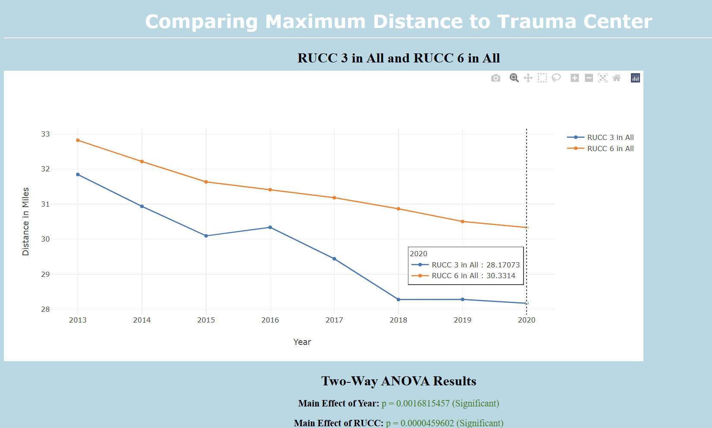

The last analysis was a two-way ANOVA of the interaction between year and RUCC codes and if that created a significant difference in the distance. Overall, all the results were not significiant and they were very rarely ever even approaching significance. This means that it is very unlikely that rural counties are seeing a recent increase in the distance needed to travel to reach an ER, ICU, or trauma center no matter the measurement method used compared to metro counties. Ultimately, this did not support our hypothesis.

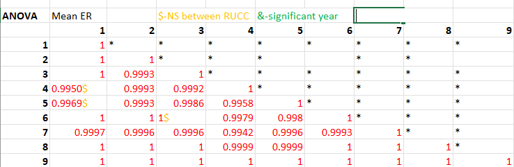

Here is an example of the results of all interactions between classifcations and year for mean distance to ER. The same recording process was repeated for al 9 variables.

One of my commenters asked if I had considered using a linear regression. This would cause the years to be treated as continuous rather than categorical. Following this recommendation, I added a linear regression to run alongside the ANOVA. An interesting future work would be to consider if this model provides any additional insights into the relationship and if the results differ from the ANOVA when treating year continuously instead. From the few analyses I ran, I did not see any significant values but I was not able to consider each interaction the way I did for the ANOVA. I do like the added benefit of having both analyses not only because it would allow an in-depth exploration into how handling a variable in different ways could affect a result (it would be a great connection to our Clinical Informatics subjects like information loss and data semantics) but it also allows for an anlaysis beyond just is there a difference and into the magnitude of the difference and how it may trend. 

**How did you validate your analyses?**

All validations are available in an Excel that can be made available upon request. 

To validate the county breakdown and API, I quiered the original dataset for a state to ensure the webpage was displaying the same county classification. I also cross checked the dataset RUCC values to other published examples of the 2013 RUCC codes.  

To validate the ANOVA and regression I used the Excel data analysis toolpack. Because Alaska had the missing data due to the addition of the two counties, Excel did not like that there were blank or N/A cells, so I had to run the analysis without Alaska. For this reason it is not a very robust validation and I do think the data analysis through Excel offers lots of potential for human error or misunderstanding, but, nevertheless, the p and beta values were very similar and more importantly remained insignificant. 

I also validated that the data was being pulled and graphed correctly by manually aggregating the means and graphing it in Excel. The output was exact same as the graphs generated from my data. 

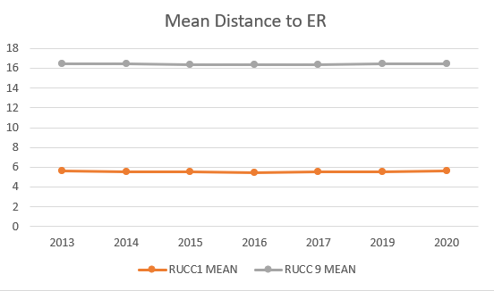

# Web Front and API
**Describe your server API and the web front-end.**
The landing page of my web page begins with a map of the country and the RUCC classification of each county developed by UNC. It states the title of the project and lets the user know only the 50 states and DC are available for analysis. It also serves as an introduction that the Rural-Urban Continuum Codes are abbreviated as RUCC and that the webpage uses the 2013 classifications, all of which are helpful for the user's understanding as they continue using the webpage. 
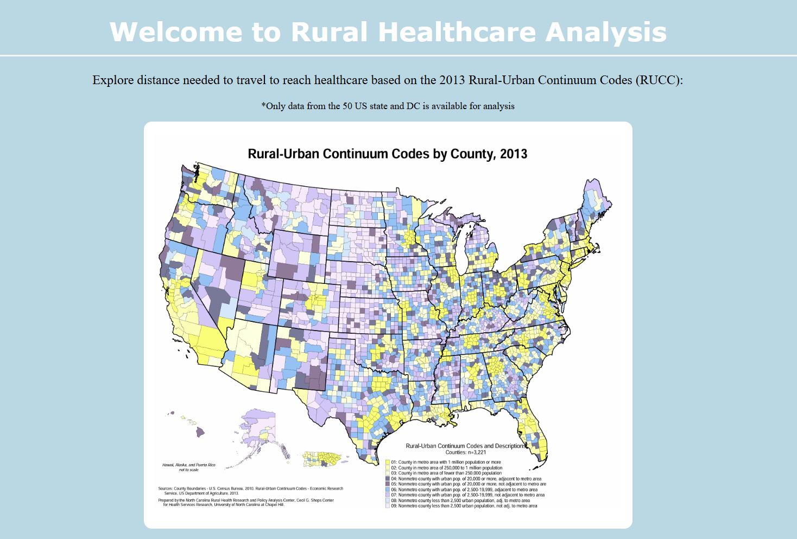

The user can then select from three options: breakdown of RUCC by state, distance to healthcare by RUCC, and about the dataset.
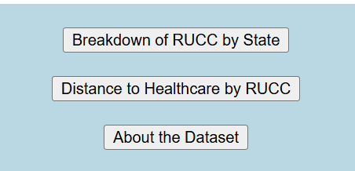

The 'breakdown of RUCC by state' option allows the user to input any selected state to learn how that state's counties are classified. The states are listed as a dropdown menu, thus eliminating any error that could occur from misspellings, use of abbreviations, etc. It also allows the user to peruse their options and choose whatever they like that is available. After a state is selected, it displays a numerical breakdown of how many counties are present in the state for each classification, a photo of the state, and it's counties colored according to their classification and a legend that tells each classification's color and metrics. The html also includes a maximum width and height so that each photo can conform to the best ratio for the state's size. 

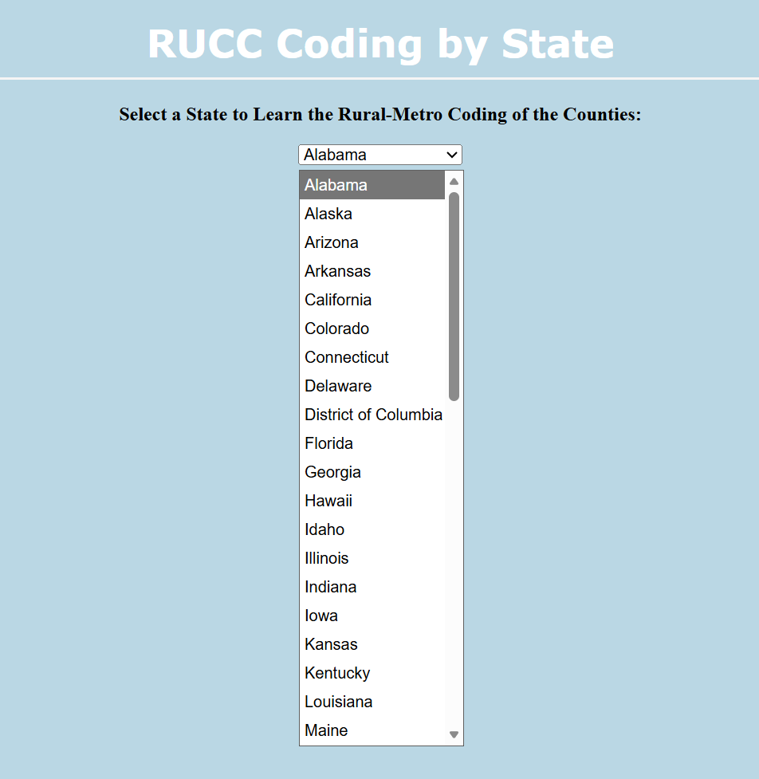
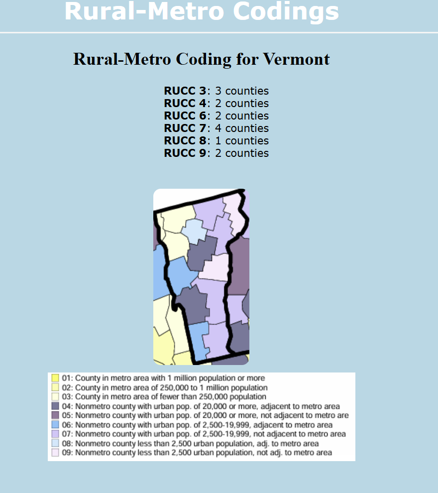

This analyze page also pulls from the website's API. The API queries the original dataset for whatever state the user selected and returns the county classification breakdown. The user could also directly query the API by inputting whatever state they would like analyzed after the = paramenter in the url. 

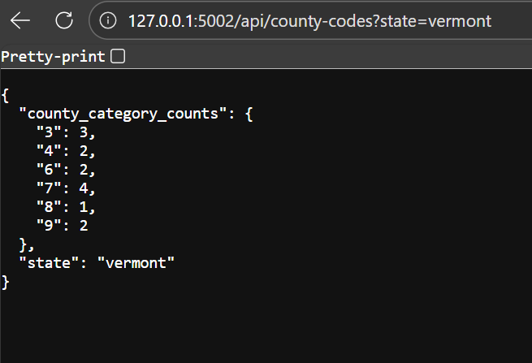

The About the Dataset page gives a brief overview of the SDOH dataset and the variables used. 

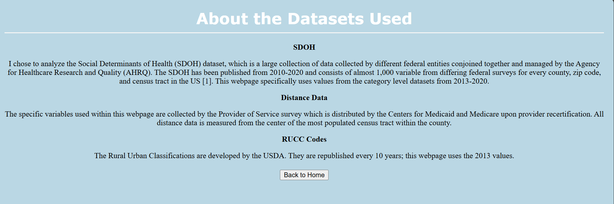

'Distance to Healthcare by RUCC' is where the heart of the analysis lives. Here the user can choose from one of the 9 variables they wish to analyze, and which two RUCCs they would like to compare. They can also stratify by region if they would like to compare classifications between region, look within one region, or compare a region to the country metrics. I added which states are classified within each region for better understanding for the user. If they would like to look at the whole country not stratified by region, they can leave 'all' selected. 

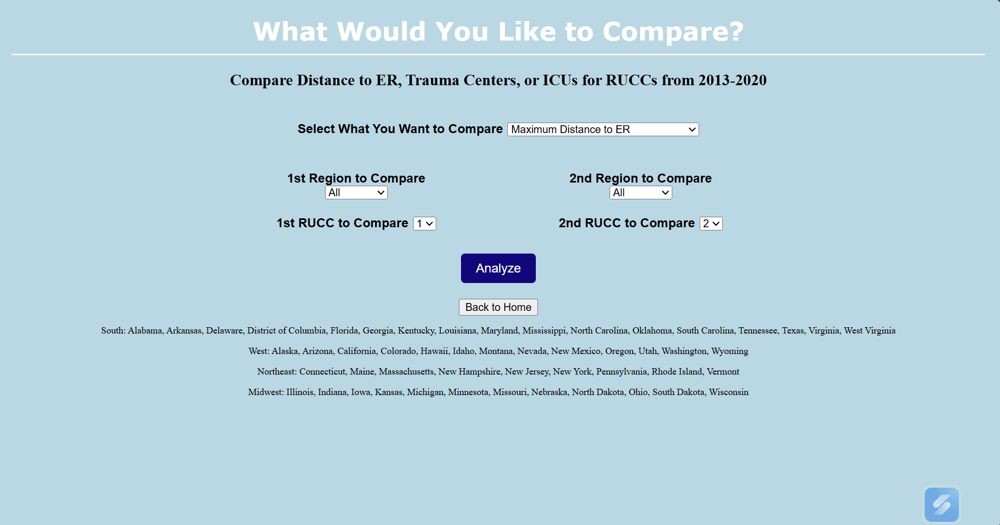

Here is a view with all the options of variables. I considered being able to analyze multiple RUCC between each other rather than just two, but I didn't know how to do this without making the user face appear clunky. 

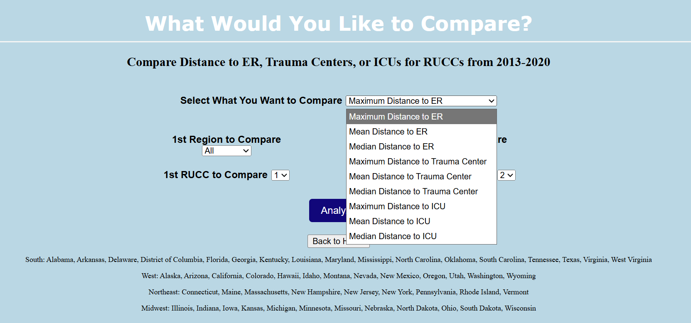

Once the user has chosen a variable, two RUCCs, and regions if they wish, they click the analyze button and a graph generates along with the ANOVA and linear regression anaysis. The graph generates as a Plotly graph so it can be interactive to users. All 9 variables and all 9 RUCC classifications are able to be graphed. The headers are also smart so they fill in as whatever variable and RUCC classification the user has chosen. The graph shows as a line graph of the means of distance wanted for each RUCC wanted for every year from 2013-2020. This allows the user to visually appreciate if there were any changes in distance needed to travel for each classification and the difference between the two classifications. The axes are dynamic to allow the best setting to display the graphs adequately, but this is something the user should take caution in if quickly comparing differnent graphs that they might be on different axes. 

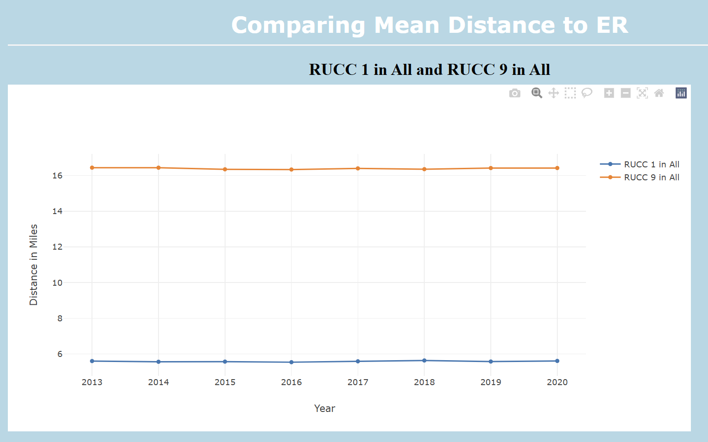

It then displays the results of the ANOVA and linear analyses. Any insignificant analyses are shown in red and any significant analyses are shown in green. 

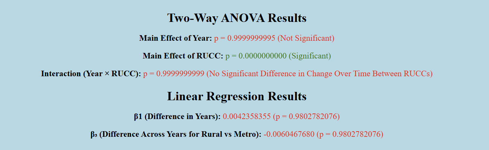


**Recommendations from video**
I recieved three comments on my video.

The first asked if I considered looking at total number of ERs and other healthcare services, and I did. This was the initial metric I wanted to use for my analysis but after looking at the data, I felt it was misleading. The more metro counties have more healthcare because they have more people and the rural counties have less, especially 5 because it is the most "rare" county classification and therefore are serving less people. It would be interesting to look at amount of people served if that is an available metric. The dataset also offers rates, so number of hospitals and ICU per 1,000 population, but I found this analysis to be misleading as well. I think this is an example of when per capita rates aree not opitmal because the rural counties appear to have a lot more healthcare options than the metro ones. For exmample, a metro classification with 2,000,000 citizens would have to have 2,000 hospitals to have the same rate as a 9 classification with 2,000 citizens and 2 hospitals[5].
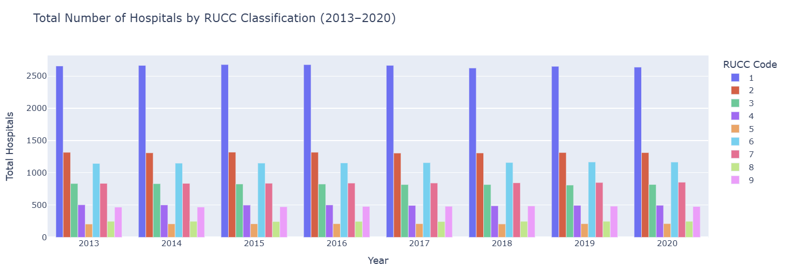
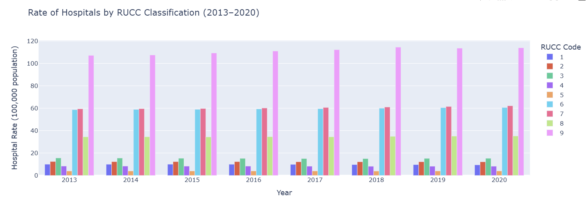

I also received a comment asking if I considered using 10 decimals for the p values as opposed ot 5. I did increase this following the comment but I'm not sure much significance was gained. I also think any more decimals would be hard to visually appreciate and become overwhelming for the viewer, so I am honestly not sure if it is a change I will retain, but I appreciate the thought given. 

The last comment I received was concerning the idea to include a linear regression as well. I originally used an ANOVA due to the categorical nature of the RUCC codes. I retained all aspects of my ANOVA but added a linear regression display of the year interaction, showing the beta correlation if year was handled continuously rather than categorically. Then the beta correlation of the full interaction between RUCC codes, year and the distance.

# Discussion
**Mention any surprising results or unexpected difficulties.**

I was surpised at the decrease in distance to reach a trauma center which was in direct opposition to what I thought we were going to find in the data. Ultimately, this is a good thing and means more people are within a reasonable distance is they need help. I was also surprised in the details gleamed from looking at the raw numbers of the data. Many of the classifications had 75% of their population living within 40 miles to multiple types of healthcare, which in dire situations is incredible. This is not the reality I thought most people were living in, but it cannot be forgotten that this data is the average man's story, so I'm not fully convinced yet that everyone lives that close to healthcare that they can access in case of emergency. 

I faced some difficulties with the amount of analyses I set out to do. Ultimately, I had 9 variables in which I attempting to compare 9 classifications in every combination against one another throughout the whole country. Because of the magnitude of this, I don't think I was able to appreciate the metrics of the difference in measurement methods or in the differing type of healthcare. As a result, I feel like I had to go very shallow in my analysis rather than deep into a couple of variables. While the mean, median, and maximum distances measure different things and tell different stories, my analysis suggests that the underlying story is the same - that the distance did not change significantly throughout the years, but were different in between the RUCC codes, but ultimately one was not having a more dramatic decrease in healthcare access than another. So, I think in any future endeavors, one could pick one measurment method and feel confident in their ability to find a significant finding if it is present. It would also be interesting to hone in on one region or state because that would allow you to really appreciate what is an outlier and what would be confounding variables to consider. 

## Sources 
[1]Social Determinants of Health Database. Content last reviewed June 2023. Agency for Healthcare Research and Quality, Rockville, MD.
https://www.ahrq.gov/sdoh/data-analytics/sdoh-data.html

[2] https://data.cms.gov/provider-characteristics/hospitals-and-other-facilities/provider-of-services-file-quality-improvement-and-evaluation-system

[3] https://data.cms.gov/provider-characteristics/hospitals-and-other-facilities/provider-of-services-file-quality-improvement-and-evaluation-system

[4]https://www.shepscenter.unc.edu/wp-content/uploads/2015/12/ruralurbancodes2013c.pdf 

[5] https://www.gao.gov/blog/why-health-care-harder-access-rural-america

[6] (https://www.tn.gov/hfc/division-of-licensure-and-regulation/trauma.html)

[7] https://unitedstatesmaps.org/alaska-county-map/

[8] Silva, W. T. A. F. (2020). Per capita death and infection rates should be avoided in international comparisons. Public Health, 186, 18

## Code Appendix
server.py
```python
# pip install pyarrow

import pandas as pd
from flask import *
from collections import Counter
import plotly 
from plotly import *
import matplotlib.pyplot as plt
from matplotlib import *
import requests
import statsmodels.api as sm
import statsmodels.formula.api as smf


app = Flask(__name__)

#call in raw data once
full_data = pd.read_parquet(r"C:\Users\carol\compmethods-cg2288\final_project\clean_data.parquet")

#bring in images
@app.route('/images/<path:filename>')
def images(filename):
    return send_from_directory('images', filename)

# helper function pulling state and county counts
def state_county_counts(state_name):
    r = (requests.get(f"http://127.0.0.1:5002/api/county-codes?state={state_name}", headers={"User-Agent": "MyScript"}))
    return r.json()

# helper function for linear regression
def run_linear_regression(df1, df2, category):
    df1 = df1.copy()
    df2 = df2.copy()
    df1["RUCC_GROUP"] = 0
    df2["RUCC_GROUP"] = 1

    df = pd.concat([df1, df2], ignore_index=True)

    # YEAR as continuous for slope comparison
    df["YEAR"] = df["YEAR"].astype(int)
    df["RUCC_GROUP"] = df["RUCC_GROUP"].astype("category")

    formula = f"{category} ~ YEAR * RUCC_GROUP"
    reg_model = smf.ols(formula, data=df).fit()

    return reg_model

# helper function for anova
def run_two_way_anova(df1, df2, category):
    # Add RUCC labels so the model knows which group each row is in
    df1 = df1.copy()
    df2 = df2.copy()
    df1["RUCC_GROUP"] = "Group1"
    df2["RUCC_GROUP"] = "Group2"

    # Combine into one dataframe
    df = pd.concat([df1, df2], ignore_index=True)

    # Convert categorical variables
    df["YEAR"] = df["YEAR"].astype(int).astype("category")
    df["RUCC_GROUP"] = df["RUCC_GROUP"].astype("category")

    # Build the two-way ANOVA model with interaction
    formula = f"{category} ~ YEAR * RUCC_GROUP"
    model = smf.ols(formula, data=df).fit()
    anova_table = sm.stats.anova_lm(model, typ=2)  # Type II ANOVA

    return model, anova_table

# landing page
@app.route("/home")
def home():
    return render_template("home_gheen.html")

# redirect to home
@app.route('/')
def root():
    return redirect("/home")

# index page
@app.route("/index")
def index():
    return render_template("index_gheen.html")

# analyze page and add images
@app.route("/analyze", methods=["POST"])
def analyze():
    usertext = request.form["usertext"]
    counts = state_county_counts(usertext)
    analyze_text = ""
    show_image = usertext != "District of Columbia"
    state_image = usertext.lower().replace(" ", "_") + ".png" if show_image else None
    legend = "legend.png" if show_image else None
    return render_template("analyze_gheen.html", analysis=analyze_text, usertext=usertext, state_image=state_image, counts=counts, legend=legend, show_image=show_image)

# about the dataset page
@app.route("/dataset", methods=["GET", "POST"])
def dataset():
    return render_template("dataset_gheen.html")

#input what to compare
@app.route("/compare", methods=["GET", "POST"])
def graphs():
    print(request.form)
    category = request.form.get("category")
    rucc1 = request.form.get("rucc1")
    rucc2 = request.form.get("rucc2")
    region1 = request.form.get("region1")
    region2 = request.form.get("region2")

    human_readable = {"POS_MAX_DIST_ED": "Maximum Distance to ER", 
        "POS_MEAN_DIST_ED": "Mean Distance to ER",
        "POS_MEDIAN_DIST_ED": "Median Distance to ER",
        "POS_MAX_DIST_TRAUMA": "Maximum Distance to Trauma Center",
        "POS_MEAN_DIST_TRAUMA": "Mean Distance to Trauma Center",
        "POS_MEDIAN_DIST_TRAUMA": "Median Distance to Trauma Center",
        "POS_MAX_DIST_MEDSURG_ICU": "Maximum Distance to ICU",
        "POS_MEAN_DIST_MEDSURG_ICU": "Mean Distance to ICU",
        "POS_MEDIAN_DIST_MEDSURG_ICU": "Median Distance to ICU",
        "POS_ASC_RATE":"Total Number of Ambulatory Surgery Centers"}

    category = request.form.get("category") or request.args.get("category")

    category_readable = human_readable.get(category, "Unknown Category") # convert to human-readable
    return render_template("deeper_analysis_gheen.html", category_readable=category_readable, category=category, rucc1=rucc1, rucc2=rucc2, region1=region1, region2=region2)

#show graphs 
@app.route("/graphs", methods=["POST"])
def deep_analyze():
    category = request.form["category"]
    rucc1 = int(request.form["rucc1"])
    rucc2 = int(request.form["rucc2"])
    region1 = request.form.get("region1")
    region2 = request.form.get("region2")

    df1 = full_data[full_data['AHRF_USDA_RUCC_2013'] == rucc1]
    df2 = full_data[full_data['AHRF_USDA_RUCC_2013'] == rucc2]

    model, anova_table = run_two_way_anova(df1, df2, category)
    
    # Extract p-values
    p_year = anova_table.loc["YEAR", "PR(>F)"]
    p_rucc = anova_table.loc["RUCC_GROUP", "PR(>F)"]
    p_interaction = anova_table.loc["YEAR:RUCC_GROUP", "PR(>F)"]

    # add linear regression
    reg_model = run_linear_regression(df1, df2, category)
    reg_summary = reg_model.summary().as_html()

    # Extract beta coefficients and pvalues for linear regression
    beta_0 = reg_model.params["Intercept"]
    beta_1 = reg_model.params["YEAR"]
    beta_2 = reg_model.params["RUCC_GROUP[T.1]"]
    beta_3 = reg_model.params["YEAR:RUCC_GROUP[T.1]"] # compares back to reference group

    p_0 = reg_model.pvalues["Intercept"]
    p_1 = reg_model.pvalues["YEAR"]
    p_2 = reg_model.pvalues["RUCC_GROUP[T.1]"]
    p_3 = reg_model.pvalues["YEAR:RUCC_GROUP[T.1]"]

    
    # Interpret the interaction (Difference-in-Differences)
    if p_interaction < 0.05:
        did_interpretation = "The change over time is significantly different between the two RUCC groups."
    else:
        did_interpretation = "No significant difference in change over time between the two RUCC groups."

    # -------- RUCC 1 ----------
    if region1 == "All":
        df1_group = df1.groupby('YEAR')[category].mean().reset_index()
    else:
        df1_group = df1[df1["REGION"] == region1].groupby('YEAR')[category].mean().reset_index()

    # -------- RUCC 2 ----------
    if region2 == "All":
        df2_group = df2.groupby('YEAR')[category].mean().reset_index()
    else:
        df2_group = df2[df2["REGION"] == region2].groupby('YEAR')[category].mean().reset_index()


    # Plotly-ready data
    plot_data = [
        {
            "x": df1_group["YEAR"].tolist(),
            "y": df1_group[category].tolist(),
            "mode": "lines+markers",
            "name": f"RUCC {rucc1} in {region1}",
        },
        {
            "x": df2_group["YEAR"].tolist(),
            "y": df2_group[category].tolist(),
            "mode": "lines+markers",
            "name": f"RUCC {rucc2} in {region2}",
        },
    ]

    layout = {
        "xaxis": {"title": "Year"},
        "yaxis": {"title": "Distance in Miles"},
        "hovermode": "x unified",
    }

    human_readable = {"POS_MAX_DIST_ED": "Maximum Distance to ER", 
        "POS_MEAN_DIST_ED": "Mean Distance to ER",
        "POS_MEDIAN_DIST_ED": "Median Distance to ER",
        "POS_MAX_DIST_TRAUMA": "Maximum Distance to Trauma Center",
        "POS_MEAN_DIST_TRAUMA": "Mean Distance to Trauma Center",
        "POS_MEDIAN_DIST_TRAUMA": "Median Distance to Trauma Center",
        "POS_MAX_DIST_MEDSURG_ICU": "Maximum Distance to ICU",
        "POS_MEAN_DIST_MEDSURG_ICU": "Mean Distance to ICU",
        "POS_MEDIAN_DIST_MEDSURG_ICU": "Median Distance to ICU",
        "POS_ASC_RATE":"Total Number of Ambulatory Surgery Centers"}

    category_readable = human_readable.get(category, category)

    return render_template(
    'compare_graphs_gheen.html',
    plot_data=plot_data,
    plot_layout=layout,
    category=category,
    rucc1=rucc1,
    rucc2=rucc2,
    graph=graphs,
    category_readable=category_readable,
    region1=region1,
    region2=region2,
    anova_table=anova_table.to_html(classes="table table-striped"),
    p_year=p_year,
    p_rucc=p_rucc,
    p_interaction=p_interaction,
    beta_0=beta_0, beta_1=beta_1,
    beta_2=beta_2, beta_3=beta_3,
    p_0=p_0, p_1=p_1, p_2=p_2, p_3=p_3
)


#API call for RUCC breakdown
@app.route("/api/county-codes", methods=["GET"])
def api_county_codes():
    state = request.args.get("state")
    if not state:
        return jsonify({'error':'Missing ?state= parameter'}), 400
    state_data = full_data[full_data['STATE'].str.lower() == state.lower()]
    state_data = state_data[state_data['YEAR'] == 2013]
    state_data = state_data.fillna(0)
    county_category_counts = state_data['AHRF_USDA_RUCC_2013'].astype(int).value_counts().sort_index().to_dict()
    return jsonify({
        'state': state,
        'county_category_counts': county_category_counts
    })


if __name__ == "__main__":
    app.run(debug=True, port=5002)

```
home.html
```python
<html>
<head>
    <link rel="stylesheet" href="{{ url_for('static', filename='style.css') }}">
</head>
<body>

<h1>Welcome to Rural Healthcare Analysis</h1>
<p>Explore distance needed to travel to reach healthcare based on the 2013 Rural-Urban Continuum Codes (RUCC):</p>
<p class="note">*Only data from the 50  US state and DC is available for analysis</p>


<div style="text-align: center; margin-top: 20px;">
    <a href="/index">
        <button>Breakdown of RUCC by State</button>
    </a>
</div>

<div style="text-align: center; margin-top: 20px;">
    <a href="/compare">
        <button>Distance to Healthcare by RUCC</button>
    </a>
</div>

<div style="text-align: center; margin-top: 20px;">
    <a href="/dataset">
        <button>About the Dataset</button>
    </a>
</div>


</body>
</html>
```
dataset_gheen.html
```python
<html>
<head>
    <link rel="stylesheet" href="{{ url_for('static', filename='style.css') }}">
</head>
<body>

<h1>About the Datasets Used</h1>


<p><strong>SDOH</strong></p>
<p> I chose to analyze the Social Determinants of Health (SDOH) dataset, 
    which is a large collection of data collected by different federal entities conjoined together and managed by the 
    Agency for Healthcare Research and Quality (AHRQ). The SDOH has been published from 2010-2020 and consists of almost 
    1,000 variable from differing federal surveys for every county, zip code, and census tract in the US [1]. 
    This webpage specifically uses values from the category level datasets from 2013-2020. </p>
<p><strong>Distance Data</strong></p>
    <p>The specific variables used within this webpage are collected by the Provider of Service survey which is distributed by the Centers for Medicaid and Medicare upon provider recertification.
    All distance data is measured from the center of the most populated census tract within the county.</p>
<p><strong>RUCC Codes</strong></p>
    <p>The Rural Urban Classifications are developed by the USDA. They are republished every 10 years; this webpage uses the 2013 values.
    </p>


<div style="text-align: center; margin-top: 20px;">
    <a href="/home">
        <button>Back to Home</button>
    </a>
</div>


</body>
</html>
```
deeper_analysis_gheen.html
```python
<html>
<head>
    <link rel="stylesheet" href="{{ url_for('static', filename='style.css') }}">
</head>
<body>


<h1>What Would You Like to Compare?</h1>
<p class="subheader"><strong>Compare Distance to ER, Trauma Centers, or ICUs for RUCCs from 2013-2020</strong></p>


<form action="/graphs" method="POST">
    <div class="category-center">
        <label><strong>Select What You Want to Compare</strong></label>
        <select name="category" id="category">
            <option value="POS_MAX_DIST_ED"selected>Maximum Distance to ER</option>
            <option value="POS_MEAN_DIST_ED">Mean Distance to ER</option>
            <option value="POS_MEDIAN_DIST_ED">Median Distance to ER</option>
            <option value="POS_MAX_DIST_TRAUMA">Maximum Distance to Trauma Center</option>
            <option value="POS_MEAN_DIST_TRAUMA">Mean Distance to Trauma Center</option>
            <option value="POS_MEDIAN_DIST_TRAUMA">Median Distance to Trauma Center</option>
            <option value="POS_MAX_DIST_MEDSURG_ICU">Maximum Distance to ICU</option>
            <option value="POS_MEAN_DIST_MEDSURG_ICU">Mean Distance to ICU</option>
            <option value="POS_MEDIAN_DIST_MEDSURG_ICU">Median Distance to ICU</option>
        </select>
    </div>
    <br><br>

    <div class="two-column">
        <div>
            <label><strong>1st Region to Compare</strong></label>
            <select name="region1">
                <option value="South">South</option>
                <option value="Midwest">Midwest</option>
                <option value="Northeast">Northeast</option>
                <option value="West">West</option>
                <option value="All" selected>All</option>
            </select>
            <br><br>

            <label><strong>1st RUCC to Compare</strong></label>
            <select name="rucc1">
                <option value="1">1</option>
                <option value="2">2</option>
                <option value="3">3</option>
                <option value="4">4</option>
                <option value="5">5</option>
                <option value="6">6</option>
                <option value="7">7</option>
                <option value="8">8</option>
                <option value="9">9</option>
            </select>
        </div>

        <div>
            <label><strong>2nd Region to Compare</strong></label>
            <select name="region2">
                <option value="South">South</option>
                <option value="Midwest">Midwest</option>
                <option value="Northeast">Northeast</option>
                <option value="West">West</option>
                <option value="All" selected>All</option>
            </select>
            <br><br>

            <label><strong>2nd RUCC to Compare</strong></label>
            <select name="rucc2">
                <option value="1">1</option>
                <option value="2"selected>2</option>
                <option value="3">3</option>
                <option value="4">4</option>
                <option value="5">5</option>
                <option value="6">6</option>
                <option value="7"\>7</option>
                <option value="8">8</option>
                <option value="9">9</option>
            </select>
        </div>

    </div>
    <br>

    
    <input type="submit" value="Analyze">
</form>

</body>
</html>


<div style="text-align: center; margin-top: 20px;">
    <a href="/home">
        <button>Back to Home</button>
    </a>
</div>


<p class=note> South: Alabama, Arkansas, Delaware, District of Columbia, Florida, Georgia, Kentucky,
 Louisiana, Maryland, Mississippi, North Carolina, Oklahoma, 
 South Carolina,  Tennessee, Texas, Virginia, West Virginia</p>


<p class=note>West: Alaska, Arizona, California, Colorado, Hawaii, Idaho, Montana, 
 Nevada, New Mexico, Oregon, Utah, Washington, Wyoming</p>
 
<p class=note>Northeast: Connecticut, Maine, Massachusetts, New Hampshire, New Jersey, 
  New York, Pennsylvania, Rhode Island, Vermont</p>


<p class=note>Midwest: Illinois, Indiana, Iowa, Kansas, Michigan, Minnesota, Missouri,
 Nebraska, North Dakota, Ohio, South Dakota, Wisconsin </p>


</body>
</html>
```
compare_graphs_gheen.html
```python
<html>
<head>
    <link rel="stylesheet" href="{{ url_for('static', filename='style.css') }}">
    <script src="https://cdn.plot.ly/plotly-latest.min.js"></script>
</head>
<body>

<h1>Comparing {{category_readable}}</h1>

<h2> RUCC {{rucc1}} in {{region1}} and RUCC {{rucc2}} in {{region2}}</h2>

<div id="comparison_plot" style="width: 80%; height: 500px;"></div>

<script>
    var data = {{ plot_data | tojson }};
    var layout = {{ plot_layout | tojson }};

    Plotly.newPlot('comparison_plot', data, layout);
</script>
</p>

<h2>Two-Way ANOVA Results</h2>

<p>
    <strong>Main Effect of Year:</strong>
    <span style="color: {{ 'green' if p_year < 0.05 else 'red' }}">
        p = {{ "%.10f"|format(p_year) }}
        
            (Significant)
        
            (Not Significant)
        
    </span>
</p>

<p>
    <strong>Main Effect of RUCC:</strong>
    <span style="color: {{ 'green' if p_rucc < 0.05 else 'red' }}">
        p = {{ "%.10f"|format(p_rucc) }}
        
            (Significant)
        
            (Not Significant)
        
    </span>
</p>

<p>
    <strong>Interaction (Year × RUCC):</strong>
    <span style="color: {{ 'green' if p_interaction < 0.05 else 'red' }}">
        p = {{ "%.10f"|format(p_interaction) }}
        
            (Significant Difference in Change Over Time Between RUCCs)
        
            (No Significant Difference in Change Over Time Between RUCCs)
        
    </span>
</p>

<h2>Linear Regression Results</h2>

<p>
<strong>β1 (Difference in Years):</strong>
<span style="color: {{ 'green' if p_3 < 0.05 else 'red' }}">
    {{ "%.10f"|format(beta_1) }} (p = {{ "%.10f"|format(p_3) }})
</span>
</p>


<p>
<strong>β₃ (Difference Across Years for Rural vs Metro):</strong>
<span style="color: {{ 'green' if p_3 < 0.05 else 'red' }}">
    {{ "%.10f"|format(beta_3) }} (p = {{ "%.10f"|format(p_3) }})
</span>
</p>

<br>
<a href="/compare" class="back-button">Go Back</a>
<br>

<br>
<a href="/home">
    <button>Back to Home</button>
</a>
<br>

</body>
</html>
```
index_gheen.html
```python
<html>
<head>
    <link rel="stylesheet" href="{{url_for('static', filename='style.css')}}">
</head>
<body>

<h1>RUCC Coding by State</h1>
<p><strong>Select a State to Learn the Rural-Metro Coding of the Counties:</strong></p>

<form action="/analyze" method="POST">
    <select name="usertext">
        <option value="Alabama">Alabama</option>
        <option value="Alaska">Alaska</option>
        <option value="Arizona">Arizona</option>
        <option value="Arkansas">Arkansas</option>
        <option value="California">California</option>
        <option value="Colorado">Colorado</option>
        <option value="Connecticut">Connecticut</option>
        <option value="Delaware">Delaware</option>
        <option value="District of Columbia">District of Columbia</option>
        <option value="Florida">Florida</option>
        <option value="Georgia">Georgia</option>
        <option value="Hawaii">Hawaii</option>
        <option value="Idaho">Idaho</option>
        <option value="Illinois">Illinois</option>
        <option value="Indiana">Indiana</option>
        <option value="Iowa">Iowa</option>
        <option value="Kansas">Kansas</option>
        <option value="Kentucky">Kentucky</option>
        <option value="Louisiana">Louisiana</option>
        <option value="Maine">Maine</option>
        <option value="Maryland">Maryland</option>
        <option value="Massachusetts">Massachusetts</option>
        <option value="Michigan">Michigan</option>
        <option value="Minnesota">Minnesota</option>
        <option value="Mississippi">Mississippi</option>
        <option value="Missouri">Missouri</option>
        <option value="Montana">Montana</option>
        <option value="Nebraska">Nebraska</option>
        <option value="Nevada">Nevada</option>
        <option value="New Hampshire">New Hampshire</option>
        <option value="New Jersey">New Jersey</option>
        <option value="New mMxico">New Mexico</option>
        <option value="New York">New York</option>
        <option value="North Carolina">North Carolina</option>
        <option value="North Dakota">North Dakota</option>
        <option value="Ohio">Ohio</option>
        <option value="Oklahoma">Oklahoma</option>
        <option value="Oregon">Oregon</option>
        <option value="Pennsylvania">Pennsylvania</option>
        <option value="Rhode Island">Rhode Island</option>
        <option value="South Carolina">South Carolina</option>
        <option value="South Dakota">South Dakota</option>
        <option value="Tennessee">Tennessee</option>
        <option value="Texas">Texas</option>
        <option value="Utah">Utah</option>
        <option value="Vermont">Vermont</option>
        <option value="Virginia">Virginia</option>
        <option value="Washington">Washington</option>
        <option value="West Virginia">West Virginia</option>
        <option value="Wisconsin">Wisconsin</option>
        <option value="Wyoming">Wyoming</option>
    </select>
    <br><br>
    <input type="submit" value="Analyze">
</form>

<div style="text-align: center; margin-top: 20px;">
    <a href="/home">
        <button>Back to Home</button>
    </a>
</div>

</body>
</html>
```
analyze_gheen.html
```python
<html>
<head>
    <link rel="stylesheet" href="{{ url_for('static', filename='style.css') }}">
</head>
<body>

<h1>Rural-Metro Codings</h1>

<h2>Rural-Metro Coding for {{usertext}}<h2></h2>

<ul class="result-box">
    
        <li><strong>RUCC {{ rucc }}</strong>: {{ count }} counties</li>
    
</ul>


<pre class="result-box">{{ analysis }}</pre>




<br>
<a href="/index" class="back-button">Go Back</a>
<br>

<br>
<a href="/home">
    <button>Back to Home</button>
</a>
<br>

</body>
</html>
```
data_cleaning.ipynb
```python
# %%
import pandas as pd
import numpy as np
import pickle
import plotly.express as px

# %%
# import wanted 2020 data and columns
data_2020 = pd.read_excel("raw_data.xlsx", 
                          sheet_name= '2020',
                          usecols= ['STATE', 'YEAR', 'REGION', 'COUNTY', 'ACS_TOT_POP_WT','AHRF_USDA_RUCC_2013', 'ACS_TOT_POP_US_ABOVE1','POS_MEDIAN_DIST_ED', 'POS_MEAN_DIST_ED','POS_MAX_DIST_ED', 'POS_MEDIAN_DIST_MEDSURG_ICU', 'POS_MEAN_DIST_MEDSURG_ICU', 'POS_MAX_DIST_MEDSURG_ICU', 'POS_MEDIAN_DIST_TRAUMA', 'POS_MEAN_DIST_TRAUMA', 'POS_MAX_DIST_TRAUMA', 'POS_ASC_RATE', 'POS_TOT_HOSP_MEDSURG_ICU', 'POS_HOSP_MEDSURG_ICU_RATE', 'POS_TOT_HOSP_ED','POS_HOSP_ED_RATE'])
data_2020.head()

# %%
# drop columns that are not the 50 states
print(data_2020["STATE"].unique())

allowed_states = ['Alabama', 'Alaska', 'Arizona', 'Arkansas', 'California', 'Colorado',
 'Connecticut', 'Delaware', 'District of Columbia', 'Florida', 'Georgia',
 'Hawaii', 'Idaho', 'Illinois', 'Indiana', 'Iowa', 'Kansas', 'Kentucky',
 'Louisiana', 'Maine', 'Maryland', 'Massachusetts', 'Michigan', 'Minnesota',
 'Mississippi', 'Missouri','Montana', 'Nebraska', 'Nevada', 'New Hampshire',
 'New Jersey', 'New Mexico', 'New York', 'North Carolina', 'North Dakota',
 'Ohio', 'Oklahoma','Oregon', 'Pennsylvania', 'Rhode Island', 'South Carolina',
 'South Dakota', 'Tennessee', 'Texas', 'Utah', 'Vermont', 'Virginia',
 'Washington', 'West Virginia', 'Wisconsin', 'Wyoming']  

data_2020 = data_2020[data_2020["STATE"].isin(allowed_states)]
print(data_2020["STATE"].unique())

print(len(data_2020["STATE"].unique()))


# %%
# Count how many missing values exist before filling
missing_count = data_2020.isna().sum().sum()

# get location of each missing value
missing_locations = data_2020.isna()
rows, cols = np.where(missing_locations)
for r, c in zip(rows, cols):
    print(f"Missing value at row {r}, column '{data_2020.columns[c]}'")

# Fill all missing values with "NA"
data1 = data_2020.fillna("NA")

print(f"Filled {missing_count} missing values with 'NA'.")

# %%
# find what had missing data 
print(data_2020.iloc[0]["STATE"])
print(data_2020.iloc[0]["COUNTY"])
print(data_2020.iloc[1]["STATE"])
print(data_2020.iloc[1]["COUNTY"])
print(data_2020.iloc[2724]["STATE"])
print(data_2020.iloc[2724]["COUNTY"])
print(data_2020.iloc[2735]["STATE"])
print(data_2020.iloc[2735]["COUNTY"])

# %%
# repeat for 2019 data 
data_2019 = pd.read_excel("raw_data.xlsx", 
                          sheet_name= '2019',
                          usecols= ['STATE', 'YEAR', 'REGION', 'COUNTY', 'ACS_TOT_POP_WT','AHRF_USDA_RUCC_2013', 'ACS_TOT_POP_US_ABOVE1','POS_MEDIAN_DIST_ED', 'POS_MEAN_DIST_ED','POS_MAX_DIST_ED', 'POS_MEDIAN_DIST_MEDSURG_ICU', 'POS_MEAN_DIST_MEDSURG_ICU', 'POS_MAX_DIST_MEDSURG_ICU', 'POS_MEDIAN_DIST_TRAUMA', 'POS_MEAN_DIST_TRAUMA', 'POS_MAX_DIST_TRAUMA', 'POS_ASC_RATE', 'POS_TOT_HOSP_MEDSURG_ICU', 'POS_HOSP_MEDSURG_ICU_RATE', 'POS_TOT_HOSP_ED','POS_HOSP_ED_RATE'])
data_2019.head()


# %%
# drop columns that are not the 50 states
data_2019 = data_2019[data_2019["STATE"].isin(allowed_states)]
print(data_2019["STATE"].unique())

print(len(data_2019["STATE"].unique()))

# Count how many missing values exist before filling
missing_count = data_2019.isna().sum().sum()

# get location of each missing value
missing_locations = data_2019.isna()
rows, cols = np.where(missing_locations)
for r, c in zip(rows, cols):
    print(f"Missing value at row {r}, column '{data_2019.columns[c]}'")

# Fill all missing values with "NA"
data1 = data_2019.fillna("NA")

print(f"Filled {missing_count} missing values with 'NA'.")

print(data_2019.iloc[68]["STATE"])
print(data_2019.iloc[68]["COUNTY"])


# %%
# repeat for 2018 data 
data_2018 = pd.read_excel("raw_data.xlsx", 
                          sheet_name= '2018',
                          usecols= ['STATE', 'YEAR', 'REGION', 'COUNTY', 'ACS_TOT_POP_WT','AHRF_USDA_RUCC_2013', 'ACS_TOT_POP_US_ABOVE1','POS_MEDIAN_DIST_ED', 'POS_MEAN_DIST_ED','POS_MAX_DIST_ED', 'POS_MEDIAN_DIST_MEDSURG_ICU', 'POS_MEAN_DIST_MEDSURG_ICU', 'POS_MAX_DIST_MEDSURG_ICU', 'POS_MEDIAN_DIST_TRAUMA', 'POS_MEAN_DIST_TRAUMA', 'POS_MAX_DIST_TRAUMA', 'POS_ASC_RATE', 'POS_TOT_HOSP_MEDSURG_ICU', 'POS_HOSP_MEDSURG_ICU_RATE', 'POS_TOT_HOSP_ED','POS_HOSP_ED_RATE'])
data_2018.head()


# %%
# drop columns that are not the 50 states
data_2018 = data_2018[data_2018["STATE"].isin(allowed_states)]
print(data_2018["STATE"].unique())

print(len(data_2018["STATE"].unique()))

# Count how many missing values exist before filling
missing_count = data_2018.isna().sum().sum()

# get location of each missing value
missing_locations = data_2018.isna()
rows, cols = np.where(missing_locations)
for r, c in zip(rows, cols):
    print(f"Missing value at row {r}, column '{data_2018.columns[c]}'")

# Fill all missing values with "NA"
data1 = data_2018.fillna("NA")

print(f"Filled {missing_count} missing values with 'NA'.")

print(data_2018.iloc[68]["STATE"])
print(data_2018.iloc[68]["COUNTY"])
print(data_2018.iloc[1816]["STATE"])
print(data_2018.iloc[1816]["COUNTY"])


# %%
# repeat for 2017 data 

data_2017 = pd.read_excel("raw_data.xlsx", 
                          sheet_name= '2017',
                          usecols= ['STATE', 'YEAR', 'REGION', 'COUNTY', 'ACS_TOT_POP_WT','AHRF_USDA_RUCC_2013', 'ACS_TOT_POP_US_ABOVE1','POS_MEDIAN_DIST_ED', 'POS_MEAN_DIST_ED','POS_MAX_DIST_ED', 'POS_MEDIAN_DIST_MEDSURG_ICU', 'POS_MEAN_DIST_MEDSURG_ICU', 'POS_MAX_DIST_MEDSURG_ICU', 'POS_MEDIAN_DIST_TRAUMA', 'POS_MEAN_DIST_TRAUMA', 'POS_MAX_DIST_TRAUMA', 'POS_ASC_RATE', 'POS_TOT_HOSP_MEDSURG_ICU', 'POS_HOSP_MEDSURG_ICU_RATE', 'POS_TOT_HOSP_ED','POS_HOSP_ED_RATE'])
data_2017.head()


# %%
# drop columns that are not the 50 states
data_2017 = data_2017[data_2017["STATE"].isin(allowed_states)]
print(data_2017["STATE"].unique())

print(len(data_2017["STATE"].unique()))

# Count how many missing values exist before filling
missing_count = data_2017.isna().sum().sum()

# get location of each missing value
missing_locations = data_2017.isna()
rows, cols = np.where(missing_locations)
for r, c in zip(rows, cols):
    print(f"Missing value at row {r}, column '{data_2017.columns[c]}'")

# Fill all missing values with "NA"
data1 = data_2017.fillna("NA")

print(f"Filled {missing_count} missing values with 'NA'.")

print(data_2017.iloc[68]["STATE"])
print(data_2017.iloc[68]["COUNTY"])
print(data_2017.iloc[85]["STATE"])
print(data_2017.iloc[85]["COUNTY"])


# %%
# repeat for 2016 data 

data_2016 = pd.read_excel("raw_data.xlsx", 
                          sheet_name= '2016',
                          usecols= ['STATE', 'YEAR', 'REGION', 'COUNTY', 'ACS_TOT_POP_WT','AHRF_USDA_RUCC_2013', 'ACS_TOT_POP_US_ABOVE1','POS_MEDIAN_DIST_ED', 'POS_MEAN_DIST_ED','POS_MAX_DIST_ED', 'POS_MEDIAN_DIST_MEDSURG_ICU', 'POS_MEAN_DIST_MEDSURG_ICU', 'POS_MAX_DIST_MEDSURG_ICU', 'POS_MEDIAN_DIST_TRAUMA', 'POS_MEAN_DIST_TRAUMA', 'POS_MAX_DIST_TRAUMA', 'POS_ASC_RATE', 'POS_TOT_HOSP_MEDSURG_ICU', 'POS_HOSP_MEDSURG_ICU_RATE', 'POS_TOT_HOSP_ED','POS_HOSP_ED_RATE'])
data_2016.head()


# %%
# drop columns that are not the 50 states
data_2016 = data_2016[data_2016["STATE"].isin(allowed_states)]
print(data_2016["STATE"].unique())

print(len(data_2016["STATE"].unique()))

# Count how many missing values exist before filling
missing_count = data_2016.isna().sum().sum()

# get location of each missing value
missing_locations = data_2016.isna()
rows, cols = np.where(missing_locations)
for r, c in zip(rows, cols):
    print(f"Missing value at row {r}, column '{data_2016.columns[c]}'")

# Fill all missing values with "NA"
data1 = data_2016.fillna("NA")

print(f"Filled {missing_count} missing values with 'NA'.")

print((data_2016.iloc[68]["STATE"]), (data_2016.iloc[68]["COUNTY"]))
print((data_2016.iloc[85]["STATE"]), (data_2016.iloc[85]["COUNTY"]))


# %%
# repeat for 2015 data 

data_2015 = pd.read_excel("raw_data.xlsx", 
                          sheet_name= '2015',
                          usecols= ['STATE', 'YEAR', 'REGION', 'COUNTY', 'ACS_TOT_POP_WT','AHRF_USDA_RUCC_2013', 'ACS_TOT_POP_US_ABOVE1','POS_MEDIAN_DIST_ED', 'POS_MEAN_DIST_ED','POS_MAX_DIST_ED', 'POS_MEDIAN_DIST_MEDSURG_ICU', 'POS_MEAN_DIST_MEDSURG_ICU', 'POS_MAX_DIST_MEDSURG_ICU', 'POS_MEDIAN_DIST_TRAUMA', 'POS_MEAN_DIST_TRAUMA', 'POS_MAX_DIST_TRAUMA', 'POS_ASC_RATE', 'POS_TOT_HOSP_MEDSURG_ICU', 'POS_HOSP_MEDSURG_ICU_RATE', 'POS_TOT_HOSP_ED','POS_HOSP_ED_RATE'])
data_2015.head()


# %%
# drop columns that are not the 50 states
data_2015 = data_2015[data_2015["STATE"].isin(allowed_states)]
print(data_2015["STATE"].unique())

print(len(data_2015["STATE"].unique()))

# Count how many missing values exist before filling
missing_count = data_2015.isna().sum().sum()

# get location of each missing value
missing_locations = data_2015.isna()
rows, cols = np.where(missing_locations)
for r, c in zip(rows, cols):
    print(f"Missing value at row {r}, column '{data_2015.columns[c]}'")

# Fill all missing values with "NA"
data1 = data_2015.fillna("NA")

print(f"Filled {missing_count} missing values with 'NA'.")

print((data_2015.iloc[67]["STATE"]), (data_2015.iloc[67]["COUNTY"]))
print((data_2015.iloc[68]["STATE"]), (data_2016.iloc[68]["COUNTY"]))
print((data_2015.iloc[84]["STATE"]), (data_2016.iloc[84]["COUNTY"]))
print((data_2015.iloc[85]["STATE"]), (data_2016.iloc[85]["COUNTY"]))
print((data_2015.iloc[86]["STATE"]), (data_2016.iloc[86]["COUNTY"]))


# %%
# repeat for 2014 data 

data_2014 = pd.read_excel("raw_data.xlsx", 
                          sheet_name= '2014',
                          usecols= ['STATE', 'YEAR', 'REGION', 'COUNTY', 'ACS_TOT_POP_WT','AHRF_USDA_RUCC_2013', 'ACS_TOT_POP_US_ABOVE1','POS_MEDIAN_DIST_ED', 'POS_MEAN_DIST_ED','POS_MAX_DIST_ED', 'POS_MEDIAN_DIST_MEDSURG_ICU', 'POS_MEAN_DIST_MEDSURG_ICU', 'POS_MAX_DIST_MEDSURG_ICU', 'POS_MEDIAN_DIST_TRAUMA', 'POS_MEAN_DIST_TRAUMA', 'POS_MAX_DIST_TRAUMA', 'POS_ASC_RATE', 'POS_TOT_HOSP_MEDSURG_ICU', 'POS_HOSP_MEDSURG_ICU_RATE', 'POS_TOT_HOSP_ED','POS_HOSP_ED_RATE'])
data_2014.head()


# %%
# drop columns that are not the 50 states
data_2014 = data_2014[data_2014["STATE"].isin(allowed_states)]
print(data_2014["STATE"].unique())

print(len(data_2014["STATE"].unique()))

# Count how many missing values exist before filling
missing_count = data_2014.isna().sum().sum()

# get location of each missing value
missing_locations = data_2014.isna()
rows, cols = np.where(missing_locations)
for r, c in zip(rows, cols):
    print(f"Missing value at row {r}, column '{data_2014.columns[c]}'")

# Fill all missing values with "NA"
data1 = data_2014.fillna("NA")

print(f"Filled {missing_count} missing values with 'NA'.")

print((data_2014.iloc[67]["STATE"]), (data_2014.iloc[67]["COUNTY"]))
print((data_2014.iloc[68]["STATE"]), (data_2014.iloc[68]["COUNTY"]))


# %%
# repeat for 2013 data 

data_2013 = pd.read_excel("raw_data.xlsx", 
                          sheet_name= '2013',
                          usecols= ['STATE', 'YEAR', 'REGION', 'COUNTY', 'ACS_TOT_POP_WT','AHRF_USDA_RUCC_2013', 'ACS_TOT_POP_US_ABOVE1','POS_MEDIAN_DIST_ED', 'POS_MEAN_DIST_ED','POS_MAX_DIST_ED', 'POS_MEDIAN_DIST_MEDSURG_ICU', 'POS_MEAN_DIST_MEDSURG_ICU', 'POS_MAX_DIST_MEDSURG_ICU', 'POS_MEDIAN_DIST_TRAUMA', 'POS_MEAN_DIST_TRAUMA', 'POS_MAX_DIST_TRAUMA', 'POS_ASC_RATE', 'POS_TOT_HOSP_MEDSURG_ICU', 'POS_HOSP_MEDSURG_ICU_RATE', 'POS_TOT_HOSP_ED','POS_HOSP_ED_RATE'])
data_2013.head()


# %%
# drop columns that are not the 50 states
data_2013 = data_2013[data_2013["STATE"].isin(allowed_states)]
print(data_2013["STATE"].unique())

print(len(data_2013["STATE"].unique()))

# Count how many missing values exist before filling
missing_count = data_2013.isna().sum().sum()

# get location of each missing value
missing_locations = data_2013.isna()
rows, cols = np.where(missing_locations)
for r, c in zip(rows, cols):
    print(f"Missing value at row {r}, column '{data_2013.columns[c]}'")

# Fill all missing values with "NA"
data1 = data_2013.fillna("NA")

print(f"Filled {missing_count} missing values with 'NA'.")

print((data_2013.iloc[2722]["STATE"]), (data_2013.iloc[67]["COUNTY"]))
print((data_2013.iloc[2723]["STATE"]), (data_2013.iloc[68]["COUNTY"]))


# %%
# repeat for 2012 data 

data_2012 = pd.read_excel("raw_data.xlsx", 
                          sheet_name= '2012',
                          usecols= ['STATE', 'YEAR', 'REGION', 'COUNTY', 'ACS_TOT_POP_WT','AHRF_USDA_RUCC_2013', 'ACS_TOT_POP_US_ABOVE1','POS_MEDIAN_DIST_ED', 'POS_MEAN_DIST_ED','POS_MAX_DIST_ED', 'POS_MEDIAN_DIST_MEDSURG_ICU', 'POS_MEAN_DIST_MEDSURG_ICU', 'POS_MAX_DIST_MEDSURG_ICU', 'POS_MEDIAN_DIST_TRAUMA', 'POS_MEAN_DIST_TRAUMA', 'POS_MAX_DIST_TRAUMA', 'POS_ASC_RATE', 'POS_TOT_HOSP_MEDSURG_ICU', 'POS_HOSP_MEDSURG_ICU_RATE', 'POS_TOT_HOSP_ED','POS_HOSP_ED_RATE'])
data_2012.head()


# %%
# drop columns that are not the 50 states
data_2012 = data_2012[data_2012["STATE"].isin(allowed_states)]
print(data_2012["STATE"].unique())

print(len(data_2012["STATE"].unique()))

# Count how many missing values exist before filling
missing_count = data_2012.isna().sum().sum()

# get location of each missing value
missing_locations = data_2012.isna()
rows, cols = np.where(missing_locations)
for r, c in zip(rows, cols):
    print(f"Missing value at row {r}, column '{data_2012.columns[c]}'")

# Fill all missing values with "NA"
data1 = data_2012.fillna("NA")

print(f"Filled {missing_count} missing values with 'NA'.")

print((data_2012.iloc[67]["STATE"]), (data_2012.iloc[67]["COUNTY"]))
print((data_2012.iloc[68]["STATE"]), (data_2012.iloc[68]["COUNTY"]))


# %%
# repeat for 2011 data 

data_2011 = pd.read_excel("raw_data.xlsx", 
                          sheet_name= '2011',
                          usecols= ['STATE', 'YEAR', 'REGION', 'COUNTY', 'ACS_TOT_POP_WT','AHRF_USDA_RUCC_2013', 'ACS_TOT_POP_US_ABOVE1','POS_MEDIAN_DIST_ED', 'POS_MEAN_DIST_ED','POS_MAX_DIST_ED', 'POS_MEDIAN_DIST_MEDSURG_ICU', 'POS_MEAN_DIST_MEDSURG_ICU', 'POS_MAX_DIST_MEDSURG_ICU', 'POS_MEDIAN_DIST_TRAUMA', 'POS_MEAN_DIST_TRAUMA', 'POS_MAX_DIST_TRAUMA', 'POS_ASC_RATE', 'POS_TOT_HOSP_MEDSURG_ICU', 'POS_HOSP_MEDSURG_ICU_RATE', 'POS_TOT_HOSP_ED','POS_HOSP_ED_RATE'])
data_2011.head()


# %%
# drop columns that are not the 50 states
data_2011 = data_2011[data_2011["STATE"].isin(allowed_states)]
print(data_2011["STATE"].unique())

print(len(data_2011["STATE"].unique()))

# Count how many missing values exist before filling
missing_count = data_2011.isna().sum().sum()

# get location of each missing value
missing_locations = data_2011.isna()
rows, cols = np.where(missing_locations)
for r, c in zip(rows, cols):
    print(f"Missing value at row {r}, column '{data_2011.columns[c]}'")

# Fill all missing values with "NA"
data1 = data_2011.fillna("NA")

print(f"Filled {missing_count} missing values with 'NA'.")

print((data_2011.iloc[67]["STATE"]), (data_2011.iloc[67]["COUNTY"]))
print((data_2011.iloc[68]["STATE"]), (data_2011.iloc[68]["COUNTY"]))
print((data_2011.iloc[69]["STATE"]), (data_2011.iloc[69]["COUNTY"]))
print((data_2011.iloc[74]["STATE"]), (data_2011.iloc[74]["COUNTY"]))
print((data_2011.iloc[78]["STATE"]), (data_2011.iloc[78]["COUNTY"]))
print((data_2011.iloc[80]["STATE"]), (data_2011.iloc[80]["COUNTY"]))
print((data_2011.iloc[81]["STATE"]), (data_2011.iloc[81]["COUNTY"]))
print((data_2011.iloc[90]["STATE"]), (data_2011.iloc[90]["COUNTY"]))


# %%
# repeat for 2010 data 

data_2010 = pd.read_excel("raw_data.xlsx", 
                          sheet_name= '2010',
                          usecols= ['STATE', 'YEAR', 'REGION', 'COUNTY', 'ACS_TOT_POP_WT','AHRF_USDA_RUCC_2013', 'ACS_TOT_POP_US_ABOVE1','POS_MEDIAN_DIST_ED', 'POS_MEAN_DIST_ED','POS_MAX_DIST_ED', 'POS_MEDIAN_DIST_MEDSURG_ICU', 'POS_MEAN_DIST_MEDSURG_ICU', 'POS_MAX_DIST_MEDSURG_ICU', 'POS_MEDIAN_DIST_TRAUMA', 'POS_MEAN_DIST_TRAUMA', 'POS_MAX_DIST_TRAUMA', 'POS_ASC_RATE', 'POS_TOT_HOSP_MEDSURG_ICU', 'POS_HOSP_MEDSURG_ICU_RATE', 'POS_TOT_HOSP_ED','POS_HOSP_ED_RATE'])
data_2010.head()


# %%
# drop columns that are not the 50 states
data_2010 = data_2010[data_2010["STATE"].isin(allowed_states)]
print(data_2010["STATE"].unique())

print(len(data_2010["STATE"].unique()))

# Count how many missing values exist before filling
missing_count = data_2010.isna().sum().sum()

# get location of each missing value
missing_locations = data_2010.isna()
rows, cols = np.where(missing_locations)
for r, c in zip(rows, cols):
    print(f"Missing value at row {r}, column '{data_2010.columns[c]}'")

# Fill all missing values with "NA"
data1 = data_2010.fillna("NA")

print(f"Filled {missing_count} missing values with 'NA'.")

print((data_2010.iloc[67]["STATE"]), (data_2010.iloc[67]["COUNTY"]))
print((data_2010.iloc[68]["STATE"]), (data_2010.iloc[68]["COUNTY"]))
print((data_2010.iloc[69]["STATE"]), (data_2010.iloc[69]["COUNTY"]))
print((data_2010.iloc[74]["STATE"]), (data_2010.iloc[74]["COUNTY"]))
print((data_2010.iloc[78]["STATE"]), (data_2010.iloc[78]["COUNTY"]))
print((data_2010.iloc[80]["STATE"]), (data_2010.iloc[80]["COUNTY"]))
print((data_2010.iloc[81]["STATE"]), (data_2010.iloc[81]["COUNTY"]))
print((data_2010.iloc[90]["STATE"]), (data_2010.iloc[90]["COUNTY"]))


# %%
# summary stats of total number, maxiumum, mean, medium distance to er, trauma, and icu; total number of ambulatory surgery centers

# %%
# mak eone big dataframe 

df_cleaned = pd.concat([data_2020, data_2019, data_2018, data_2017, data_2016, data_2015, data_2014, data_2013], ignore_index=True)

df_cleaned['YEAR'] = df_cleaned['YEAR'].astype('Int64')
df_cleaned['AHRF_USDA_RUCC_2013'] = df_cleaned['AHRF_USDA_RUCC_2013'].astype('Int64')

df_cleaned.head()


# %%
df_cleaned[df_cleaned['AHRF_USDA_RUCC_2013'].isna()]


# %%
df_cleaned['AHRF_USDA_RUCC_2013'].describe()

# %%
pd.set_option('display.max_columns', None)
pd.set_option('display.width', 9999)


# %%
df_cleaned.describe()

# %%
df_cleaned[df_cleaned["YEAR"] == 2013].describe()

# %%
df_cleaned[df_cleaned["YEAR"] == 2020].describe()


# %%
df_cleaned.groupby('AHRF_USDA_RUCC_2013').describe()


# %%
df_cleaned[df_cleaned["YEAR"] == 2013] \
    .groupby("AHRF_USDA_RUCC_2013") \
    .describe()


# %%
df_cleaned[df_cleaned["YEAR"] == 2020] \
    .groupby("AHRF_USDA_RUCC_2013") \
    .describe()


# %%
df_cleaned[df_cleaned["YEAR"] == 2013] \
    .groupby("AHRF_USDA_RUCC_2013")["ACS_TOT_POP_US_ABOVE1"] \
    .sum()

# %%
df_cleaned[df_cleaned["YEAR"] == 2020] \
    .groupby("AHRF_USDA_RUCC_2013")["ACS_TOT_POP_US_ABOVE1"] \
    .sum()


# %%
for col in df_cleaned.columns:
    print(f"--- {col} ---")
    print(df_cleaned[col].describe())
    print()

# %%
df_cleaned["REGION"].unique()

# %%
south_states = df_cleaned[df_cleaned['REGION'] == 'South']['STATE'].unique()
print("South:", south_states)

west_states = df_cleaned[df_cleaned['REGION'] == 'West']['STATE'].unique()
print("West:", west_states)

northeast_states = df_cleaned[df_cleaned['REGION'] == 'Northeast']['STATE'].unique()
print("Northeast:", northeast_states)

midwest_states = df_cleaned[df_cleaned['REGION'] == 'Midwest']['STATE'].unique()
print("Midwest:", midwest_states)


# %%
df_cleaned.to_parquet("clean_data.parquet")


# %%
years = (2013, 2014, 2015, 2016, 2017, 2018, 2019, 2020)
for year in years:
    df_year = df_cleaned[df_cleaned["YEAR"] == year]
    fig = px.box(
        df_year,
        x="AHRF_USDA_RUCC_2013",
        y="POS_MAX_DIST_MEDSURG_ICU",
        points="all",
        title=f"Maximum Distance to ICU by RUCC for All Counties ({year})",
        labels={
            "AHRF_USDA_RUCC_2013": "RUCC Code",
            "POS_MAX_DIST_MEDSURG_ICU": "Maximum Distance to ICU (miles)"},
        hover_data={
            "COUNTY": True,
            "STATE": True,
            "POS_MAX_DIST_MEDSURG_ICU": True,
            "AHRF_USDA_RUCC_2013": False,
        }
    )
    fig.show()

# %%
years = (2013, 2014, 2015, 2016, 2017, 2018, 2019, 2020)
for year in years:
    df_year = df_cleaned[df_cleaned["YEAR"] == year]
    fig = px.box(
        df_year,
        x="AHRF_USDA_RUCC_2013",
        y="POS_MEDIAN_DIST_MEDSURG_ICU",
        points="all",
        title=f"Median Distance to ICU by RUCC for All Counties ({year})",
        labels={
            "AHRF_USDA_RUCC_2013": "RUCC Code",
            "POS_MEDIAN_DIST_MEDSURG_ICU": "Median Distance to ICU (miles)"},
        hover_data={
            "COUNTY": True,
            "STATE": True,
            "POS_MEDIAN_DIST_MEDSURG_ICU": True,
            "AHRF_USDA_RUCC_2013": False,
        }
    )
    fig.show()

# %%
years = (2013, 2014, 2015, 2016, 2017, 2018, 2019, 2020)
for year in years:
    df_year = df_cleaned[df_cleaned["YEAR"] == year]
    fig = px.box(
        df_year,
        x="AHRF_USDA_RUCC_2013",
        y="POS_MEAN_DIST_MEDSURG_ICU",
        points="all",
        title=f"Mean Distance to ICU by RUCC for All Counties ({year})",
        labels={
            "AHRF_USDA_RUCC_2013": "RUCC Code",
            "POS_MEAN_DIST_MEDSURG_ICU": "Mean Distance to ICU (miles)"},
        hover_data={
            "COUNTY": True,
            "STATE": True,
            "POS_MEAN_DIST_MEDSURG_ICU": True,
            "AHRF_USDA_RUCC_2013": False,
        }
    )
    fig.show()

# %%
years = (2013, 2014, 2015, 2016, 2017, 2018, 2019, 2020)
for year in years:
    df_year = df_cleaned[df_cleaned["YEAR"] == year]
    fig = px.box(
        df_year,
        x="AHRF_USDA_RUCC_2013",
        y="POS_MEAN_DIST_ED",
        points="all",
        title=f"Mean Distance to ER by RUCC for All Counties ({year})",
        labels={
            "AHRF_USDA_RUCC_2013": "RUCC Code",
            "POS_MEAN_DIST_ED": "Mean Distance to ER (miles)"},
        hover_data={
            "COUNTY": True,
            "STATE": True,
            "POS_MEAN_DIST_ED": True,
            "AHRF_USDA_RUCC_2013": False,
        }
    )
    fig.show()

# %%
years = (2013, 2014, 2015, 2016, 2017, 2018, 2019, 2020)
for year in years:
    df_year = df_cleaned[df_cleaned["YEAR"] == year]
    fig = px.box(
        df_year,
        x="AHRF_USDA_RUCC_2013",
        y="POS_MEDIAN_DIST_ED",
        points="all",
        title=f"Median Distance to ER by RUCC for All Counties ({year})",
        labels={
            "AHRF_USDA_RUCC_2013": "RUCC Code",
            "POS_MEDIAN_DIST_ED": "Median Distance to ER (miles)"},
        hover_data={
            "COUNTY": True,
            "STATE": True,
            "POS_MEDIAN_DIST_ED": True,
            "AHRF_USDA_RUCC_2013": False,
        }
    )
    fig.show()

# %%
years = (2013, 2014, 2015, 2016, 2017, 2018, 2019, 2020)
for year in years:
    df_year = df_cleaned[df_cleaned["YEAR"] == year]
    fig = px.box(
        df_year,
        x="AHRF_USDA_RUCC_2013",
        y="POS_MAX_DIST_ED",
        points="all",
        title=f"Maximum Distance to ER by RUCC for All Counties ({year})",
        labels={
            "AHRF_USDA_RUCC_2013": "RUCC Code",
            "POS_MAX_DIST_ED": "Maxium Distance to ER (miles)"},
        hover_data={
            "COUNTY": True,
            "STATE": True,
            "POS_MAX_DIST_ED": True,
            "AHRF_USDA_RUCC_2013": False,
        }
    )
    fig.show()

# %%
years = (2013, 2014, 2015, 2016, 2017, 2018, 2019, 2020)
for year in years:
    df_year = df_cleaned[df_cleaned["YEAR"] == year]
    fig = px.box(
        df_year,
        x="AHRF_USDA_RUCC_2013",
        y="POS_MEAN_DIST_TRAUMA",
        points="all",
        title=f"Mean Distance to Trauma by RUCC for All Counties ({year})",
        labels={
            "AHRF_USDA_RUCC_2013": "RUCC Code",
            "POS_MEAN_DIST_TRAUMA": "Mean Distance to Trauma (miles)"},
        hover_data={
            "COUNTY": True,
            "STATE": True,
            "POS_MEAN_DIST_TRAUMA": True,
            "AHRF_USDA_RUCC_2013": False,
        }
    )
    fig.show()

# %%
years = (2013, 2014, 2015, 2016, 2017, 2018, 2019, 2020)
for year in years:
    df_year = df_cleaned[df_cleaned["YEAR"] == year]
    fig = px.box(
        df_year,
        x="AHRF_USDA_RUCC_2013",
        y="POS_MEDIAN_DIST_TRAUMA",
        points="all",
        title=f"Median Distance to Trauma by RUCC for All Counties ({year})",
        labels={
            "AHRF_USDA_RUCC_2013": "RUCC Code",
            "POS_MEDIAN_DIST_TRAUMA": "Median Distance to Trauma (miles)"},
        hover_data={
            "COUNTY": True,
            "STATE": True,
            "POS_MEDIAN_DIST_TRAUMA": True,
            "AHRF_USDA_RUCC_2013": False,
        }
    )
    fig.show()

# %%
years = (2013, 2014, 2015, 2016, 2017, 2018, 2019, 2020)
for year in years:
    df_year = df_cleaned[df_cleaned["YEAR"] == year]
    fig = px.box(
        df_year,
        x="AHRF_USDA_RUCC_2013",
        y="POS_MAXIMUM_DIST_TRAUMA",
        points="all",
        title=f"Maximum Distance to Trauma by RUCC for All Counties ({year})",
        labels={
            "AHRF_USDA_RUCC_2013": "RUCC Code",
            "POS_MAXIMUM_DIST_TRAUMA": "Maximum Distance to Trauma (miles)"},
        hover_data={
            "COUNTY": True,
            "STATE": True,
            "POS_MAXIMUM_DIST_TRAUMA": True,
            "AHRF_USDA_RUCC_2013": False,
        }
    )
    fig.show()

# %%
# Filter for 2020 only
df_2020 = df_cleaned[(df_cleaned["YEAR"] == 2013)& (df_cleaned["AHRF_USDA_RUCC_2013"] == 9)]

# Create interactive boxplot
fig = px.box(
    df_2020,
    x="AHRF_USDA_RUCC_2013",          # RUCC groups across the x-axis
    y="POS_MEAN_DIST_ED",             # your mean distance column
    points="all",                     # show all counties as points
    title="Mean Distance to ER for All Counties of RUCC 9 (2013)",
    labels={
        "AHRF_USDA_RUCC_2013": "RUCC Code",
        "POS_MEAN_DIST_ED": "Mean Distance to ER (miles)"},
    hover_data={
        "COUNTY": True,
        "STATE": True,
        "POS_MEAN_DIST_ED": True,
        "AHRF_USDA_RUCC_2013": False,  # hides RUCC from tooltip if you want
    }

)

fig.update_layout(
    width=600,   # narrower than default (~1000px)
    height=500
)

fig.show()

# %%
# Filter for 2020 only
df_2020 = df_cleaned[(df_cleaned["YEAR"] == 2020)& (df_cleaned["AHRF_USDA_RUCC_2013"] == 9)]

# Create interactive boxplot
fig = px.box(
    df_2020,
    x="AHRF_USDA_RUCC_2013",          # RUCC groups across the x-axis
    y="POS_MEAN_DIST_ED",             # your mean distance column
    points="all",                     # show all counties as points
    title="Mean Distance to ER for All Counties of RUCC 9 (2020)",
    labels={
        "AHRF_USDA_RUCC_2013": "RUCC Code",
        "POS_MEAN_DIST_ED": "Mean Distance to ER (miles)"},
    hover_data={
        "COUNTY": True,
        "STATE": True,
        "POS_MEAN_DIST_ED": True,
        "AHRF_USDA_RUCC_2013": False,  # hides RUCC from tooltip if you want
    }

)

fig.update_layout(
    width=600,   # narrower than default (~1000px)
    height=500
)

fig.show()

# %%
df_hospital = (
    df_cleaned
    .groupby(["AHRF_USDA_RUCC_2013", "YEAR"])[["POS_TOT_HOSP_ED","POS_HOSP_ED_RATE"]]
    .sum()
    .reset_index())

# %%
df_hospital.head()

# %%
import plotly.express as px
df_hospital["YEAR"] = df_hospital["YEAR"].astype(str)
df_hospital["AHRF_USDA_RUCC_2013"] = df_hospital["AHRF_USDA_RUCC_2013"].astype(str)

fig = px.bar(
    df_hospital,
    x="YEAR",
    y="POS_TOT_HOSP_ED",
    color="AHRF_USDA_RUCC_2013",
    barmode="group",
    title="Total Number of Hospitals by RUCC Classification (2013–2020)",
    labels={
        "AHRF_USDA_RUCC_2013": "RUCC Code",
        "POS_TOT_HOSP_ED": "Total Hospitals",
        "YEAR": "Year"
    }
)

fig.show()

# %%
import plotly.express as px
df_hospital["YEAR"] = df_hospital["YEAR"].astype(str)
df_hospital["AHRF_USDA_RUCC_2013"] = df_hospital["AHRF_USDA_RUCC_2013"].astype(str)

fig = px.bar(
    df_hospital,
    x="YEAR",
    y="POS_HOSP_ED_RATE",
    color="AHRF_USDA_RUCC_2013",
    barmode="group",
    title="Rate of Hospitals by RUCC Classification (2013–2020)",
    labels={
        "AHRF_USDA_RUCC_2013": "RUCC Code",
        "POS_HOSP_ED_RATE": "Hospital Rate (100,000 population)",
        "YEAR": "Year"
    }
)

fig.show()

# %%
```
style.css
```python
/*home*/

.home-image {
    display: block;
    margin: 0 auto;
    height: 500px;
    width: 600px;
    border-radius: 10px;
}

/*index*/

body {
    background-color: lightblue;
    font-family: Verdana, sans-serif;
    margin: 0;
    padding: 20px;
}

h1 {
    color: white;
    text-align: center;
    margin-bottom: 20px;
    font-family: Verdana, sans-serif;
    border-bottom: 2px solid whitesmoke;
    padding-bottom: 10px;
}

p {
    font-size: 16px;
    color: #000000;
    text-align: center;
    font-family: serif;
}
p.note {
    font-size: 12px;
    color: #000000;
    text-align: center;
    font-family: serif
}

/* Subheader on graph comparison*/
p.subheader {
    font-size: 20px;
    color: #000000;
    text-align: center;
    font-family: serif;
    margin-bottom: 40px;
}

/* Text area where user types */
textarea {
    width: 100%;
    height: 10em;
    font-size: 1rem;
    padding: 10px;
    border: 1px solid #577;
    border-radius: 5px;
}

/* Submit button */
input[type="submit"] {
    padding: 0.6em 1.2em;
    background-color: navy;
    color: white;
    border: none;
    border-radius: 5px;
    cursor: pointer;
    font-size: 1rem;
    margin-top: 10px;
}

input[type="submit"]:hover {
    background-color: #000080;
}

form {
    max-width: 600px;
    margin: 0 auto;
    text-align: center;
}


ul {
    color: black;
    text-align: center;
    margin-bottom: 8px;
    font-family: serif;
    list-style-type: none;
}

h2 {
    color: black;
    text-align: center;
    margin-bottom: 8px;
    font-family: serif;
    font-weight: bold;
}

.result-box {
    border-radius: 5px;
    margin: 0 auto 20px auto;
    width: 90%;
    font-family: Verdana;
    overflow-x: auto;
    font-size: 14px;
    text-align: center;
}

/* Back button styling */
.back-button {
    display: inline-block;
    text-decoration: none;
    background-color: navy;
    color: white;
    padding: 0.5em 1em;
    border-radius: 5px;
    margin-top: 10px;
    font-size: 1rem;
    margin: 0
}

.back-button:hover {
    background-color: #000080;
}

.analyze-image {
    display: block;
    margin: 0 auto;             
    border-radius: 10px;
    max-width: 500px;
    max-height: 350px;
    min-width: 100px;
    min-height: 100px;
    height: auto;
}
.legend {
    display: block;
    margin: 0 auto;
    padding-top: 10px;
}

.legend-box {
    width: 100%;
    padding: 5px 10px;
    box-sizing: border-box;
    border-top: 1px solid #ccc;
}

.legend-box h3 {
    font-size: 10px;  /* smaller heading */
    margin: 0 0 5px 0;
    text-align: center;
}

.legend-list {
    display: flex;
    flex-wrap: wrap;       /* wraps to next line if needed */
    justify-content: center; /* center horizontally */
    font-size: 10px;       /* smaller text */
    list-style: none;      /* remove bullets */
    padding: 0;
    margin: 0;
}

.legend-list li {
    margin: 0 10px;        /* space between items */
    white-space: nowrap;   /* prevent line breaks inside items */
}

/*label fonts*/

label {
    font-family: sans-serif;
    font-size: 12x;                
    color: #000000;                  
}

/* make two categories on analyze page*/

.category-center {
    text-align: center;
    margin-bottom: 5px;
}

.two-column {
    display: flex;
    justify-content: space-between; /* pushes one left, one right */
    width: 100%;
    max-width: 900px;               /* keeps spacing reasonable */
    margin: 0 auto;                 /* centers entire two-column block */
}

.two-column div {
    width: 40%;                     /* controls column width */
}       
```

Code Sources: 

Server.py: [1] I adapted code by Robert McDougal demonstrating flask [2] Used ChatGPT to develop API call [3] Used ChatGPT to understand how to call in a CSS sheet and have buttons go to other pages [4] Used ChatGPT to turn data into paraquet form to be faster than calling in data as Excel or pickle form [9] Used ChatGPT to call in human readable version of variables for better graph display [5] Used ChatGPT to call in a plotly graph - done prior to the class lecture. [6] Used ChatGPT to troubleshoot having a wanted image show up based on what user selects in RUCC state breakdown [7] Used ChatGPT to format dictionary that brings in human readable values to the plotly graph [8] Use ChatGPT to understand what variable sto pass through have the ANOVA and linear correlation analyses under the graphs 

Analysis: [1] Used ChatGPT to determine which statistical test would be best, how to implement in python and display on html. [2] Use StatisticsAI to understand linear regression [3] used python to implement a linear regression in which RUCC categories are dummy coded 

Data_cleaning.ipynb [1] Used ChatGPT to implement scrolling bars and different ways to congregate variables for summary statistics [2] Used ChatGPT to implement box and whisker plots that would cycle through each years dataset and concact all classifications into one graph [3] Used ChatGPT to have bar graph of total hospitals and hospital rate per classifcation per year appear in two graphs

Home.html: [1]Used ChatGPT to call in images to display on html pages [2] Used ChatGPT to call in style sheet [3] Used ChatGPT to understand tags with html that will connect to style heading to make font change size

Deeper_analysis.html: [1] Used ChatGPT to make subheaders and change size of font [2] used ChatGPT to select an option to stay on for dropdown menus [3] Used ChatGPT to display 2 columns for drop down options

Compare_graphs.html: [1] Used ChatGPT to turn statistically significant results green and not statistically significant results red on displayed html pages [2] Used ChatGPT to call in plotly_layout | to json [3] Used ChatGPT to add ANOVA and linear regression outputs

Index.html: [1] Used ChatGPT to change usertext imput in Robert McDougal's original file to be a dropdown instead 

Style.css: [1] Used https://www.w3schools.com/Css/css_editor.asp as a template for the CSS and used ChatGPT to edit to my needs

GitHub link: https://github.com/gheenc/compmethods-cg2288
