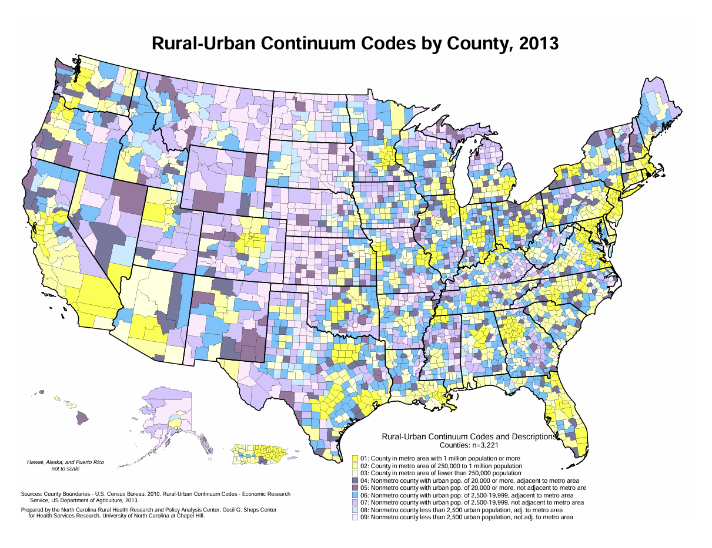

# About the Dataset
**Describe the dataset and why it is interesting.**
I chose to analyze the Social Determinants of Health (SDOH) dataset, which is a large collection of data collected by different federal entities conjoined together and managed by the Agency for Healthcare Research and Quality (AHRQ). The SDOH has been published from 2010-2020 and consists of almost 1,000 variable from differing federal survey for every county, zip code, and census tract in the US [1]. I chose to analyze on a county level. I also used the Rural-Urban Classification Code (RUCC) that assigns a classification to every county in the United States. There are 3,141 counties in the 50 United States so utilizing zip code or census tract for the entire US would be a large undertaking. Overall, I think the SDOH is interesting because it pulls so many variables from all the federal agencies and is a nice way to do comprehensive research. Within the SDOH, I specifically pulled variables from the Provider of Service (POS) dataset and the Area Health Resources Files (AHRF) dataset. 

From the POS dataset, I used the maximum, median, and mean distance to emergency rooms (ER), medical-surgical ICUs (ICU), and designated trauma center (trauma) in miles. The POS data is collected by the Centers of Medicaid and Medicare quarterly. The POS must be completed during the provider recertification process that happens every 5 years at risk of not receiving full Medicare funding, so the dataset is very robust. It caluclates the distances based on the population centroid of each census tract to ensure it is not measuring the farthest distance as a place where no one lives. *cite POS website?*

I chose to three methods of measurement to ensure my analyses were robust. Means can easily be skewed by outliers so sometimes median is actually better at telling a more comprehensive story. I also thought maximum would be an interesting metric because this has potential to show an interesting story, especially surrounding the question of if distance needed to travel is increasing. 
By using three methods of measurements, I could appreciate if the results were in a different method and there was information loss in any others that were disguising significance. 

From the AHRF dataset, I used the Rural-Urban Continuum Codes (RUCC) from 2013. These codes are originally developed and collected by the USDA every decade. The codes for each county in the USA are on a scale from 1-9 with 1 being the most metro and 9 being the most rural. They codes are reanalyzed every 10 years following the census, so there are updated codes from 2023, but they changed the classification level (higher population required for each level) so I decided to continue using the 2013 codes when they would have been in effect for the data collected. The SDOH dataset has data from 2010-2020, but for the same reason, I only analyzed data from 2013-2020. While there are codes for Puerto Rico and some other territories, I only analyzed data from the 50 states and DC. 

The 2013 RUCC codes have the following classifications: 
1-Metro: Areas of 1+ million population
2-Metro: Areas of 250,000 -1,000,000 population
3-Metro: Areas of fewer than 250,000 population
4-Urban: 20,000+ population, adjacent to a metro area
5-Urban: 20,000+ population, not adjacent to a metro area
6-Urban: 2,500-19,999, adjacent to a metro area
7-Urban: 2,500-19,999 population, not adjacent to a metro area
8-Rural: less than 2,500, adjacent to a metro area
9-Rural: less than 2,5000, not adjacent to a metro area [2]

Ultimately, I thought this data and question was interesting following research I conducted to answer the final question in our problem set #2 about why one cannot/should not use technology to fix every problem. I found an article from the Government Accountability Office that said rural counties were seeing their healthcare centers close at a higher rate than metro counties, leading to rural populations who are already typically older and have more chronic disease to travel further for healthcare [3]. I wanted to see if we could see this same trend in the publically available datasets. 

All raw data is available either as an Excel that was too large for GitHub so is available upon request or in the paraquet or pickle version in GitHub.

**Explain how you acquired it (e.g. via an API, file download, etc).**
I acquired my data via a file download. On the SDOH website (https://www.ahrq.gov/sdoh/data-analytics/sdoh-data.html), they offer a direct file download of a xlsx file for every year at each level (county, zip, census tract) that is offered, making it easy to access the whole dataset. Because it is so large, it does create a big datafile for use.I downloaded all the raw data from 2013-2020 and then only called in the columns I was initially interested in. When calling in the data like this to my Flask, it was extremely slow even as a pickled file, so I made the file a paraquet. I also have it load only one time at the top of my server so it is not continually having to reload. 

# FAIR Data
**Discuss the FAIRness of the data provider.**
**FAIR is a journey not a destination, so when considering each aspect find something that it does well and something that could be done better**
**Include: Was the data well-annotated with metadata? Was the license clear?**
Overall I found the data to be very fair.

F-
SDOH is a well-known dataset and it is posted in a easy to acces format on the AHRQ SDOH website. I will say that I'm not sure if it is a personal issue, but I sometimes have a hard  time finding the actual raw data. While it is easy to find AHRQ and their work on SDOH, when you Google AHRQ SDOH data, it brings you to their homepage with already built analyses and tools. I have come to just bookmarking the page because the raw data is not obvious on their website (but again that could be a personal issue).

A-
The data is very accessible as it is very  open to anyone wanting to research SDOHs or even just curious. It is also available as a simple Excel download, so no complex software is required making it a more accessible system for the general public. One downside is that they lack an API to query, which would be helpful for such a multi-year large dataset. 

I
The dataset retains very good standard naming procedures: they start with the entity that orginally collected the data then a full variable name and that remains consistent across all levels (county, zip code, and census tract) and years. It is only available in an Excel file, so it is not interopable with other computer systems to the degree it would be if it were available as a CSV or JSON download.

R
Again, the dataset uses very clean and clear variables that stay consistent throughout all years, making it very easy to research across multiple years and to repeat any analyses. There are no standards shared about data collection or methods, however. To find these, you would have to go back to the original source and inquiry with them and their information, which adds another level of research to any repeated future project.  

Metadata/License
Each year has a very detailed code notebook that consists of which social determinant it is concerned with, who collected the data, the variable name, what it actually is about, and the years it was collected. This and the very clear names leads to very good metadata, but as stated they lack any of the information about how, who, where, or when the actual data was collected without going back to the orignial source. 
Because the data is from federal agencies it is free and available to use. There are stipulations if one is wanting to publish a large amount, but it is mostly about how to cite them. 

# Data Cleaning
**Describe any data cleaning or other preprocessing.**
**e.g. If some data was missing, how did you handle it?**
The datasets I chose within the SDOH were very comprehensive and required little cleaning or imputations.

After pulling in the wanted columns for each year from the raw excel file, I dropped any rows that were not from the 50 states or DC. I did this by creating a variable called "allowed states" and consistently called that variable for each year so only the rows where STATE == one of the allowed states it was kept. I then had the data print all values in STATE and the length so I could visually ensure only all 50 states and DC were kept and thus the length would be 51. For each year, I printed any rows which were missing. Overall, the only rows with missing data were from Alaska. The Alaska West Census Area did not have values to a designated-trauma center or ICU for any years.I attempted to do outside research to determine if this county has any healthcare that was being overlooked, but I was not able to determine with any confidence what their healthcare availability is like. I validated a county in Tennessee and a list of their designated trauma centers in the data set that it did not require the healthcare entitiy to be within the county borders and it did not [4]. Because of this I am not sure why they would have metrics of distance, except this county is the little line of islands that make the arm of Alaska, so they are very remote. Because of this data collection or distance measuring could be an issue. The only other missing data was from other counties in Alaska that would randomly not have a value for distance to either a designated trauma center or an ICU (the specific counties, years, and variables that were missing can be seen in data_cleaning.ipynb). When this happened, I left the values blank and they would not be included in the analyses for that year. 
Because the RUCC codes are created once in 2013, they stay consistent throughout the dataset and would only appear missing if a county was created. Alaska did create two new counties - Chugach Census and Copper River - in 2019 from the Valdez-Crodova Census Area. Because of this the two new counties did not have RUCC classification but they did have distance to ER, designated trauma centers, and ICUs because there are 4 hospitals in Chugach county and 1 in Copper River. Because of the reclassification however, Valdez-Cordova did not have any information about ER, ICU, or trauma centers. Because the new counties were not classified and the ratings of classification changed in 2023, I chose to leave them blank as well and not include them in the analysis when they appear, which was only for 2020. 

I then made one big dataframe of all years extracted. I made sure the year and RUCC classifications were integers. I did look at the summary statistics for the whole dataframe, but because all the RUCC codes and years were integrated, I found more benefit from the stratified summary statistics. Looking at each variable stratified by RUCC classification, there are a couple of things that can be appreciated. 

I did look at the summary statistics in 2013 and 2020 to see if there were any large changes, but I could not appreciate any visually.

None of the data was standardized prior to analysis. The RUCC scores are categorical so they could not be standardized. Difference within the distance variables is what is telling the story - standardizing it would take away any insights we might be able to see. For the main analyses (regression and ANOVA), the variables were not being compared in way that expressing them in different units would have a meaningful impact on how they are interpretted. 

# Summary Statistics
**Discuss summary statistics and how they do or do not reflect the characteristics of the data. (e.g. are they skewed by outliers, is missing data a problem? are they misleading because of non-continuous variables? etc?)**
All summary statistics can be found in data_cleaning.ipynb

Summary statistics of county distribution and population
*Population table*

To analyze if there were any outliers I made interactive box and whisker plots of each variable considered for each county classification in 2013 and 2020. *it would be beneficial to do one for each year*
*Box and Whisker Plot from one year of one variable*

This allowed me to ensure there were no random outliers that would have made me question the data integrity or if there was a potential data input error. The majority of the outliers were from Alaska. Because Alaska is so rural, they had some of the largest distances to travel to healthcare, especially in the rural counties. I did not change or drop these outliers because it is the story for Alaska - that they have to travel that far to healthcare - so I think they are beneficial to leave. This is what inspired me to add the stratification based on region, because if one wanted a analyses with potentially less outliers, they could focus on the South or Northeast regions only. 

I also analyzed the equivilent of the box and whisker plots in full number format but doing .describe() on each variable while they were seperated by RUCC codes. By looking at the mean of each RUCC code, we see that the avergae distance to each healthcare entity increases as you move from the metro to the more rural classification, as is expected. 
*Mean of something table*

I thought it was interesting that many of the values were actually seperated by a similar distribution. We also see the no matter the classification the difference between the numbers at the 25% percentile and numbers at the 75% percentile are similar, until a certain point. This may indicate that the difference between the populations within a classification who are relatively close to healthcare and relatively far from healthcare within that classification are actually very similar, it is just the base number that changes. So for example, within a 1 metro area the difference between someone being in the top 25% closest to healthcare on average is about 4 miles closer than someone in the 25% of the population farthest from healthcare no matter the RUCC classification - what changes when changing classification is how even the closest 25% are so in classification 1 it is the difference in between 6 miles from a trauma center to 20 miles from a trauma center but in classification 6 it is the difference in being 10 miles and 35 miles from a trauma center.

In this view, I was also able to appreciate the real world significance of the values. For example, the mean distance to an ER were very small even at the 75th quartile, which is great for healthcare availability. With mean distance to ER, we can also see the difference between the 25th quartile and the 75th quartile of the 1 metro classification counties is only 3 miles. While 3 miles is still a genuine amount to cross in an emergency, it is not quite the distribution I was expecting to see. We can also see that the mean distance to ER for RUCC classifications for counties 1-7 are similar and the difference between the 75th quartile of classification 1 and classification 7 is only 3 miles. Again, while these are different they are not quite as meaningful as I expected to see. We do still see maximum numbers that get quite high and would be a meaningful distance to cross in case of emergency, so we cannot discount that these exist as well and how they are represented throughout the classification breakdown. 
*Table*

# Analysis 
**Discuss the analyses you chose to run.**
**Why these questions?**
**What were the results?**
**Any surprises?**
Due to the categorical nature of RUCC categories, I chose to run a two-way ANOVA that analyzed the analyses on the difference in years, difference in RUCC categories, and ultimately, the interaction between both that would answer the intital research question of if rural hospitals are seeing having a drastic increase in distance needed to travel to access healthcare compared to rural counties.

The first aspect of the ANOVA looks at the main effect of year, so if there is a statistically significant difference in distance needed to travel to reach healthcare between years. It is worth nothing that doing an ANOVA causes the years to be treated as categorical rather than continuous. Ultimately, for many of the analyses, year was not significant, meaning there was not a difference of distance throughout the years. There were some analyses that returned significant specifically for the trauma variables in which the distance to trauma centers actually decreased, meaning the trauma centers were closer and easier to access. This was suprising to me as it is totally contrary to the hypothesis. I am curious if this is due to more trauma centers being built or expanded or if there is some background reason relating to the trauma center designation, of which I am unsure, that is causing existing centers to be upgraded to trauma centers.

The second aspect of the ANOVA looks at the main effect of the RUCC classification, so if there is a significant difference in distance needed to travel to reach healthcare between the RUCC classifications. For this analysis, there was found to be a significant difference between the RUCC counties distance majority of the time. There were 36 interactions that were not significant, mostly within the maximum measurements. One interesting aspect of this interaction being significat (that I was able to determine thanks to the interactability of Plotly graphs) is that a lot of the times they were deemed significant, the number would not actually be that different from each other, similar to discussed in the summary statistics. 

The last analysis was a two-way ANOVA of the interaction between year and RUCC codes and if that created a significant difference in the distance. Overall, all the results were not significiant and they were very rarely ever even approaching significance. This means that it is very unlikely that rural counties are seeing a recent increase in the distance needed to travel to reach an er, icu, or trauma center no matter the measurement method used compared to metro counties. This did not support our hypothesis.

*picture of matrix of analyses*

One of my commenters asked if I had considered using a linear regression. This would cause the years to be treated as continuous rather than categorical. Following this recommendation, I added a linear regression to run alongside the ANOVA. An interesting future work would be to consider if this model provides any additional insights into the relationship AND if the results differ from the ANOVA. From the few analyses I ran, I did not see any significant values. 

Methods of measurment - I noticed more similaries across the type of healthcare rather than the measurement being used. Ultimately, I saw similar results no matter the measurment method being used. 

**How did you validate your analyses?**
All validations are available in an Excel that was too large to push to GitHub, but can be made available upon request. 

To validate the county breakdown and API 

To validate the ANOVA and regression I used the Excel data analysis toolpack. Because Alaska had the missing data due to the addition of the two counties, Excel did not like that there were blank or N/A cells, so I had to run the analysis without Alaska. For this reason it is not a very robust validation and I do think the data analysis through Excel offers lots of potential for human error or misunderstanding, but, nevertheless, the p values were very similar and more importantly remained insignificant. 

I also validated that the data was being pulled and graphed correctly by aggregating the means and graphing it in Excel. The output was exact same as the graphs generated from my data. 

# Web Front and API
**Describe your server API and the web front-end.**
The landing page of my web page begins with a map of the country and the RUCC classification of each county developed by UNC. It also states the title of the project and lets the user know only the 50 states and DC are available for analysis. 
*Photo of landing page*

The user can then select from three options: breakdown of RUCC by state, distance to healthcare by RUCC, and about the dataset.
*Photo of the three button*

The breakdown of RUCC by state allows the user to input any selected state to learn how that state's counties are classified. After a state is selected, it displays a numerical breakdown of how many counties are present in the state for each classification, a photo of the state and it's counties colored according to their classification and a legend that tells each classification's color and metrics. The html also includes a maximum width and height so that each photo can conform to the best ratio for the state's size. 
*Photo of Vermont*

This analyze page also pulls from the website's API. The API queries the original dataset for whatever state the user selected and returns the county classification breakdown.
*Photo of Vermont API*

The About the Dataset page gives a brief overview of SDOH and the variables used. 
*Photo of about the Dataset*

Distance to Healthcare is where the heart of the analysis lives. Here the user can choose from one of the 9 variables they wish to analyze, and which two RUCCs they would like to compare. They can also stratify by region if they would like to compare classifications between region or only look within one region. I added which states are classified within each region for better understanding for the user. For all my analyzes I only focused on the interaction of RUCC in all the US.
*Photo of input distance*

Once the user has chosen a variable, two RUCCs, and regions if they wish, they click the analyze button and a graph generates along with a ANOVA and linear regression anaysis. The graph generates as a Plotly graph so it can be interactive to users. The graph shows as a line graph of the mean distance wanted for each RUCC wanted for every year from 2013-2020. This allows the user to visually appreciate if there were any changes in distance needed to travel for each classification and the difference between the two classifications. The axes are dynamic to allow the best setting to display the graphs adequately, but this is something the user should take caution in if quickly comparing differnent graphs. 
*Photo of Graph*

It then displays the results of the ANOVA and linear analyses. Any insignificant analyses are shown in red and any significant analyses are shown in green. 
*Photo of analyses*

**Recommendations from video**
I recieved three comments on my video.

The first asked if I considered looking at total number of ERs and other healthcare services, and I did. This was the initial metric I wanted to use for my analyses but after looking at the data, I felt it was misleading. 
*Two graphs*

I also received a comment asking if I considered using 10 decimals for the p values as opposed ot 5. I did increase this following the comment but I'm not sure much significance was gained. I also think any more decimals would be hard to visually appreciate and become overwhelming for the viewer, so I ultimately put it back. 
*Photo of 10 decimals*

The last comment I received was concerning the idea to include a linear regression as well. I originally used an ANOVA due to the categorical nature of the RUCC codes. I retained all aspects of my ANOVA but added a linear regression display of the year interaction, showing the beta correlation if year was handled continuously rather than categorically. Then the beta correlation of the full interaction between RUCC codes, year and the distance. 

# Discussion
**Mention any surprising results or unexpected difficulties.**
I considered being able to analyze multiple RUCC between each other but I didn't know how to do this without making the user face appear clunky. 

Surprises: trauma - more being built or more being designated
Difficulty: validating, determing statistics, lots of variables with the 3x3 measurement methds, especially because did not see any significance, would be cool to zoom in on one region and look deeper at one measurment method.

## Sources 
[1]Social Determinants of Health Database. Content last reviewed June 2023. Agency for Healthcare Research and Quality, Rockville, MD.
https://www.ahrq.gov/sdoh/data-analytics/sdoh-data.html - dataset
[2]https://www.shepscenter.unc.edu/wp-content/uploads/2015/12/ruralurbancodes2013c.pdf - images in analyze
[3] https://www.gao.gov/blog/why-health-care-harder-access-rural-america
[4] (https://www.tn.gov/hfc/division-of-licensure-and-regulation/trauma.html)

## Code Appendix
Sources: Server.py: [1] I adapted code by Robert McDougal demonstrating flask[2] Used ChatGPT to develop API call [3] Used https://www.w3schools.com/Css/css_editor.asp as a template for the CSS and used ChatGPT to edit to my needs [4] Used ChatGPT to understand how to call in a CSS sheet and have buttons go to other pages [5] Used ChatGPT to determine which statistical test would be best, how to implement in python and display on html. [6] Used ChatGPT to turn statistically significant results green and not statistically significant results red on displayed html pages [7] Used ChatGPT to turn data into paraquet form to be faster than calling in data as Excel or pickle form [8] Used ChatGPT to implement difference of difference statistical test and two way ANOVA in python [9] Used ChatGPT to call in human readable version of variables for better graph display [10] Used ChatGPT to call in a plotly graph 
Data_cleaning.ipynb [1] Used ChatGPT to implement scrolling bars
Home.html: [1]Used ChatGPT to call in images to display on html pages [2] Used ChatGPT to call in style sheet
Deeper_analysis.html: [1] Used ChatGPT to make subheaders and change size of font [2] used ChatGPT to select an option to stay on for dropdown menus [3] Used ChatGPT to display 2 columsn for drop down options
