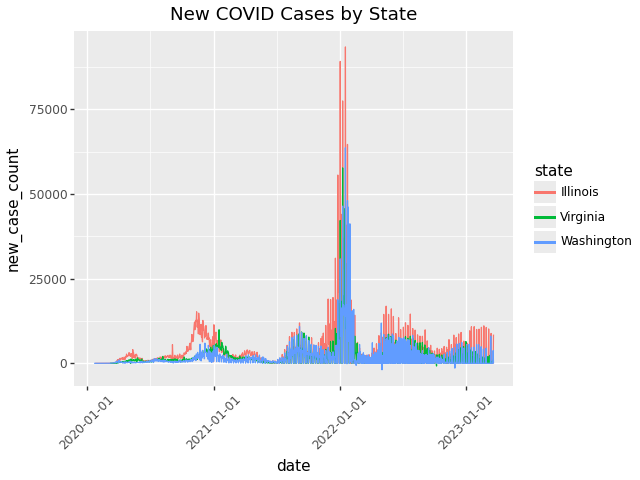
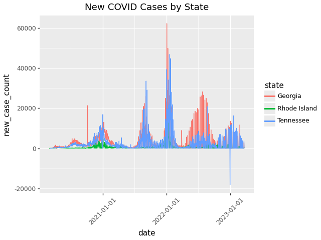
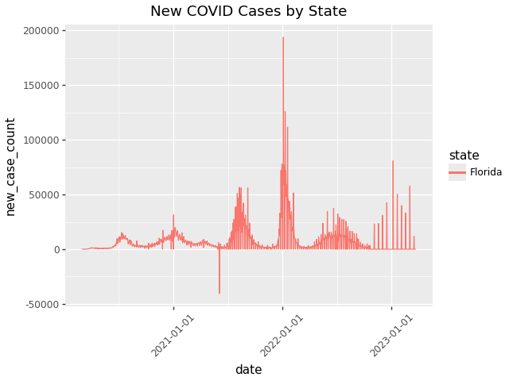
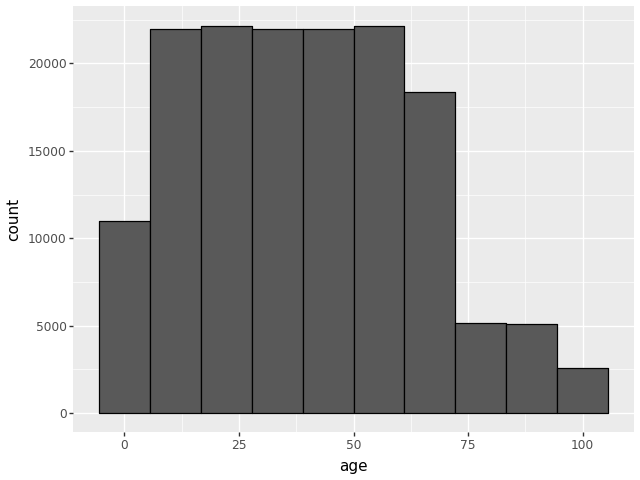
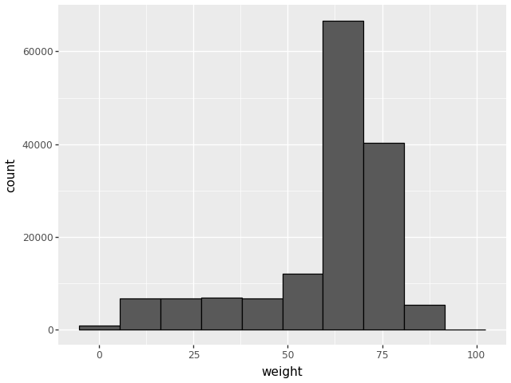
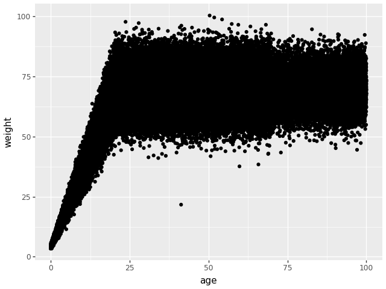
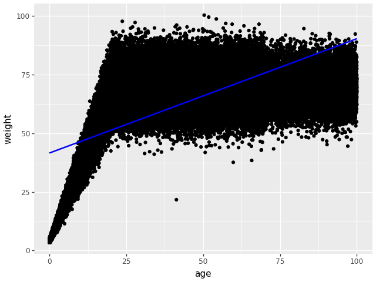

# compmethods-cg2288
Caroline Gheen - cg2288
BIS 634
# Problem 1
The following function takes in a given normal temperature and returns if another temperature is within 1 degree of the normal temperature. If it is, it returns True; if it is not, it returns False. 

```python
def temp_tester(normal_temp):
    def actual_temp(temp):
        if (abs(normal_temp - temp) < 1):
            return True
        return False
    return actual_temp
```
  
There can be some ambiguity in this in that the function does not tell you how far the imput temperature is from normal or in which direction. So, medically, you don't know if someone only has a slight fever or if they have an emergent fever. Similarly, you don't know if someone has a fever or if they are hypothermic - you just know that their temperate is outside the range of normal. 

Testing the function returned the following results:
 
 ```python
 human_tester = temp_tester(37)
chicken_tester = temp_tester(41.1)

chicken_tester(42) = True
human_tester(42) = False
chicken_tester(43) = False
human_tester(35) = False
human_tester(98.6) = False
```
      
# Problem 2

Data was downloaded from the New York Times Github of covid-19-data [1].

I imported pandas, plotnine, and the data.

```python
import pandas as pd
import plotnine as p9
from plotnine import geom_bar, ggplot, aes, geom_line, labs, theme, geom_point
coviddata = pd.read_csv("us-states.csv")
```
I think converted all dates in the data set to be useable timestamps in pandas. 

```python
coviddata['date']=pd.to_datetime(coviddata['date'])
```
I then created a function that would add a new column called new_case_counts to the existing COVID data frame. I had to trouble shoot the function so it would group by states and create the new case count rather than creating new case count from dataframe with the states intermixed. I then added this new column to the overall COVID dataframe. I visualized the dataset again to ensure this new column was added.

```python
def new_case_count(df):
    df["new_case_count"] = df.groupby(["state"])["cases"].diff().fillna(0)
    return df

new_case_count(coviddata)
```

Next, I created a function that loops through multiple states and graphs new case counts versus the date. The states of interst need to be listed as variable states.  

```python
states = ["Washington", "Illinois", "Virginia"]
```

```python
plot_state = pd.DataFrame()
for state in states:
    state_df = new_case_count(coviddata[coviddata['state']==state])
    plot_state = pd.concat([plot_state, state_df], ignore_index = True)
```

We can visualize plot state to ensure only the states of interest have been chosen

```python
plot_state
```
We can then plot the graph. 
```python
g = ggplot(plot_state, p9.aes(x='date', y='new_case_count', color='state'))+ p9.geom_line()+ p9.labs(title = 'New COVID Cases by State')+ p9.theme(axis_text_x=p9.element_text(angle=45))
```

The X axis progresses through the dates and the y axis shows the number of new cases. Colors are varied based on state and the axis labels are titled to increase readability for the viewer. 



I checked this with 3 more states to ensure functionality. 

```python
 states2 = ["Tennessee", "Rhode Island", "Georgia"]

 plot_state2 = pd.DataFrame()

 for state in states2:
    state_df = new_case_count(coviddata[coviddata['state']==state])
    plot_state2 = pd.concat([plot_state2, state_df], ignore_index = True)

 ggplot(plot_state2, p9.aes(x='date', y='new_case_count', color='state'))+ p9.geom_line()+ p9.labs(title = 'New COVID Cases by State')+ p9.theme(axis_text_x=p9.element_text(angle=45))
```


To determine when a state peaked, I created a fucntion named date_of_peak that returns the date of it's max new case count.  

```python
def date_of_peak(df, state):
    data2 = new_case_count(df)
    data3 = data2[data2["state"]==state]
    max_case_count = data3["new_case_count"].idxmax()
    max_case_row = data3.loc[max_case_count,"date"]
    return max_case_row
```
I tested this function with Tennesse and Georgia because I could visualize when their peak was from the graph and therefore check the functions return

```python
date_of_peak(coviddata, "Georgia")
date_of_peak(coviddata, "Tennessee")
```

I then created a function to test what state had it's peak first and how many days between. 

```python
def compare(df, state1, state2):
    peak_date1 = date_of_peak(df, state1)
    peak_date2 = date_of_peak(df, state2)
    delta = abs((peak_date1 - peak_date2).days)
    if peak_date1 > peak_date2:
        earlier_date = peak_date2
        earlier_state = state2
        later_date = peak_date1
        later_state = state1
        return(f"{state2} had its peak first and the peak was {delta} days apart")
    elif peak_date1 < peak_date2:
        earlier_date = peak_date1
        earlier_state = state1
        later_date = peak_date2
        later_state = state2
        return(f"{state1} had its peak first and the peak was {delta} days apart")
    elif peak_date1 == peak_date2:
        return(f"{state2} and {state1} had its peak on the same day")
```
I tested this with Tennessee and Georgia, Florida and Wyoming, and Tennessee and Washington to test all three options of state1 peaking first, state2 peaking first and the states peaking at the same time.

```python
compare(coviddata, "Tennessee", "Georgia")

compare(coviddata, "Florida", "Wyoming")

compare(coviddata, "Tennessee", "Washington")
```
I then extrapolated Florida into its own data frame to analyze the data and plotted it.

```python
florida = coviddata[coviddata['state']=='Florida']

florida.describe()

ggplot(florida, p9.aes(x='date', y='new_case_count', color='state'))+ p9.geom_line()+ p9.labs(title = 'New COVID Cases by State')+ p9.theme(axis_text_x=p9.element_text(angle=45))
```


We can see in the middle of 2021, Flordia had a negative new case count of -40,527. Also, toward the end of 2022, rather than having reports everyday, there are sporatic bouts of reporting. It seems they have changed their reporting cadence and potentially changed reporting standards within the state.

# Problem 3
I imported the data from the SQLite Database [3]
```python 
import pandas as pd
import sqlite3
with sqlite3.connect("pset0-population.db") as db:
data = pd.read_sql_query("SELECT * FROM population", db)
```

I also imported plotnnine for later use during graphing.

```python
import plotnine as p9
from plotnine import geom_bar, ggplot, aes, geom_histogram, geom_smooth, theme_bw
```
Visualizing the data, we can see the column names are: name, age, weight, eyecolor and there are 152361 rows or individuals in the data set.

```python
data
len(data)
```
We can see the following statistics for the age group: Mean = 39.51, standard deviation = 24.15, minimum = .000748, maximum = 99.99.

```python
data.describe()
print(data['age'].max())
print(data['age'].min())
print(data['age'].mean())
print(data['age'].std())
```
The age distributions were graphed in a histogram.

```python
h = ggplot(data, aes(x ='age'))+ geom_histogram(bins=10, color = 'black')
``` 


For the histogram of age, I chose to use bin size of 10. With a smaller bin width, you could loose some of the true distribution of the data because it becomes very minute but a larger bin width, some of the distribution gets lost. With too many bins (like bins=100), the graph can become seem to focus in on individual data points rather than visualizing the data as groups. With too few bins (like bins = 3), you lose the trends you are able to visualize through creating a graph. I also changed the color to black to be easier to visualize.
There is a potential outlier in the 90-100 bucket. 
The majority of data points are pretty uniformly distributed in the 10-60 age range. 

For the weight group we can see the following statistics: mean = 60.88, standard deviation = 18.41, minimum = 3.382, maximum = 100.44

```python
print(data['weight'].max())
print(data['weight'].min())
print(data['weight'].mean())
print(data['weight'].std())
```
```python
g = ggplot(data, aes(x ='weight'))+ geom_histogram(bins=10, color = 'black')
```



I chose 10 bins again for the same reason stated in the age histogram. I also liked 10 because it evenly and logically slpit 100 into 10 even group.  

```python
f = p9.ggplot(data, p9.aes(x='age', y='weight'))+p9.geom_point()
```


From the scatterplot, we can tell there is a relationship between age and weight in that, typically, weight has a small range until about 20 years of age. After 20, the data suggests that there is more varaibility in the weight. 
There is an outlier at around 35 years of age and 20 weight. Their data does not follow the general relationship observed. 
I confirmed my identification of this outlier by adding a linear regression line to the plot to understand better how intense the relationship level was between data. I also re analyzed the describe outlook to better understand the standard deviations of the data and confirmed that this data point would lie outside the standard deviation. It would be ideal to add the standard deviation as a visualization to the plot because then you can see if the data point lands in or out of the catchment of the standard deviation. 

```python
fg = p9.ggplot(data, p9.aes(x='age', y='weight'))+p9.geom_point()+p9.geom_smooth(method='lm', se=True, color='blue')
```



# Problem 4
To compare the entries I asked for the legnth of M and F in the databases.

      len(patient_data[patient_data['gender']=='M'])  
      len(patient_data[patient_data['gender']=='F'])

This returned 45 for males and 55 for females. I confirmed males have less than females by placing both on either side of the <

      len(patient_data[patient_data['gender']=='M']) > len(patient_data[patient_data['gender']=='F']) 
returned False 

      len(patient_data[patient_data['gender']=='M']) < len(patient_data[patient_data['gender']=='F'])
returned True

    def diagnosis_pt(diagnosis_name):
          code =                               diagnosis_data[diagnosis_data['long_title']==diagnosis_name]["icd9_code"].item()
          test = icd_data[icd_data["icd9_code"]==code]['subject_id']
          return list(test)

    diagnosis_pt('Intestinal infection due to Clostridium difficile')
    
##diagnosis -> subject id
##function testing
##age calculation
##reflection

References
[1] https://github.com/nytimes/covid-19-data
[3]pset0-population.db SQLite