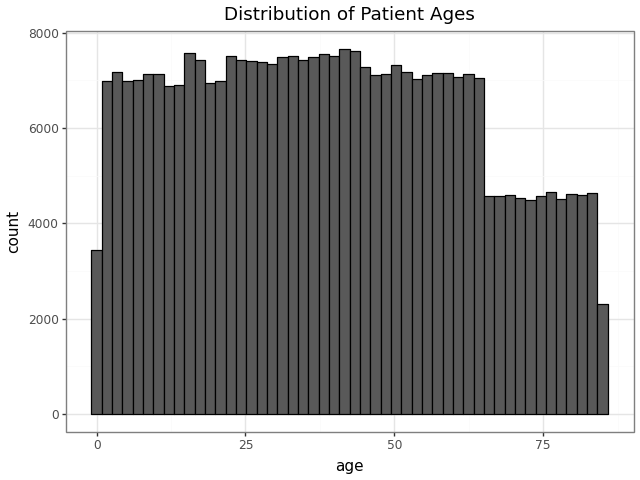
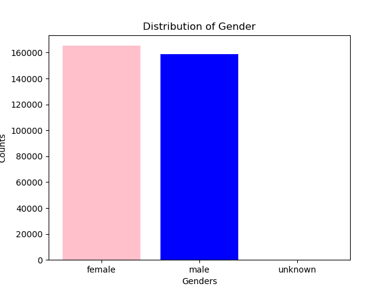
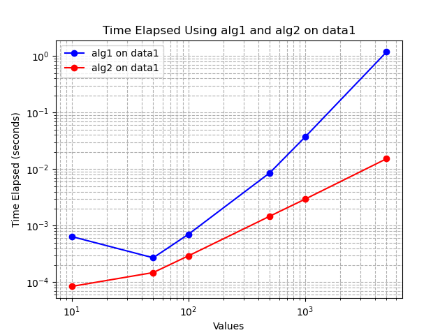
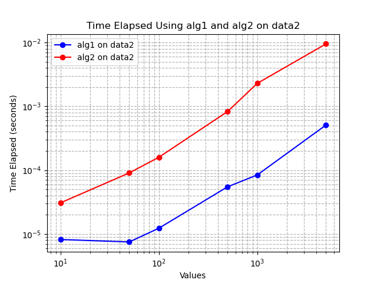
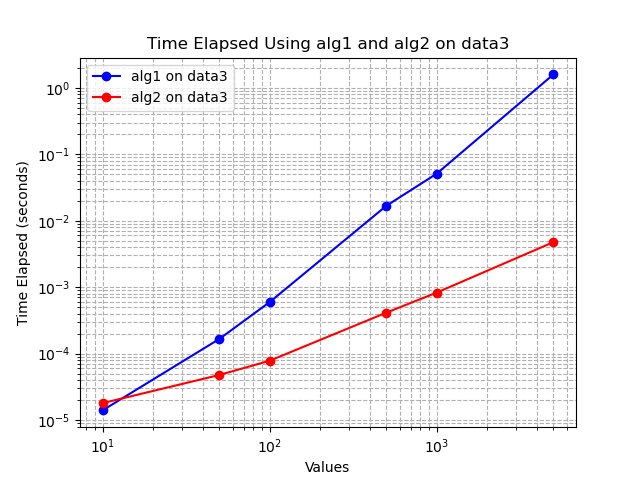

# Problem Set #1 #
cg2288 - Caroline Gheen

# Problem 1 #

**a.** I loaded and parsed the data using Beautiful Soup then visualized it. 

No patients share the same age. We can ensure this by finding the duplicates of the age tag, which returns 'there are no duplicates' [3,4]. 

```python
element_counts = Counter(ages_list)

duplicate_ages= [(age, count) for age, count in element_counts.items() if count > 1]

print("Duplicate Child Elements:")
for age, count in duplicate_ages:
    print(f"Age: {age}, Count: {count}")
```
Extra Credit: A binary search is not possible with duplicate items [0]. So, another method would need to be chosen at 1.e and after. 

 

**b.** Each gender is encoded as a full word; either 'male,' 'female,' or 'unknown.' While the scale of the bar graph makes it appear that there are no items in the unknown category, we can see from a printed dataframe that there are 72 patients with unknown gender. 

```python
unique_genders = set(genders_list)
for tag in unique_genders:
    print(tag)

returns 
unknown
male
female
```



[6,7]

**c.**I created a list of ages to plot the histogram, so I just sorted this existing list. 

```python
ages_list = []
for patient in patients_bs:
    ages = float(patient.get('age'))
    ages_list.append(ages)

sorted_ages = sorted(ages_list)
```
I then reverse sorted this list and found the patient whos age matched index position 0. 

```python 
reverse_sorted_ages = sorted(ages_list, reverse=True)
reverse_sorted_ages[0]

oldest_pt = Bs_data.find('patient', {'age':reverse_sorted_ages[0]})
print(oldest_pt)

returns
<patient age="84.99855742449432" gender="female" name="Monica Caponera">
<diagnosis>Hypertension</diagnosis>
</patient>
```
The oldest patient is 84.9982928781625, she is female and her name is Monica Caponera.  

**d.**
To achieve this in O(n) time, you would need to use a set. Using a set allows for more overhead as it functions at a constant time and is just looking at the hash and placing. 
Lists, while they take longer with larger data sets, are ordered. A set would also be a more difficult way to look for the second oldest patient because of this lack of order. To look for the second oldest patient in a set, you could take the max, then subtract out that value then take the max again.
If wanting to do something with ordered meaning, a list would be better.So, for example, things with age or ranking of pain severity might be adventageous to use a list. 

**e.** 
<patient age="41.5" gender="male" name="John Braswell">
</patient>

```python
def binary_search(arr, x):
    low = 0
    high = len(arr) - 1

    while low <= high:
        mid = (high + low) // 2
        if arr[mid] < x:
            low = mid + 1
        elif arr[mid] > x:
            high = mid - 1
        else:
            mid == x
            return mid
    return None

    index = binary_search(sorted_ages, 41.5)
forty_pt = Bs_data.find('patient', {'age':sorted_ages[index]})
print(forty_pt)
```

**f.** 150471 patients are at least 41.5 years old

```python
index = binary_search(sorted_ages, 41.5)
above_index = sorted_ages[index:]
len(above_index)
```

**g**

```python
def binary_search1(arr, x, y):
    low = 0
    high = len(arr) - 1

    while low <= high:
        mid = (high + low) // 2
        if arr[mid] <= x:
            low = mid + 1
        else: 
            high = mid - 1
    low_index = low
    high = len(arr) - 1
    while low <= high:
        mid = (high + low) // 2
        if arr[mid] > y:
            high = mid - 1
        else: 
            low = mid + 1
    high_index = high 
    if low_index <= high_index:
        return high_index - low_index + 1
    else: return 0
```

    I tested this function with both fake data and xml data.

```python
 fake_data = [1, 2, 3, 4, 5, 6, 7, 8, 9, 10]

 print(binary_search1(fake_data, 2, 4))

 returns 2

 binary_search1(fake_data, 5, 8)

 returns 3
```

I can index into sorted_ages and reverse_sorted_ages to see the youngest patient is 0.00010629282758800596 and the oldest patient is 84.99855742449432. Therefore this binary search of the entire patient list should return the number of patients - 1, which is does. 

```python
binary_search1(sorted_ages, 0.00010629282758800596, 84.99855742449432)

returns 324356

len(sorted_ages)

returns  324357
```

**h.**
```python
male_prefix_sum = []
count = 0
for gender in sorted_gender_list:
    if gender == 'male':
        count += 1
    male_prefix_sum.append(count)

def binary_search2(arr, male_prefix_sum, x, y):
    low = 0
    high = len(arr) - 1

    while low <= high:
        mid = (high + low) // 2
        if arr[mid] < x:
            low = mid + 1
        else: 
            high = mid - 1
    low_index = low

    low = 0
    high = len(arr) - 1
    while low <= high:
        mid = (high + low) // 2
        if arr[mid] < y:
            low = mid + 1
        else: 
            high = mid - 1
    high_index = low 

    if low_index < high_index:
        total_in_range = high_index - low_index
        males_in_range = male_prefix_sum[high_index-1]
        if low_index > 0:
            males_in_range -= male_prefix_sum[low_index -1]
    else:
        total_in_range = 0
        males_in_range = 0
    return (f"Number of patients between these ages: {total_in_range}, Number of males: {males_in_range}")
```
I created a patient list with name, age, and gender attributes of the patients sorted by age. I also created a list with just the genders and the ages sorted to use for testing. 
I indexed into the 0, 1, and 2 positions of the sorted patient list, sorted age list, and sorted gender list to confirm all returned as expected for the first three patients. I knew from previous tests that Timothy Larson was the youngest patient in the data file. I then tested the range of these first 3 patients in the binary search using the ages returned and it returned as expected .  

```python
binary_search2(sorted_ages_list, male_prefix_sum, 0.00010629282758800596, 0.0011937231038899876)

returned 'Number of patients between these ages: 2, Number of males: 1'
```

I also knew from earlier tests that Monica was the oldest patient. I indexed into the sorted list in the same way and retrieved the second oldest patient, who was a male. I then tested the function on this end of the list and it returned as expected. 

```python
binary_search2(sorted_ages_list, male_prefix_sum, 84.9982928781625, 84.99855742449432)

returned
'Number of patients between these ages: 1, Number of males: 1'
```

Lastly, I tested for a long range of ages to ensure it would run on more data.
```python
binary_search2(sorted_ages_list, male_prefix_sum, 20, 30)

returned
'Number of patients between these ages: 42335, Number of males: 21137'
```


### Sources:
[0] https://thelinuxcode.com/mastering-binary-search-in-python-a-complete-visual-walkthrough/

[1] https://pythonguides.com/read-xml-files-in-python/
loading xml data

[2] https://www.geeksforgeeks.org/python/reading-and-writing-xml-files-in-python/
visualizing data and finding attributable tags

[3] Asked Yale Clarity how to determine duplicates in a list of all childs of unique tags in XML.

[4] Asked Yale Clarity how to add a title to a graph in ggplot.

[5] Asked Yale Clarity how to see all unique entires in my list of child tags. 

[6] Asked Yale Clarity to troubleshoot errors when coding for bar plot and saving the image. 

[7] https://www.geeksforgeeks.org/pandas/bar-plot-in-matplotlib/

[8] https://www.geeksforgeeks.org/python/python-sorted-function/ 

[10] Asked Yale Clarity why my fake data was not returning a non sorted list right of the median. Asked Yale Clarity GPT how to find everything above my index value. 

[12] I used ChatGPT to ensure that my functions were correctly inclusive or exclusive to the wanted range. Also asked how to sort list with multiple attributes by the age and how to match the ages of the index found with the gender of that same child. 

# Problem 2 #

**a.**This function is administering medicine in increments. So, if you tell the function you want to administer medicine in 6 units, it will give 6 units until it hits the amount that is tstop. Tstop is the amount of full medicine needed to be given; delta_t is the difference between what has already been administered + what was just administered; and the number of doses administered is the amount needed to get to tstop in the incremental amounts that is t.

**b.** When you call 0.25, 1 you get, as expected it took four rounds of administering 0.25 doses amounts to reach full dosage of 1. 
```python
administer_meds(0.25,1)
Administering meds at t=0
Administering meds at t=0.25
Administering meds at t=0.5
Administering meds at t=0.75
```

**c.** When you call 0.1, 1 you start getting wonky decimal numbers. The dose of 3 is displayed as 3.0000000000000004. This goes awry after the 0.7 dosage. The next dose, which should be 0.8 is 0.7999999999999999. Then the dosage is 0.8999999999999999 then 0.9999999999999999. 

```python
administer_meds(0.1,1)

Administering meds at t=0
Administering meds at t=0.1
Administering meds at t=0.2
Administering meds at t=0.30000000000000004
Administering meds at t=0.4
Administering meds at t=0.5
Administering meds at t=0.6
Administering meds at t=0.7
Administering meds at t=0.7999999999999999
Administering meds at t=0.8999999999999999
Administering meds at t=0.9999999999999999
```

**d.** The dosage is not as expected and this could lead to a compounding effect of delivering too much medicine. The times are also not as expected because with the trailing decimals, the function is not realizing it has hit t-stop.  

**e.** These trailing decimals will compound into an issue, which is not great when delivering medicine. Insulin, for example, is delivered in units because it is so potent - too much insulin or too little insulin for a diabetic can have profound impacts.

**f.** To fix, I coded the function so that it only return 2 decimal places [1]. This will help the calculations stay aligned. I tested it with (0.1, 1), (0.1, 2), and (0.15, 3).
```python
def administer_meds1(delta_t, tstop):
    t = 0
    while t < tstop: 
        print(f"Administering meds at t={t:.2f}")
        t += delta_t


administer_meds1(0.1,1)
Administering meds at t=0.00
Administering meds at t=0.10
Administering meds at t=0.20
Administering meds at t=0.30
Administering meds at t=0.40
Administering meds at t=0.50
Administering meds at t=0.60
Administering meds at t=0.70
Administering meds at t=0.80
Administering meds at t=0.90
Administering meds at t=1.00

administer_meds1(0.1, 2)
Administering meds at t=0.00
Administering meds at t=0.10
Administering meds at t=0.20
Administering meds at t=0.30
Administering meds at t=0.40
Administering meds at t=0.50
Administering meds at t=0.60
Administering meds at t=0.70
Administering meds at t=0.80
Administering meds at t=0.90
Administering meds at t=1.00
Administering meds at t=1.10
Administering meds at t=1.20
Administering meds at t=1.30
Administering meds at t=1.40
Administering meds at t=1.50
Administering meds at t=1.60
Administering meds at t=1.70
Administering meds at t=1.80
Administering meds at t=1.90

administer_meds(0.15, 3)

Administering meds at t=0
Administering meds at t=0.15
Administering meds at t=0.3
Administering meds at t=0.44999999999999996
Administering meds at t=0.6
Administering meds at t=0.75
Administering meds at t=0.9
Administering meds at t=1.05
Administering meds at t=1.2
Administering meds at t=1.3499999999999999
Administering meds at t=1.4999999999999998
Administering meds at t=1.6499999999999997
Administering meds at t=1.7999999999999996
Administering meds at t=1.9499999999999995
Administering meds at t=2.0999999999999996
Administering meds at t=2.2499999999999996
Administering meds at t=2.3999999999999995
Administering meds at t=2.5499999999999994
Administering meds at t=2.6999999999999993
Administering meds at t=2.849999999999999
Administering meds at t=2.999999999999999
```


## Sources used:

[1] Asked ChatGPT how to code so that only 2 decimal places were returned  

# Problem 3 # 

**a.** algorithm 1 and 2 - data 1 is making little increments between range. for 100, only goes 20-50.
algorithm 1 and 2 -data 2 runs a list easily for 100. Starts at 0 goes to 99
algorithm 1 and 2- data 3 runs a list easily for every number in 100. Starts at 1 ends at 100.

I hypothesize that Algorithm 1 is running a bubble sort. Algorithm 2 is running a merge sort. 
#cite slides
#go further on graph x axis.

```python
 alg1(data1(100))
 [20.204472832048545,
 20.213040136936243,
 20.27775999095576,
 20.295935618820344,
 20.44001633033436,
 20.445173959305194,
 20.65234381358303,
 20.698073859463396,
 20.908711658169402,
 21.05868316994932,
 21.20538012061718,
 21.52876758765491,
 21.53348028121465,
 21.884376174024972,
 22.115699414903467,
 22.249861191779097,
 22.622329751533943,
 22.827555082811326,
 22.994912567212936,
 23.361569287372784,
 23.67329118682685,
 23.717137289248004,
 24.057339507317266,
 24.378757031841133,
 24.662764470091197,
...
 50.10966699477457,
 50.70001159917119,
 50.8852397709095,
 51.13969178536924,
 51.21913659552547]

 alg1(data2(100))
[0,
 1,
 2,
 3,
 4,
 5,
 6,
 7,
 8,
 9,
 10,
 11,
 12,
 13,
 14,
 15,
 16,
 17,
 18,
 19,
 20,
 21,
 22,
 23,
 24,
...
 95,
 96,
 97,
 98,
 99]

 alg1(data3(100))
[1,
 2,
 3,
 4,
 5,
 6,
 7,
 8,
 9,
 10,
 11,
 12,
 13,
 14,
 15,
 16,
 17,
 18,
 19,
 20,
 21,
 22,
 23,
 24,
 25,
...
 96,
 97,
 98,
 99,
 100]
 *Outputs are truncated
 ```

```python
alg2(data1(100))
[20.204472832048545,
 20.213040136936243,
 20.27775999095576,
 20.295935618820344,
 20.44001633033436,
 20.445173959305194,
 20.65234381358303,
 20.698073859463396,
 20.908711658169402,
 21.05868316994932,
 21.20538012061718,
 21.52876758765491,
 21.53348028121465,
 21.884376174024972,
 22.115699414903467,
 22.249861191779097,
 22.622329751533943,
 22.827555082811326,
 22.994912567212936,
 23.361569287372784,
 23.67329118682685,
 23.717137289248004,
 24.057339507317266,
 24.378757031841133,
 24.662764470091197,
...
 50.10966699477457,
 50.70001159917119,
 50.8852397709095,
 51.13969178536924,
 51.21913659552547]

alg2(data2(100))
[0,
 1,
 2,
 3,
 4,
 5,
 6,
 7,
 8,
 9,
 10,
 11,
 12,
 13,
 14,
 15,
 16,
 17,
 18,
 19,
 20,
 21,
 22,
 23,
 24,
...
 95,
 96,
 97,
 98,
 99]

 alg2(data3(100))
 [1,
 2,
 3,
 4,
 5,
 6,
 7,
 8,
 9,
 10,
 11,
 12,
 13,
 14,
 15,
 16,
 17,
 18,
 19,
 20,
 21,
 22,
 23,
 24,
 25,
...
 96,
 97,
 98,
 99,
 100]
 *Outputs are truncated
 ```

**b.** Algorithm 1 is cycling through a list that if the index + 1 is less than the index it places it places it before in the list, otherwise it returns the value. 
Algorithm 2 divides the data in half then splits it among a left branch and a right branch. It then proceeds down each branch and if the left branch is less than the right branch it adds the number to the left branch and moves to the next value until nothing remains. 

**c.** The Big O of algorithm 1 is n^2.
The Big O of algorithm 2 is n log n.

Data 1 tested on both algorithms [1]:  



Data 2 tested on both algorithms:



Data 3 tested on both algorithms:
 
 [2]

**d.** At all numbers using data 1, algorithm 1 is slower than algorithm 2. Both slow down at data bigger than 100.

For data 2, algorithm 1 preforms better at all n values. Algorithm 1 is very fast until 100 then begins slowing down.

Using data 3, the algorithms perform similarly at small numbers but eventually algorithm 2 preforms faster. Both increase at similar increments as data increases. 

Algorithm 2 is perferable for super small n's and data well over 10^2. Between those points algorithm 1 is faster. 
#Mathematical, specific data sets 

Sources Used: 
[1] https://www.geeksforgeeks.org/python/time-perf_counter-function-in-python/

[2]Asked Yale Clarity how to plot so axises are log-log and how to save photo of graph generated in matplot. 

# Problem 4 #
**a.** 
``` python 
class Tree:
    def __init__(self):
        self._value = None
        self._data = None
        self.left = None
        self.right = None

    def add(self, key, data):
        if self._value is None:
            self._value = key
            self._data = data
            self.left = Tree()
            self.right = Tree()
            return self

        if self._value == key:
            return self

        if self._value < key:
            self.right.add(key, data)
        else:
            self.left.add(key, data)
        return self
```
Added given data to the tree and tested to ensure it was added correctly [2]. 

```python
 my_tree = Tree()
 for patient_id, initials in [(24601, "JV"), (42, "DA"), (7, "JB"), (143, "FR"), (8675309, "JNY")]:
     my_tree.add(patient_id, initials)

for pid in [24601, 42, 7, 143, 8675309]:
    assert pid in my_tree, f"Patient ID {pid} not found in tree!"
print("All inserted patient IDs found.")

```
**b.** After adding contains, my tree looked like this*. 
```python
class Tree:
    def __init__(self):
        self._value = None
        self._data = None
        self.left = None
        self.right = None

    def add(self, key, data):
        if self._value is None:
            self._value = key
            self._data = data
            self.left = Tree()
            self.right = Tree()
            return self

        if self._value == key:
            return self

        if self._value < key:
            self.right.add(key, data)
        else:
            self.left.add(key, data)
        return self
    
    def __contains__(self, patient_id):
        if self._value == patient_id:
           return True
        elif self.left and patient_id < self._value:
            return patient_id in self.left
        elif self.right and patient_id > self._value:
            return patient_id in self.right
        else:
            return False
```
Tested this on multiple cases including known trues of varying length and the node and known falses that were close to trues or exceeded the digit count of what was in the tree (eg. 14921234 is longer than any other number in the tree).
```python
print(144 in my_tree)
returned False

print(24601 in my_tree)
returned True

print(14921234 in my_tree)
returned False

print(7 in my_tree)
returned True

print(8675309 in my_tree)
returned True
```
**c.**
```python
def has_data(node, data):
    if node is None or node._value is None:
        return False
    if node._data == data:
        return True
    left_result = has_data(node.left, data) if node.left else False
    right_result = has_data(node.right, data) if node.right else False
    return left_result or right_result
```
Tested this on known true and false cases of varying lengths.
```python
has_data(my_tree, 'JV')
returns True

has_data(my_tree, 24601)
returns False

has_data(my_tree, 'CG')
returns False

has_data(my_tree, 'JNY')
returns True

has_data(my_tree, 'BIS')
returns False

has_data(my_tree, 'J')
returns False
```

**d.** To populate the tree, I created functions to make random 1-6 digit numbers and random 2 letter initials. 
```python
def generate_one_digit_number():
    return random.randint(1, 10)
def generate_two_digit_number():
    return random.randint(10, 99)
def generate_three_digit_number():
    return random.randint(100, 999)
def generate_four_digit_number():
    return random.randint(1000, 9999)
def generate_five_digit_number():
    return random.randint(10000, 999999)
def generate_six_digit_number():
    return random.randint(100000, 9999999)

def generate_initials():
    return ''.join(random.choices(string.ascii_uppercase, k=2))
```
I then invoked the another function to generate 100 fake patients with different n length of patient ids varying from 1-6 using the appropraite digits' random number generator. Both the patient id and initials were stored in that n digits' list, creating 6 different lists each consisting of 100 patients of fake data.

```python
def generate_patient_data(num_patients_per_group=100):
    fake_data = []

    for _ in range(num_patients_per_group):
        fake_data.append((generate_one_digit_number(), generate_initials()))
    return fake_data

fake_one_digit = generate_patient_data()
for patient_id, initials in fake_one_digit:
    print(f"Patient ID: {patient_id}, Initials: {initials}")

def generate_patient_data(num_patients_per_group=100):
    fake_data = []

    for _ in range(num_patients_per_group):
        fake_data.append((generate_two_digit_number(), generate_initials()))
    return fake_data

fake_two_digit = generate_patient_data()
for patient_id, initials in fake_two_digit:
    print(f"Patient ID: {patient_id}, Initials: {initials}")

def generate_patient_data(num_patients_per_group=100):
    fake_data = []

    for _ in range(num_patients_per_group):
        fake_data.append((generate_three_digit_number(), generate_initials()))
    return fake_data

fake_three_digit = generate_patient_data()
for patient_id, initials in fake_three_digit:
    print(f"Patient ID: {patient_id}, Initials: {initials}")

def generate_patient_data(num_patients_per_group=100):
    fake_data = []

    for _ in range(num_patients_per_group):
        fake_data.append((generate_four_digit_number(), generate_initials()))
    return fake_data

fake_four_digit = generate_patient_data()
for patient_id, initials in fake_four_digit:
    print(f"Patient ID: {patient_id}, Initials: {initials}")

def generate_patient_data(num_patients_per_group=100):
    fake_data = []

    for _ in range(num_patients_per_group):
        fake_data.append((generate_five_digit_number(), generate_initials()))
    return fake_data

fake_five_digit = generate_patient_data()
for patient_id, initials in fake_five_digit:
    print(f"Patient ID: {patient_id}, Initials: {initials}")

def generate_patient_data(num_patients_per_group=100):
    fake_data = []

    for _ in range(num_patients_per_group):
        fake_data.append((generate_six_digit_number(), generate_initials()))
    return fake_data

fake_six_digit = generate_patient_data()
for patient_id, initials in fake_six_digit:
    print(f"Patient ID: {patient_id}, Initials: {initials}")
```
I then combined all 6 digit lists into one list to add all the fake data to the tree. 
```python
all_digit_fake_data = [item for sublist in [fake_two_digit, fake_three_digit, fake_four_digit, fake_five_digit, fake_six_digit] for item in sublist]
print(all_digit_fake_data)

 my_tree = Tree()
 for patient_id, initials in all_digit_fake_data:
     my_tree.add(patient_id, initials)
```
Once the tree was populated, I measured the time for 'in' using the different n digit lists created earlier. 

This is an example of how I measured time for patient id with 1 digit. This was repeated for all id lengths. To fully test the ability and timing of the function, it would be ideal to vary the lenghts of patient initials to be longer than 2 as well.

```python
one_digit_time = []

for patient_id, _ in fake_one_digit:
    t1start = perf_counter()
    result = patient_id in my_tree
    t1stop = perf_counter()
    total_time = t1stop - t1start
    one_digit_time.append(total_time)
    print("Elapsed time during the whole program in seconds:", total_time)
```

This method was repeated for the same randomly generated patient ids and initials using the has_data. 

```python
hs_one_digit_time = []

for patient_id, _ in fake_one_digit:
    t1start = perf_counter()
    result = has_data_pid(my_tree, patient_id)
    t1stop = perf_counter()
    total_time = t1stop - t1start
    hs_one_digit_time.append(total_time)
    print("Elapsed time during the whole program in seconds:", total_time)
```

Both timings of the time elapsed during the running of in/contains and has_data are displayed in the graph below. 


Based on this graph, the has_data method consistently performed slower than the in/contains method. We can see better from the in method that as the n of patient id increases, so does the time elapsed. This line look more like the O(log n) line that we would expect. 
The timing of the has_data method is very close to O(1), so there may be an error in the measuring of the times. 


I repeated a similar process to time elapsed time during the construction of a tree of various n's. Again, I only varied the n size of patient id, but a more thorough test would also vary the patient id n size. 

```python
total_tree = []
t1start = perf_counter()
my_tree = Tree()
for patient_id, initials in fake_one_digit:
    my_tree.add(patient_id, initials)
t1stop = perf_counter()
total_time = t1stop - t1start
total_tree.append(total_time)
print("Elapsed time during the whole program in seconds:", total_time)
```

I added bounds for O(n) and O(n^2), as we would expect this line to be between them and curving upwards as the n increases. Instead, we see a line approaching O(1), so there is likely an error in the method used to time contruction of the tree. The test might also benefit from going higher than 6 digit n's. 

**e.** A beneficial tests uses varying data of varying sizes to ensure it can withstand many requests. Continually using the same value or only one test point does not accurately assess the performance of the function - it would assess the functions ability to do that one request. Using a varied set of values allows the function to be more real-world ready and ensure that any edge cases or accidental human errors have been eliminated. It also gives more validity that the well-tested function will be reliable in different circumstances. 


[1] Yale Clarity to build binary search tree without a node and ensure self._value being used correctly.
[2] Asked ChatGPT for a way to test that all data was added to tree correctly. 
*My code would not work unless I edited the tree within one code block. 
[3] Ask Yale Clarity how to create a n digit fake number generator and fake initial generator. 
[4]With ChatGPT, trouble shooted why has_data would not work for patient ids in part d. Ensured timings were running correctly. Asked how to graph meanings on log-log scale and add curve bounds on time to construct graph. 

# Problem 5 #

**a.** I recommend the following 4 ontologies:
    SNOMEDCT - to be used with clincian free-text and data entry, medications,specimans/pathologies, symptoms, and more. SNOMEDCT is a widely accepted ontology that provides many core concepts, schemes, and guidelines so it is a good baseline ontology, especially for use by clinicians and for patient data. It is rated as widely accpeted (99.2), not very specialized(18.5), and fairly detailed (50) for a cancer ontology. It makes sense for multiple data types because it has extenive concepts, defintions,, and links/relationships.

    GO - Gene Ontology - provides vocabulary for gene products, functions, components and roles. GO will give ontology for the molecular, gene, and protein componets of the cancer research not covered in SNOMEDCT or EDAMBIO. It is very detailed (62.1), gives fair coverage (50), isn't very specific (12.7), but is widely accepted (88.2) for a gene ontology. It will give great depth to the molecular and biological processes needed for cancer research, although it does have some potential overlap with NCIT. 

    NCIT - National Cancer Institute Thesarus - semantics for basic clinical care, translational and basic reasearch, and administration. This ontology allows for specific cancer needed ontologies, including drug concepts, biomarkers, and cancer-specific molecular and celluar components. NCIT is pretty specialized (45.8) but gives great coverage (100) and deep detail (88.2) and is widely accepted (87.9) for a cancer ontology. It provides a good baseline for all other ontologies/data to be cancer specific as it provides an intersection for mediciation and genes but gives a needed cancer depth to all elements that is not given through the other ontologies. 

    EDAMBIO - EDAM Bioimaging Ontology - bioimaging topics including format and analysis. EDAMBIO provides imaging ontologies and metadata not present in the others mentioned. It is very detailed (100) and provides amazing coverage(100), while also being well specialized (60.5) and widely accpeted (86.7) for an imaging ontology.

    If the clincial/research staff feels overwhelmed due to these ontologies being broader, one could recommend a mapping ontology that aid in reconciling overlapping concepts. 
    Or, if the research hospital is interested in creating cancer drugs, I would recommend MedDRA as a fifth ontology.

* all numbers are the numbers reported with the biorecommender on bioportal when searched with the associated term; higher is better in that category. 

**b.** EDAM Bioimaging Ontology  is shared under the Creative Commons Attribution-ShareAlike 4.0 International Public License in which it is open to share and edit with some stipulations. One is able to use it for their own use or distribution and modify it, but they must cite the authors if publishing and any modification must fit community standards. Additionally, the license does not carry liability, trademark, patent or warranty.

Gene Ontology is licensed under the Creative Commons Attribution 4.0. This allows free use of the ontology with proper documentation.

SNOMEDCT is available free of charge to those with a license for the UMLS Metathesarus but it cannot be distributed to those without. It is updated biannually, but by the US government, not world wide. 

NCIT is licensed under the Creative Commons Attribution 4.0 but produced by the National Cancer Institute (under NIH) so also is available for free use with proper documentation. It is updated monthly.

There is a benefit to the ontologies maintained by federal entities because they are updated frequently and typically interacts well with other common ontologies. They do lack, however, the benefit of community input and fast updates. These ontologies developed in the community, however, are not guarenteed to be maintained and my have tricky licensing agreements. 

**c.**
1. I entered "Imagine you work at a cancer hospital and are responsible for making internal research data discoverable and interoperable. The dataset includes gene sequence metadata, imaging metadata (radiology / pathology), medication records, and free-text clinician notes" into the search of bio portal. This generated a good list of ontologies that I first parsed thorugh. 
2. I specifically searched medical imaging metadata, gene sequencing, pathology, cancer research into bioportal to ensure I was meeting all ontologies aspects needed. 
3. I considered the scores given to the ontologies from Bio portal for most wanted input. This gave me an idea of if they would be too broad and overwhelming or if they would be too specific and detailed.
4. Once I had 5 ontologies I liked, I pasted the Bioportal page and homepage of each ontology into ChatGPT to ensure ontologies did not have substantial overlap and touched all wanted scopes.
6. My initial stopping point was that I had 5 ontologies and that was the maximum for this assignment. But once I considered the ranges of the Bio portal scales and the feedback considering overlap from ChatGPT, I considered different combinations of ontologies. Once I had an ontology that primarily focused on one specific facet of the cancer hospital (research, clinical, imaging, genes) that also interacted well with the other ontologies, I stopped. 

Sources:
[1] Used ChatGPT to ensure written answers fully answer every aspect of questions. 


# Appendix of Code #
Problem 1: 
# %%
!pip install BeautifulSoup4
import plotnine as p9
from plotnine import geom_bar, ggplot, aes, geom_histogram, geom_smooth, theme_bw, labs
from collections import Counter
from bs4 import BeautifulSoup
import pandas as pd
import matplotlib.pyplot as plt
from matplotlib.ticker import MultipleLocator
import random

# %%
with open('pset1-patients.xml', 'r') as file:
    data = file.read()
print(data)

# %%
Bs_data = BeautifulSoup(data, 'xml')

# %%
patients_bs = Bs_data.find_all('patient')

# %%
ages_list = []
for patient in patients_bs:
    ages = float(patient.get('age'))
    ages_list.append(ages)

# %%
ages_df = pd.DataFrame({'age':ages_list})

# %%
a = ggplot(ages_df, aes(x='age'))+ geom_histogram(bins=50, color = 'black') + labs(title='Distribution of Patient Ages') + theme_bw()
a
a.save("age_distribution.png")

# %%
element_counts = Counter(ages_list)

duplicate_ages= [(age, count) for age, count in element_counts.items() if count > 1]

print("Duplicate Child Elements:")
for age, count in duplicate_ages:
    print(f"Age: {age}, Count: {count}")

# %%
genders_list = []
for patient in patients_bs:
    genders = patient.get('gender')
    genders_list.append(genders)
genders_list

# %%
unique_genders = set(genders_list)
for tag in unique_genders:
    print(tag)

# %%
genders_df = pd.DataFrame({'gender':genders_list})
gender_counts = genders_df['gender'].value_counts().reset_index()
gender_counts.columns = ['gender', 'count']

gender_counts

# %%
plt.bar(gender_counts['gender'], gender_counts['count'], color=['pink', 'blue', 'gray'])
plt.title('Distribution of Gender')
plt.xlabel('Genders')
plt.ylabel('Counts')
plt.savefig("gender_graph.png")
plt.show()

# %%
sorted_ages = sorted(ages_list)

# %%
reverse_sorted_ages = sorted(ages_list, reverse=True)
reverse_sorted_ages[0]


# %%
oldest_pt = Bs_data.find('patient', {'age':reverse_sorted_ages[0]})
print(oldest_pt)

# %%
def binary_search(arr, x):
    low = 0
    high = len(arr) - 1

    while low <= high:
        mid = (high + low) // 2
        if arr[mid] < x:
            low = mid + 1
        elif arr[mid] > x:
            high = mid - 1
        else:
            mid == x
            return mid
    return None

# %%
index = binary_search(sorted_ages, 41.5)
forty_pt = Bs_data.find('patient', {'age':sorted_ages[index]})
print(forty_pt)

# %%
index = binary_search(sorted_ages, 41.5)
above_index = sorted_ages[index:]
len(above_index)


# %%
def binary_search1(arr, x, y):
    low = 0
    high = len(arr) - 1

    while low <= high:
        mid = (high + low) // 2
        if arr[mid] < x:
            low = mid + 1
        else: 
            high = mid - 1
    low_index = low
    high = len(arr) - 1
    while low <= high:
        mid = (high + low) // 2
        if arr[mid] >= y:
            high = mid - 1
        else: 
            low = mid + 1
    high_index = high 
    if low_index <= high_index:
        return high_index - low_index + 1
    else: return 0

# %%
fake_data = [1, 2, 3, 4, 5, 6, 7, 8, 9, 10]

# %%
result = binary_search1(fake_data, 5, 8)
print(result)

# %%
print(binary_search1(fake_data, 2, 4))

# %%
sorted_ages[0]

# %%
reverse_sorted_ages[0]

# %%
binary_search1(sorted_ages, 0.00010629282758800596, 84.99855742449432)

# %%
len(sorted_ages)

# %%
patient_list = []
for patient in patients_bs:
    name = patient.get('name')
    gender = patient.get('gender')
    age = float(patient.get('age'))
    patient_list.append({'name': name, 'gender': gender, 'age': age})

sorted_patient_list = sorted(patient_list, key=lambda x: x['age'])

# %%
sorted_gender_list = [patient['gender'] for patient in sorted_patient_list]
sorted_ages_list = [patient['age'] for patient in sorted_patient_list]

# %%
print(sorted_patient_list[1])
print(sorted_gender_list[1])
print(sorted_ages_list[1])

# %%
print(sorted_patient_list[2])
print(sorted_gender_list[2])
print(sorted_ages_list[2])

# %%
print(sorted_patient_list[0])
print(sorted_gender_list[0])
print(sorted_ages_list[0])

# %%
oldest_pt = Bs_data.find('patient', {'age':reverse_sorted_ages[0]})
print(oldest_pt)

# %%
oldest_pt = Bs_data.find('patient', {'age':reverse_sorted_ages[1]})
print(oldest_pt)

# %%
male_prefix_sum = []
count = 0
for gender in sorted_gender_list:
    if gender == 'male':
        count += 1
    male_prefix_sum.append(count)


# %%
def binary_search2(arr, male_prefix_sum, x, y):
    low = 0
    high = len(arr) - 1

    while low <= high:
        mid = (high + low) // 2
        if arr[mid] < x:
            low = mid + 1
        else: 
            high = mid - 1
    low_index = low

    low = 0
    high = len(arr) - 1
    while low <= high:
        mid = (high + low) // 2
        if arr[mid] < y:
            low = mid + 1
        else: 
            high = mid - 1
    high_index = low 

    if low_index < high_index:
        total_in_range = high_index - low_index
        males_in_range = male_prefix_sum[high_index-1]
        if low_index > 0:
            males_in_range -= male_prefix_sum[low_index -1]
    else:
        total_in_range = 0
        males_in_range = 0
    return (f"Number of patients between these ages: {total_in_range}, Number of males: {males_in_range}")

# %%
binary_search2(sorted_ages_list, male_prefix_sum, 0.00010629282758800596, 0.0011937231038899876)

# %%
binary_search2(sorted_ages_list, male_prefix_sum, 20, 30)

# %%
binary_search2(sorted_ages_list, male_prefix_sum, 84.9982928781625, 84.99855742449432)


Problem 2:
# %%
def administer_meds(delta_t, tstop):
    t = 0
    while t < tstop: 
        print(f"Administering meds at t={t}")
        t += delta_t

# %%
administer_meds(6, 24)

# %%
administer_meds(2, 10)

# %%
administer_meds(1, 2)

# %%
administer_meds(1000, 5000)

# %%
administer_meds(2, 9)

# %%
administer_meds(0.25,1)

# %%
administer_meds(0.1,1)

# %%
administer_meds(0.1,2)

# %%
administer_meds(0.1,3)

# %%
def administer_meds1(delta_t, tstop):
    t = 0
    while t < tstop: 
        print(f"Administering meds at t={t:.2f}")
        t += delta_t

# %%
administer_meds1(0.1,1)

# %%
administer_meds1(0.15, 3)

# %%
administer_meds(0.15, 3)

# %%
administer_meds1(0.1, 2)


Problem 3:
# %%
import time
import matplotlib.pyplot as plt
import numpy as np

# %%
def alg1(data):
  data = list(data)
  changes = True
  while changes:
    changes = False
    for i in range(len(data) - 1):
      if data[i + 1] < data[i]:
        data[i], data[i + 1] = data[i + 1], data[i]
        changes = True
  return data

# %%
def alg2(data):
  if len(data) <= 1:
    return data
  else:
    split = len(data) // 2
    left = iter(alg2(data[:split]))
    right = iter(alg2(data[split:]))
    result = []
    # note: this takes the top items off the left and right piles
    left_top = next(left)
    right_top = next(right)
    while True:
      if left_top < right_top:
        result.append(left_top)
        try:
          left_top = next(left)
        except StopIteration:
          # nothing remains on the left; add the right + return
          return result + [right_top] + list(right)
      else:
        result.append(right_top)
        try:
          right_top = next(right)
        except StopIteration:
          # nothing remains on the right; add the left + return
          return result + [left_top] + list(left)

# %%
def data1(n, sigma=10, rho=28, beta=8/3, dt=0.01, x=1, y=1, z=1):
    import numpy
    state = numpy.array([x, y, z], dtype=float)
    result = []
    for _ in range(n):
        x, y, z = state
        state += dt * numpy.array([
            sigma * (y - x),
            x * (rho - z) - y,
            x * y - beta * z
        ])
        result.append(float(state[0] + 30))
    return result

# %%
def data2(n):
    return list(range(n))

# %%
def data3(n):
    return list(range(n, 0, -1))

# %%
alg1(data1(100))

# %%
alg1(data2(100))

# %%
alg1(data3(100))

# %%
alg2(data1(100))

# %%
alg2(data2(100))

# %%
alg2(data3(100))

# %%
alg1(data1(10))

# %%
alg1(data1(1))

# %%
alg2(data1(10))

# %%
alg2(data1(1))

# %%
alg1(data2(10))

# %%
alg2(data2(10))

# %%
alg2(data2(1))

# %%
time.perf_counter()
from time import perf_counter
t1start = perf_counter()
t1stop = perf_counter()
print("Elapsed time during the whole program in seconds:", t1stop - t1start)    

# %%
t1start = perf_counter()
alg1(data1(100))
t1stop = perf_counter()
print("Elapsed time during the whole program in seconds:", t1stop - t1start)

# %%
t1start = perf_counter()
alg2(data1(100))
t1stop = perf_counter()
print("Elapsed time during the whole program in seconds:", t1stop - t1start)

# %%
t1start = perf_counter()
alg1(data1(1))
t1stop = perf_counter()
print("Elapsed time during the whole program in seconds:", t1stop - t1start)    

# %%
t1start = perf_counter()
alg2(data1(1))
t1stop = perf_counter()
print("Elapsed time during the whole program in seconds:", t1stop - t1start)

# %%
t1start = perf_counter()
alg1(data1(1000))
t1stop = perf_counter()
print("Elapsed time during the whole program in seconds:", t1stop - t1start)

# %%
t1start = perf_counter()
alg2(data1(1000))
t1stop = perf_counter()
print("Elapsed time during the whole program in seconds:", t1stop - t1start)

# %%
t1start = perf_counter()
alg1(data1(5000))
t1stop = perf_counter()
print("Elapsed time during the whole program in seconds:", t1stop - t1start)

# %%
t1start = perf_counter()
alg2(data1(5000))
t1stop = perf_counter()
print("Elapsed time during the whole program in seconds:", t1stop - t1start)

# %%
t1start = perf_counter()
alg1(data2(100))
t1stop = perf_counter()
print("Elapsed time during the whole program in seconds:", t1stop - t1start)

# %%
t1start = perf_counter()
alg2(data2(100))
t1stop = perf_counter()
print("Elapsed time during the whole program in seconds:", t1stop - t1start)

# %%
t1start = perf_counter()
alg1(data2(1))
t1stop = perf_counter()
print("Elapsed time during the whole program in seconds:", t1stop - t1start)

# %%
t1start = perf_counter()
alg2(data2(1))
t1stop = perf_counter()
print("Elapsed time during the whole program in seconds:", t1stop - t1start)

# %%
t1start = perf_counter()
alg1(data2(1000))
t1stop = perf_counter()
print("Elapsed time during the whole program in seconds:", t1stop - t1start)

# %%
t1start = perf_counter()
alg2(data2(1000))
t1stop = perf_counter()
print("Elapsed time during the whole program in seconds:", t1stop - t1start)

# %%
t1start = perf_counter()
alg1(data2(5000))
t1stop = perf_counter()
print("Elapsed time during the whole program in seconds:", t1stop - t1start)

# %%
t1start = perf_counter()
alg2(data2(5000))
t1stop = perf_counter()
print("Elapsed time during the whole program in seconds:", t1stop - t1start)

# %%
t1start = perf_counter()
alg1(data3(1))
t1stop = perf_counter()
print("Elapsed time during the whole program in seconds:", t1stop - t1start)

# %%
t1start = perf_counter()
alg2(data3(1))
t1stop = perf_counter()
print("Elapsed time during the whole program in seconds:", t1stop - t1start)

# %%
t1start = perf_counter()
alg1(data3(100))
t1stop = perf_counter()
print("Elapsed time during the whole program in seconds:", t1stop - t1start)

# %%
t1start = perf_counter()
alg2(data3(100))
t1stop = perf_counter()
print("Elapsed time during the whole program in seconds:", t1stop - t1start)

# %%
t1start = perf_counter()
alg1(data3(1000))
t1stop = perf_counter()
print("Elapsed time during the whole program in seconds:", t1stop - t1start)

# %%
t1start = perf_counter()
alg2(data3(1000))
t1stop = perf_counter()
print("Elapsed time during the whole program in seconds:", t1stop - t1start)

# %%

#3c creating data frames of times to plot

# %%
t1start = perf_counter()
alg2(data3(5000))
t1stop = perf_counter()
print("Elapsed time during the whole program in seconds:", t1stop - t1start)

# %%
data1_time_alg1 = []
n_values = [10, 50, 100, 500, 1000, 5000]
for n in n_values:
    t1start = perf_counter()
    alg1(data1(n))
    t1stop = perf_counter()
    total_time = t1stop - t1start
    data1_time_alg1.append(total_time)
    print("Elapsed time during the whole program in seconds:", total_time)


# %%
data1_time_alg1

# %%
data1_time_alg2 = []
n_values = [10, 50, 100, 500, 1000, 5000]
for n in n_values:
    t1start = perf_counter()
    alg2(data1(n))
    t1stop = perf_counter()
    total_time = t1stop - t1start
    data1_time_alg2.append(total_time)
    print("Elapsed time during the whole program in seconds:", total_time)


# %%
x_values = [10, 50, 100, 500, 1000, 5000]

plt.figure()
plt.loglog(x_values, data1_time_alg1, label='alg1 on data1', marker='o', linestyle='-', color='blue')
plt.loglog(x_values, data1_time_alg2, label='alg2 on data1', marker='o', linestyle='-', color ='red')

plt.xlabel('Values')
plt.ylabel('Time Elapsed (seconds)')
plt.title('Time Elapsed Using alg1 and alg2 on data1')
plt.legend()

plt.grid(True, which="both", ls="--")

h = plt.savefig('data1_algs.png')
plt.show()


# %%
data2_time_alg1 = []
n_values = [10, 50, 100, 500, 1000, 5000]
for n in n_values:
    t1start = perf_counter()
    alg1(data2(n))
    t1stop = perf_counter()
    total_time = t1stop - t1start
    data2_time_alg1.append(total_time)
    print("Elapsed time during the whole program in seconds:", total_time)


# %%
data2_time_alg2 = []
n_values = [10, 50, 100, 500, 1000, 5000]
for n in n_values:
    t1start = perf_counter()
    alg2(data2(n))
    t1stop = perf_counter()
    total_time = t1stop - t1start
    data2_time_alg2.append(total_time)
    print("Elapsed time during the whole program in seconds:", total_time)


# %%
plt.figure()
plt.loglog(n_values, data2_time_alg1, label='alg1 on data2', marker='o', linestyle='-', color='blue')
plt.loglog(n_values, data2_time_alg2, label='alg2 on data2', marker='o', linestyle='-', color ='red')

plt.xlabel('Values')
plt.ylabel('Time Elapsed (seconds)')
plt.title('Time Elapsed Using alg1 and alg2 on data2')
plt.legend()

plt.grid(True, which="both", ls="--")
j = plt.savefig('data2_algs.png')
plt.show()


# %%
data3_time_alg1 = []
n_values = [10, 50, 100, 500, 1000, 5000]
for n in n_values:
    t1start = perf_counter()
    alg1(data3(n))
    t1stop = perf_counter()
    total_time = t1stop - t1start
    data3_time_alg1.append(total_time)
    print("Elapsed time during the whole program in seconds:", total_time)


# %%
data3_time_alg2 = []
n_values = [10, 50, 100, 500, 1000, 5000]
for n in n_values:
    t1start = perf_counter()
    alg2(data3(n))
    t1stop = perf_counter()
    total_time = t1stop - t1start
    data3_time_alg2.append(total_time)
    print("Elapsed time during the whole program in seconds:", total_time)


# %%
plt.figure()
plt.loglog(n_values, data3_time_alg1, label='alg1 on data3', marker='o', linestyle='-', color='blue')
plt.loglog(n_values, data3_time_alg2, label='alg2 on data3', marker='o', linestyle='-', color ='red')

plt.xlabel('Values')
plt.ylabel('Time Elapsed (seconds)')
plt.title('Time Elapsed Using alg1 and alg2 on data3')
plt.legend()

plt.grid(True, which="both", ls="--")
k = plt.savefig('data3_algs.png')
plt.show()

Problem 4:
