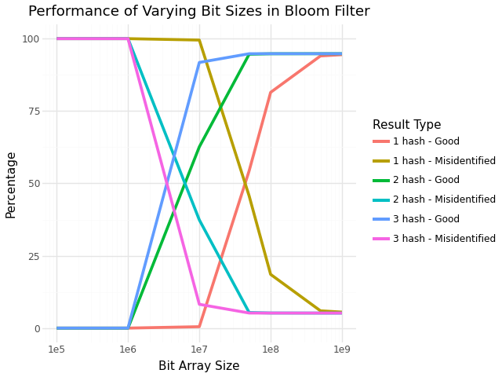
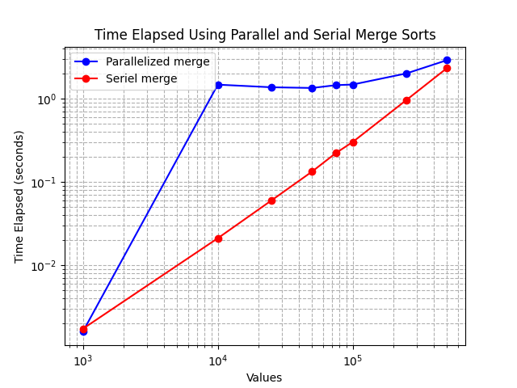
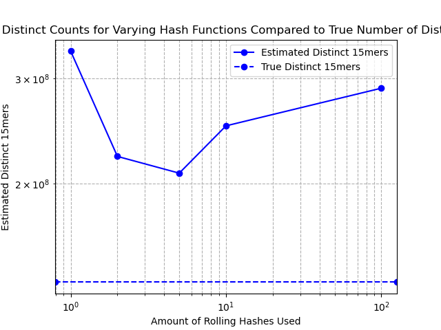

## Problem 1 ##
**a.** 
I began by reading in the words list and creating a list of individual words to be added to the bloom filter. 
```python
words = []

with open('words.txt') as f:
    for line in f:
        word = line.strip().lower()
        words.append(word)
```

I then set all the hashes to size 10,000,000 for testing and created three functions that were a combination of all 3 hashes, 2 hashs and 1 hash. 
```python 
size = 10_000_000
def my_hash(s):
    return int(sha256(s.lower().encode()).hexdigest(), 16) % size # given
def my_hash2(s):
    return int(blake2b(s.lower().encode()).hexdigest(), 16) % size
def my_hash3(s):
    return int(sha3_256(s.lower().encode()).hexdigest(), 16) % size

three_hash_functions = [my_hash, my_hash2, my_hash3]
two_hash_functions = [my_hash, my_hash2]
one_hash_function = [my_hash]
```

I was then able to create the bloom filter whose bitarray size would be specified when called.
```python
class BloomFilter:
    def __init__(self, size, hash_functions):
        self.size = size
        self.hash_functions = hash_functions
        self.bit_array = bitarray(self.size)
        self.bit_array.setall(0)

    def add(self, item):
        for func in self.hash_functions:
            index = func(item)
            if index >= self.size:
                raise ValueError(f"Index {index} out of bounds for size {self.size}")
            self.bit_array[index] = 1

    def check(self, item):
        for func in self.hash_functions:
            index = func(item)
            if self.bit_array[index] == 0:
                return False
        return True
```

I was then able to add the words to three different bloom filters with different hash combinations. I also created a test bloom filter with "apple" and "banana" only in it for testing. All these bloom filters used size 10,000,000 set when making the hash functions. 
```python
bloomf_3 = BloomFilter(size,three_hash_functions) 
bloomf_2 = BloomFilter(size, two_hash_functions) 
bloomf_1 = BloomFilter(size, one_hash_function)
bloom_test = BloomFilter(size, three_hash_functions)

for word in words:
    bloomf_3.add(word)
    bloomf_2.add(word)
    bloomf_1.add(word)

bloom_test.add("apple")
bloom_test.add("banana")
```

I checked that the word were added correctly to the bloom filter by checking my test one, a word I knew was in the large word list, and a word I knew was not in the large word list. 
```python
print(bloom_test.check("apple"))
print(bloomf_3.check('abandoner'))
print(bloomf_3.check('carolinejkerwe'))
```

**b.** 
I then created a function that would implement single character changes on a given word and store all possibilites as replaced_words. I tested it on the word 'cat,' which with 3 letters, should have 75 possibilities and confirmed it does.
```python
def single_char_changes(word): 
    replaced_words = []
    for i in range(len(word)):
        for letter in string.ascii_lowercase:
            if word[i] != letter:
                changed = word[:i] + letter + word[i+1:]
                replaced_words.append(changed)
    return replaced_words

len(single_char_changes('cat'))
```
I then created a different function that checked if each possibility created by single character changes was in the bloom filter and returned it as a match if it was. 
```python
def spell_check(word, bloom):
    candidates = single_char_changes(word)
    matches = []
    for candidate in candidates:
        if bloom.check(candidate):  
            matches.append(candidate)
    return matches
```

I checked this again with apple in my test bloom filter and did the implementation self check with 'floeer' in each combination of hashes' bloom filters.
```python
spell_check('bpple', bloom_test)
returned ['apple']

spell_check('floeer', bloomf_1)
returned ['bloeer',
 'qloeer',
 'fyoeer',
 'flofer',
 'floter',
 'flower',
 'floeqr',
 'floees']

 spell_check('floeer', bloomf_2)
 returned ['fyoeer', 'floter', 'flower']

 spell_check('floeer', bloomf_3)
 returned spell_check('floeer', bloomf_3)
 ```
 I then called in typos and visualized the first 5 pairs to understand the dataset. 
 ```python
 with open('typos.json', 'r') as file2:
    typos = json.load(file2)

for typed_word, correct_word in typos:
    typed_word.lower().strip()
    correct_word.lower().strip(

print(typos[:5])
```

I then created a function that would check if a bloom filter was good and keep track of the returned misidentified (a suggestions list of more than 3 and/or that did not contain the correct word), good suggetions (a suggestions list of 3 or less that contained the correct word), and the total number that had been checked. 
```python
def good_bloom(typed_word, correct_word, bloom):
    good_suggestion = 0
    misidentified = 0
    total_checked   = 0
    if typed_word == correct_word: 
        return good_suggestion, misidentified, total_checked
    
    suggestions = spell_check(typed_word, bloom) 
    total_checked += 1 

    if len(suggestions) <= 3 and correct_word in suggestions: 
        good_suggestion += 1
    else:
        misidentified += 1 
    
    return good_suggestion, misidentified, total_checked 
```
I then tested this on 'floeer' and 'flower' as the typed word and correct word, respectively, as I knew the one hash function bloom filter should be a misidentified, and the two and three hash function bloom filters would be good suggestions. I also tested it using 'flower' and 'flower' to ensure it skipped inputs where the typed word and correct word were the same.
```python
print(good_bloom('floeer', 'flower', bloomf_1))
print(good_bloom('floeer', 'flower', bloomf_2))
print(good_bloom('floeer', 'flower', bloomf_3))
print(good_bloom('flower', 'flower', bloomf_3))

returned 
(0, 1, 1)
(1, 0, 1)
(1, 0, 1)
(0, 0, 0)
```
I then had it cycle through the typos dataset for each bloom filter of 1 hashes, 2 hashes, and 3 hashes, at 10,000,000 bit size and return the number of good suggestions, number of misidentified, and number of total checked.

```python
total_good_suggestions = 0
total_misidentified = 0
total_checked = 0

for typed_word, correct_word in typos:
    bloom = bloomf_1
    good, misidentified, checked = good_bloom(typed_word, correct_word, bloom)
    total_good_suggestions += good
    total_misidentified += misidentified
    total_checked += checked

print(total_good_suggestions, total_misidentified, total_checked)
print(f"Preformance at 1 hash 10,000,000 bits was {(total_good_suggestions/total_checked)*100}% good suggestions and {(total_misidentified/total_checked)*100}% misidentified")
```

**c.** 

I initially did this cycling through for each seperate bloom filter, but to optimize the process of making many bloom filters of varying bit size and amount of hashes used, I created a hash factory function that would create hashes of the imputted size and cycle through a desired list of sizes and create bloom filters of 1, 2, and 3 hashes of that respective size. I then added words into these new bloom filters. I did 9 different sizes so there were 27 bloom filters total. I confirmed these loaded correctly by calling 'floeer' and 'flower' again and getting the same results. 
```python
sizes = [100_000, 500_000, 1_000_000, 1_500_00, 10_000_000, 50_000_000, 100_000_000, 500_000_000, 1_000_000_000] 
bloom_filters = {}

for size in sizes:
    h1 = my_hash_factory(size)
    h2 = my_hash2_factory(size)
    h3 = my_hash3_factory(size)

    bloom_filters[(size, 1)] = BloomFilter(size, [h1])
    bloom_filters[(size, 2)] = BloomFilter(size, [h1, h2])
    bloom_filters[(size, 3)] = BloomFilter(size, [h1, h2, h3])

print(len(bloom_filters))

for bf in bloom_filters.values():
    for word in words:
        bf.add(word)

print(good_bloom('floeer', 'flower', bloom_filters[(10_000_000, 1)]))

print(good_bloom('floeer', 'flower', bloom_filters[(10_000_000, 2)]))

print(good_bloom('floeer', 'flower', bloom_filters[(10_000_000, 3)]))

print(good_bloom('flower', 'flower', bloom_filters[(10_000_000, 1)]))
```
I then implemented a large for loop that would cycle through typos for each bloom filter and append the percentages of misidentified and good suggestion for each bloom filter to a results dictionary. I was then able to turn this dictionary into a pandas dataframe for easy plotting.
```python
results = {}

for (size, num_hashes), bloom in bloom_filters.items(): 
    total_good_suggestions = 0
    total_misidentified = 0
    total_checked = 0

    for typed_word, correct_word in typos:
        good, misidentified, checked = good_bloom(typed_word, correct_word, bloom)
        total_good_suggestions += good
        total_misidentified += misidentified
        total_checked += checked

    results[(size, num_hashes)] = {
        "good": total_good_suggestions,
        "misidentified": total_misidentified,
        "total checked": total_checked,
        "good_pct": (total_good_suggestions / total_checked) * 100 if total_checked else 0,
        "misidentified_pct": (total_misidentified / total_checked) * 100 if total_checked else 0
    }

    print(f"Results for size={size}, hashes={num_hashes}")
    print(f"  Good: {total_good_suggestions}, Misidentified: {total_misidentified}, Checked: {total_checked}")
    print(f"  Good suggestions: {results[(size, num_hashes)]['good_pct']:.2f}%, Misidentified: {results[(size, num_hashes)]['misidentified_pct']:.2f}%")
    print('-' * 60)

    plot_data = []

for (size, num_hashes), data in results.items():
    plot_data.append({
        "size": size,
        "type": f"{num_hashes} hash - Good",
        "percentage": data["good_pct"]
    })
    plot_data.append({
        "size": size,
        "type": f"{num_hashes} hash - Misidentified",
        "percentage": data["misidentified_pct"]
    })

df_plot = pd.DataFrame(plot_data)
```


**Approximately how many bits are necessary to achieve 85% good suggestions with each combination of 1, 2, or 3 hashes**
When using 3 hashes, you can achieve 85% good suggestions with the smallest bit size of a little less than 10,000,000. When using 2 hashes, your bit size needs to be about 50,000,000. When using 1 hash, you require the largest bit size of about 250,000,000. 


Sources: 
[1] I orignally implmented a bloom filter that hard coded for mmh.3 hash, so I had ChatGPT turn that bloom filter into one that could have varying hashes used and called for.
[2] I asked ChatGPT to create a function that would replace each letter in a word and return the results
[3] Asked ChatGPT how to compare to the bloom filter in a for loop and ensured my spell check was answer the question fully
[4] Asked ChatGPT how to format good_bloom so that it would keep track of misidentified, good suggestions, and total checked
[5] Asked ChatGPT to clean up my for loop that cycled through typos 
[6] I orignally had the hashes/blooms set up for me to hard code the size, implement number of hashes, add words, and cycle through typos for each one. This was very time inefficient when using varying bit sizes so I used suggestions from ChatGPT of how to create for loops that would load the hashes and bloom filters and cycle each through typos and output wanted numbers of misidentified, good suggestions and total checked. It also suggested storing them in a results dictionary that could be turned into a pandas dataset for easy graphing later.
[7] I also troubleshooted errors using ChatGPT. Of this, I implemented things like the sanity check for bit/hash size in the bloom filter and the debugging of floeer which originally presented as a 'true' in the bloom filter but was just a false positive. 

## Problem 2 ##


**a.**
I edited the merge sort given in Problem set 1 to sort by a wanted value (key) in a tuple and retain the relationship.

```python
def alg_new(data, key):
    if len(data) <= 1:
        return data
    else:
        split = len(data) // 2
        left = alg_new(data[:split], key)
        right = alg_new(data[split:], key)
        result = []
        i = j = 0
        while i < len(left) and j < len(right):
            if key(left[i]) < key(right[j]):
                result.append(left[i])
                i += 1
            else:
                result.append(right[j])
                j += 1
        result.extend(left[i:])
        result.extend(right[j:])
        return result
```

I created fake data to test this new algorithm. I made two list: one of 6 "patients" and one of 3 digit ids. When joined together, the list of ids was out of order numerically, which I checked by printing the zipped together patient data. I also made this a list so it was accepted by the merge sort. 

```python 
patient_ids = [123, 456, 798, 234, 567, 891]
patient_names = ["John Smith", "Jane Doe", "Taylor Swift", "Harry Styles", "Mallory Swanson", "Jane Goddall"]
patient_data = list(zip(patient_ids, patient_names))
print(patient_data)
```

I then used the new merge sort to sort them numerically by patient id to confirm that my merge sort is working the way it is inteded and the original relationship is maintained. 
```python
print(alg_new(patient_data, key=itemgetter(0)))
```
**b.** 
To create a faster, parallel version of the merge sort, I implemented chuncks and multiprocessing via ProcessPoolExecutor that chunked the data across 4 processors. I also implemented a cutoff that if the data was less than 500,000 the original, "serial," merge would be ran because I observed that below this threshold, the paralell merge actually took longer due to the added overhead of seperating out the work. 
```python

# %% -----------------------------
# CHUNKIFY HELPER
def chunkify(data, num_chunks):
    avg = math.ceil(len(data) / num_chunks)
    return [data[i:i + avg] for i in range(0, len(data), avg)]

# %% -----------------------------
# SORT CHUNK FUNCTION (safe for multiprocessing)
def sort_chunk_with_key(args):
    chunk, key = args
    return alg_new(chunk, key)

# %% -----------------------------
# PARALLEL MERGE SORT (safe for Windows)
def parallel_merge_sort(data, key, num_workers=None):
    if len(data) <= 1:
        return data
    
    if len(data) < 500_00:
        alg_new(data, key)
    
    num_workers = num_workers or min(4, multiprocessing.cpu_count())
    chunks = chunkify(data, num_workers)

    # Bundle each chunk with key for processing
    chunk_args = [(chunk, key) for chunk in chunks]

    with ProcessPoolExecutor(max_workers=num_workers) as executor:
        sorted_chunks = list(executor.map(sort_chunk_with_key, chunk_args))

    return list(heapq.merge(*sorted_chunks, key=key))
```
I then tested both the parallel algorithm and the original seriel algorithm on fake data of full patient names and a 6 digit patient id, all randomly generated using a Faker seed. I randomly generated patient lists of 100,000, 250,000, 500,000, 1,000,000, 2,000,000, 5,000,000. I attempted to use datasets that were 10^7 and 10^8 long, but my computer was unable to complete the processing. Because of the cutoff at 500,000, I chose smaller increments between that my computer was able to run to show the parallel did run faster than the original merge.
```python
if __name__ == '__main__':
    Faker.seed(900)
    fake = Faker()

    dataset_sizes = [100000, 250000, 500000, 1000000, 2000000, 5000000]
    length_based_data = []

    def generate_patient_data(size):
        generate_number = lambda: random.randint(100000, 999999)
        return [(generate_number(), fake.name()) for _ in range(size)]

    for size in dataset_sizes:
        length_based_data.append(generate_patient_data(size))

    all_parallel_times = []
    all_serial_times = []

    for dataset in length_based_data:
        print(f"\nRunning sort on dataset with {len(dataset)} patients")
        p_time, s_time = time_algorithms_on_patients(dataset)
        all_parallel_times.append(p_time)
        all_serial_times.append(s_time)

    plot_timings(dataset_sizes, all_parallel_times, all_serial_times)
```
Full execution of timing of merges and creation of fake data is in the code appendix below

I plotted the run times of both the parallel and seriel merge sorts on a log-log graph. 


**Demonstrate parallel runs in no more than 70% of the time. For extra credit, show speeds up by 2x.**
At it's fastest, the parallel merge sort was running in about ~15 seconds, compared to the original sort which took about ~45 seconds to run. 

Sources:
[1] # https://stackoverflow.com/questions/60508591/sorting-list-of-tuples-using-merge-sort
[2] Googled how to add key to a merge sort in python and merged wjhat Copilot Search result suggested with class provided alg2. Used ChatGPT to clean up any errors thrown.
[3] I initially created a parallelized merge sort using multiprocessor.Pool and a data cutoff only. This ran only slightly faster (and sometimes not at all) faster than the original sort, so I had ChatGPT improve it. It suggested using chunking and PoolExecutor instead to imrpove my parallelization.
[4] I also asked ChatGPT to improve and optimize the generating of random data I used in pset1 as this was very time inefficient and left room for error. It suggested using Faker and lambda.
[5] I used ChatGPT to overcome any errors thrown and better understand what needed to be run in the if name == main line.

## Problem 3## 
**a.**
I opened the file as fasta_path then used BioPython to parse out the overlapping 15mers from chromosome 1 and visualized the first 5 to ensure they were correct.  
```python
with open(fasta_file, "rb") as f:
    print(f.read(2))

fasta_file = r"C:\Users\carol\Downloads\human_g1k_v37.fasta.gz"

with gzip.open(fasta_file, "rt") as f:
    print(f.readline())
 
def extract_15mers_from_chr1(fasta_path):
    fifteen_mers = []

    with gzip.open(fasta_path, "rt") as handle:
        for record in SeqIO.parse(handle, "fasta"):
            if record.id.strip().lower() in ["1", "chr1"]:
                sequence = str(record.seq)
                for i in range(len(sequence) - 14):
                    fifteen_mers.append(sequence[i:i+15])
                return fifteen_mers

# File path
fasta_file = r"C:\Users\carol\Downloads\human_g1k_v37.fasta.gz"

# Run the extraction
kmers = extract_15mers_from_chr1(fasta_file)

# Check a few
print(kmers[:5])
```
I then used length to see how many nucelotides were in chromosome 1. There were 249250607. 
```python
len(kmers)

returned
249250607
```
I excluded all kmers that had a count of 3 N or more.
```python 

filtered_kmers = []
for kmer in kmers:
    if kmer.count('N') <= 2:
        filtered_kmers.append(kmer)

len(filtered_kmers)
```
The new number of valid 15-mers was 225,280,241.

**There were 249,250,607 nucleotides in Chromosome 1. I excluded any 15-mers that contained more than two N. After excluding those, there are 225,280,241 valid 15-mers.**

**b.**
I implemented this code that utilized a rolling hash that breaks at chromosome 1 and returns the normalized minimum for each hash. My code also allows the varying of base a to generate multiple independent hash functions. 

```python
def estimate_distinct_15mers_multihash(fasta_file, num_hashes=10, M=10**9 + 7):
    bases = [101 + i*2 for i in range(num_hashes)]  
    min_hashes = [None] * num_hashes
    window_size = 15

    with gzip.open(fasta_file, "rt") as handle:
        for record in SeqIO.parse(handle, "fasta"):
            if record.id.strip().lower() in ["1", "chr1"]:
                seq = str(record.seq)
                n = len(seq)

                for h, base in enumerate(bases):
                    power = [1] * window_size
                    for i in range(1, window_size):
                        power[i] = (power[i - 1] * base) % M

                    current_hash = 0
                    for i in range(window_size):
                        current_hash = (current_hash * base + ord(seq[i])) % M

                    min_hash = current_hash

                    for i in range(1, n - window_size + 1):
                        if 'N' in seq[i - 1:i + window_size]:  
                            continue
                        current_hash = (
                            (current_hash - power[window_size - 1] * ord(seq[i - 1])) % M
                        )
                        current_hash = (current_hash * base + ord(seq[i + window_size - 1])) % M
                        if min_hash is None or current_hash < min_hash:
                            min_hash = current_hash

                    min_hashes[h] = min_hash

                break  # Only chromosome 1

    # Normalize and estimate
    normalized_mins = [h / M for h in min_hashes if h is not None]
    mean_min = sum(normalized_mins) / len(normalized_mins)
    estimated_distinct = (1 / mean_min) - 1 if mean_min > 0 else 0

    return estimated_distinct, normalized_mins, min_hashes, mean_min

```
**c.**
I included the normalizing of minimum hash values, calculation of mean of minima, and estimating of distinct 15-mer count in my original rolling hash as it allowed me to store them without exceeding my computer memory. I then implemented a for loop that used the rolling hash for a base 1, 2, 5, 10, and 100 and stored the estimate for each in a list.  

```python
    # Normalize and estimate
    normalized_mins = [h / M for h in min_hashes if h is not None]
    mean_min = sum(normalized_mins) / len(normalized_mins)
    estimated_distinct = (1 / mean_min) - 1 if mean_min > 0 else 0

    return estimated_distinct, normalized_mins, min_hashes, mean_min
```
```python
hash_counts = [1, 2, 5, 10, 100]
estimates = []

for n_hash in hash_counts:
    est, _, _, _ = estimate_distinct_15mers_multihash(fasta_file, num_hashes=n_hash)
    print(f"{n_hash} hash(es): estimated = {int(est)}")
    estimates.append(est)
```
**d.**
I plotted the estimates given by varying hashes used against the true number of distinct 15-mers.



**Discuss how estimate improves as more hash functions are combined. How stable are the estimates? What happens if you only use a single hash?**

As more hash functions are combined, the closer the estimated distinct count approaches the true distinct count. We can especially see this in the move to using 1, 2, and 5 rolling hashes. The estimates are not very stable, however. Using 10 and 100 hashes was slightly higher than using 2 or 5 rolling hashes. I believe this could be due to noise created during the long process of creating a calculating the rolling hashes (my computer took 8 hours to compute the estimated distinct count of 100 hashes). Using a long process of creating 100 hashes is still better, however, than using a single hash which was the most off from the true number of distinct elements. Using only a single hash overestimated the number of distinct elements by almost 200,000,000.

**e.** **How did you select values for a? Any optimizations?**
I used the example values given for varying base a. As explained in d, it took my machine a long time to compute an estimate using 100 rolling hashes. I would be interesting to repeat the experiment using 50 rolling hashes to see if it would continue to trend down toward the true distinct without the machine's noise impedding. 

I did not make many optimizations (which is probably why it took so long). I only parsed the first chromosome out of the original data file which I think helped maintain some low eroverhead. I orignally completed the problem using 5 string of 5 nucleotides, so when I attempted to run the code on the full data set ending with returning all the hash values, I ran into memory load issues. This is when I implemented the rolling hash returning the mean, which I could then build on to complete part c. If I were to optimize more, I think there is something with numpy that I could use when storing hashes to minimize overhead even more. (This segment was written prior to the added comment by Prof. McDougal that encouraged the use of numpy.) (There was also a glitch in my viewing of the assignment for the problem set created by the comment on Oct 6 that put a yellow box over the encoding of ci in the rolling hash (A:1, C:2...). It was fixed by the comment on Oct 8 but I ran this problem prior to the full comment being viewable again, so my coding does not include the encoding of the characters as numbers.)

Sources:
[1] Used ChatGPT to help in loading the file and ensuring it was loaded correctly, parsing and extracting of 15mers.
[2] To drop kmers with more than 2 N, I asked ChatGPT how to implement a for loop that dropped wanted criteria. 
[3] I implemented the rolling hash on synthetic data. When I tried to then use it on the full data set, I ran into memory issues on my computer. I then troubleshooted with ChatGPT to implement a rolling hash that would not crash my computer.
[4] Used ChatGPT to better understand the wording and use of tracking the minimum value, normalizing by M, creating a mean of minima, and coverting into an estimated count of 15mers. 
[5] Used ChatGPT to create the for loop that looped through the varying bases. 
[6] Used ChatGPT to implement a straight hashed line at the true estimated count of 15mers, 

## Problem 4 ##
**a. Discuss some of the challenges with making more and more health care resources available over the internet.**
 
Technology seems to be today’s society answer to every issue. But with evolving technology comes greater responsibility and can sometimes spur issues of its own. This can be seen in the healthcare sector as the creation and permeation of a ‘digital divide,’ end-user responsibilities in use of technological tools, and threats to institutions from cybercriminals. 

Definitionally, the digital divide is when already present health disparities persist in spite of, and sometimes exacerbated by, new technologies implemented to aid healthcare delivery [1]. Sometimes the disparity can be solved with more technology - like a digital divide that exists because a rural community lacks high speed internet can be solved by installing 5G capabilities. But the digital divide provides many complex examples of how technology cannot always solve an issue and how technology implementation can even create more issues. Recently, many rural communities have seen their already few local healthcare providers close [2]. Telehealth might seem like a nice solution to this issue, but many rural residents are also uninsured, so even introducing telehealth capabilities would not be useful for these residents [2]. Additionally, rural communities are less likely to fully and quickly trust public health interventions, as was seen during the COVID-19 pandemic [3]. So, while technology can improved the delivery and availability of medicine, attitudes and trust that manifest into the use of the tools is still a barrier to productive healthcare delivery. 

Many of the implementation of the advancements in technology rely on the users to adapt and learn new skills. The pressures on those creating the medical technologies and those using them to encompass all details and adapt quickly are burdensome to an already responsibility-heavy profession of health care workers. As was captured in Evolutionary Pressures on the Electronic Health Record, “there is a building resentment against the shackles of the present HER, every additional click inflicts a nick on physicians’ morale,” [4]. When physicians already have limited time to care for their patients, establish new research, and fulfill all their professional responsibilities, any additional work created by the EHR is cumbersome and counterproductive to the original purpose of technology to simplify the care process. 
Cybersecurity is a growing concern of the technology era as well. While the interoperability allowed by technology has been a great advantage to internal communication and continuous care of patients, it leaves institutions vulnerable to external threats [5]. Cybersecurity also lends itself to identifying how complex the downsides of technologizing everything because the increase in cyberthreats and phishing scams in recent years has required additional end-user training, adding tasks to an already fully physicians plate and public data breeches can dismay the already flimsy trust of a community [6]. 

Overall, while the benefits of technology have been great and will continue to improve the workflow and delivery of healthcare, caution must be exercised before implementing technology into everything. Undermining the implications and added responsibility of a technological tool could cause more headaches than the technologizing warrants. 

References: 
[1] Saeed, S. A., & Masters, R. M. (2021). Disparities in health care and the digital divide. Current Psychiatry Reports, 23(9), 61. https://doi.org/10.1007/s11920-021-01274-4
[2] U.S. Government Accountability Office. (2023, May 16). Why health care is harder to access in rural America. GAO WatchBlog. https://www.gao.gov/blog/why-health-care-harder-access-rural-america
[3] Kricorian K, Civen R, Equils O. COVID-19 vaccine hesitancy: misinformation and perceptions of vaccine safety. Hum Vaccin Immunother. 2022 Dec 31;18(1):1950504. doi: 10.1080/21645515.2021.1950504. Epub 2021 Jul 30. PMID: 34325612; PMCID: PMC8920251.
[4] Zulman, Donna M., Nigam H. Shah, and Abraham Verghese. "Evolutionary pressures on the electronic health record: caring for complexity." Jama 316, no. 9 (2016): 923-924
[5] Coventry, L., & Branley, D. (2018). Cybersecurity in healthcare: A narrative review of trends, threats and ways forward. Maturitas, 113, 48–52. https://doi.org/10.1016/j.maturitas.2018.04.008
[6] Alder, S. (2025, January 14). 2024 was another bad year for healthcare ransomware attacks. HIPAA Journal. https://www.hipaajournal.com/2024-was-another-bad-year-for-healthcare-ransomware-attacks/ 

**b. Reflect on your own experience with digital health care resources, OR the experience of someone you know (family, friend, or community member).**

I have mostly been a patient during the digital era and have reaped many benefits from the convenience of today’s healthcare resources. I am a patient who is guilty of using the electronic messaging like they are texting their doctor and waiting for an immediate answer. I have also seen the other side, as a worker in the health care field, and the strain technology can put on the health care workforce. While, in my opinion, the benefits ultimately outweigh the downsides, the added responsibility to remember passwords, stay current on trainings, answer patient messages, etc. are very real added responsibilities to today’s healthcare workforce. I also think as scientists, it can be overlooked that digitized does not equate to correctness. Just because something is in a digital format does not mean that it is correct and human error still permeates these mediums. For example, I would see a lot in the EHR a patient’s height incorrectly entered in inches rather than centimeters, as the field required. This would then lead to them having a massively inflated (and impossible) BMI. If this BMI is added to a dataset without any additional checks, it will not lend itself to good science. 

**c. Explain what part of this assignment was most challenging for you personally. For example, did you struggle with finding credible sources, connecting research to real life, or articulating your own views?**
I honestly enjoyed this assignment. I felt like it allowed me to synthesize a lot of the conversations we’ve been having in Clinical Informatics and bring my personal views into the topics of this class. I also think coming from both sides of today’s healthcare, I enjoyed looking at the benefits and downsides of technology and the central place it is taking up in our healthcare landscape today. I also think coming from a state with rural areas and a spectrum of attitudes toward technology, it made me think about how they feel about their healthcare being digitized. I struggled with the word count because I wanted to be concise in my thoughts while also expanding on all the complexities of the benefits and downsides of technology. 

## Problem 5##

**a. Identify data of "moderate" size (at least 100+ rows or equivalent) that you think would be interesting to explore for your final project and has a license permitting reuse and analysis (e.g., CC BY). Tell us about it:**

**What is the data about? (1 point)**
Using AHRQ-SDOH, I identified data concerning availability of healthcare services to rural and metro counties in the US.

**Where did you find it? (1 point)**
The data is available within the AHRQ-SDOH.
Data is collected by the National Center of Healthcare Statistics that denotes each county across 6 classes as rural or metro; by the Centers for Medicare and Medicaid Provider of Service that tracks the amount and types of providers in a county; and by Area Health Resource Files that calculates the average distance to emergency and urgent care services for counties

**What license was specified? (1 point)**
All data was collected by federal agencies and housed in the AHQR dataset so they are public use data files. 

**Why do you think it is interesting? (1 points)**
I think the data is interesting because I learned from researching the last question that rural healthcare was already sparse and has been declining in recent years and I’m interested if we could see the same issue when visualizing the data. I also believe coming from a state with many rural areas, I have seen the lengths patients have had to go to to get simple healthcare.

**Give an example of two questions you could explore with this data. (1 point).**
I could explore if there have been decline in healthcare availability in rural areas in recent years. I could also explore the differences in providers based on counties that are rural vs areas that are metro. 

## Code Appendix ##
The correct notebooks for these are 'pset2 problem1 take 3,' 'pset problem2 take4,' and 'pset2 problem3.' I believe I have deleted all others from the GitHub. 
**Problem 1**

# %%
from bitarray import bitarray
import hashlib
from hashlib import sha3_256, sha256, blake2b
import math 
import mmh3
import string
import json
import requests
import plotnine as p9
from plotnine import ggplot, aes, geom_line, labs, theme_minimal, guide_legend, scale_x_log10, geom_smooth
import pandas as pd

# %%
# You can read the list one at a time using the code snippet below

words = []

with open('words.txt') as f:
    for line in f:
        word = line.strip().lower()
        words.append(word)

# %%
from hashlib import sha3_256, sha256, blake2b
# everyting  below is done with 10_000_000 size bitarray

size = 10_000_000
def my_hash(s):
    return int(sha256(s.lower().encode()).hexdigest(), 16) % size # given
def my_hash2(s):
    return int(blake2b(s.lower().encode()).hexdigest(), 16) % size
def my_hash3(s):
    return int(sha3_256(s.lower().encode()).hexdigest(), 16) % size

three_hash_functions = [my_hash, my_hash2, my_hash3] # set functions that will later dictate how many hashes are used
two_hash_functions = [my_hash, my_hash2]
one_hash_function = [my_hash]

# %%
from bitarray import bitarray

class BloomFilter:
    def __init__(self, size, hash_functions):
        self.size = size
        self.hash_functions = hash_functions
        self.bit_array = bitarray(self.size)
        self.bit_array.setall(0)

    def add(self, item):
        for func in self.hash_functions:
            index = func(item)
            if index >= self.size: # sanity check for index and hash size
                raise ValueError(f"Index {index} out of bounds for size {self.size}")
            self.bit_array[index] = 1

    def check(self, item):
        for func in self.hash_functions:
            index = func(item)
            if self.bit_array[index] == 0:
                return False
        return True


# %%
bloomf_3 = BloomFilter(size,three_hash_functions) # added words to bloom filter using size given and all three hashed
bloomf_2 = BloomFilter(size, two_hash_functions) # two hashes used
bloomf_1 = BloomFilter(size, one_hash_function) # one hash used
bloom_test = BloomFilter(size, three_hash_functions)

for word in words: # added words to each type of bloom filter
    bloomf_3.add(word)
    bloomf_2.add(word)
    bloomf_1.add(word)

bloom_test.add("apple")
bloom_test.add("banana")

# %%
print(bloom_test.check("apple"))
print(bloomf_3.check('abandoner'))
print(bloomf_3.check('carolinejkerwe'))

# %%
#b. Create a function that checks all possible single-character substitutions for a given word using the Bloom filter. . 

#I need the function to take in each word, replace a single character, compare to the rest of list and return if it is a match. Repeat for all letter combinations

#Asked ChatGPT how to make a function that replces single character in given word
def single_char_changes(word): 
    replaced_words = []
    for i in range(len(word)):
        for letter in string.ascii_lowercase:
            if word[i] != letter:
                changed = word[:i] + letter + word[i+1:]
                replaced_words.append(changed)
    return replaced_words

#Tested that the function does single character substitution for word given
len(single_char_changes('cat'))

# %%
#create full function
#Asked ChatGPT how to compare again the bloom filter and ensure function is doing what i want. 
def spell_check(word, bloom):
    candidates = single_char_changes(word)
    matches = []
    for candidate in candidates:
        if bloom.check(candidate): #check  if hash function is there 
            matches.append(candidate)
    return matches


# %%
spell_check('bpple', bloom_test)

# %%
spell_check('floeer', bloomf_1)

# %%
spell_check('floeer', bloomf_2)

# %%
spell_check('floeer', bloomf_3)

# %%
#call in typos and visualize
with open('typos.json', 'r') as file2:
    typos = json.load(file2)

for typed_word, correct_word in typos:
    typed_word.lower().strip()
    correct_word.lower().strip()

# %%
print(typos[:5])

# %%
def good_bloom(typed_word, correct_word, bloom):
    good_suggestion = 0
    misidentified = 0
    total_checked   = 0
    if typed_word == correct_word: #if typo and correct word are same, returns 
        return good_suggestion, misidentified, total_checked
    
    suggestions = spell_check(typed_word, bloom) # does single character changes and returns any that are in bloom filter
    total_checked += 1 # if typo and correct word are not same, adds 1 total checked

    # check if it's a good suggestion
    if len(suggestions) <= 3 and correct_word in suggestions: # is matches is more than 3, deems it a bad outcome. If matches is less than 3 deems it a good outcome; need to add if it includes correct word is good, if not is bad. 
        good_suggestion += 1 # if less than 3 and has correct word counts 1 to good suggestions
    # Count misidentified
    else:
        misidentified += 1 # else counts one to misidentified 
    
    return good_suggestion, misidentified, total_checked # returns number of good suggestions, misidentified, and total checked
    

# %%
print(good_bloom('floeer', 'flower', bloomf_1))
print(good_bloom('floeer', 'flower', bloomf_2))
print(good_bloom('floeer', 'flower', bloomf_3))
print(good_bloom('flower', 'flower', bloomf_3))

# %%
# Cycle through typos and implement good blom and keep track of counts
# one hash with 10_000_000 bit array

total_good_suggestions = 0
total_misidentified = 0
total_checked = 0

for typed_word, correct_word in typos:
    bloom = bloomf_1
    good, misidentified, checked = good_bloom(typed_word, correct_word, bloom)
    total_good_suggestions += good
    total_misidentified += misidentified
    total_checked += checked

print(total_good_suggestions, total_misidentified, total_checked)
print(f"Preformance at 1 hash 10,000,000 bits was {(total_good_suggestions/total_checked)*100}% good suggestions and {(total_misidentified/total_checked)*100}% misidentified")
#so using a 10_000_000 bit, bloom 1 had a good suggestion 120/250000 and misidentified of 24880/25000


# %%
# Cycle through typos and implement good blom and keep track of counts
# two hash with 10_000_000 bit array

total_good_suggestions = 0
total_misidentified = 0
total_checked = 0

for typed_word, correct_word in typos:
    bloom = bloomf_2
    good, misidentified, checked = good_bloom(typed_word, correct_word, bloom)
    total_good_suggestions += good
    total_misidentified += misidentified
    total_checked += checked

print(total_good_suggestions, total_misidentified, total_checked)
print(f"Preformance at 2 hash 10,000,000 bits was {(total_good_suggestions/total_checked)*100}% good suggestions and {(total_misidentified/total_checked)*100}% misidentified")
#so using a 10_000_000 bit, bloom 2 had a good suggestion 120/250000 and misidentified of 24880/25000


# %%
# Cycle through typos and implement good blom and keep track of counts
# three hash with 10_000_000 bit array

total_good_suggestions = 0
total_misidentified = 0
total_checked = 0

for typed_word, correct_word in typos:
    bloom = bloomf_3
    good, misidentified, checked = good_bloom(typed_word, correct_word, bloom)
    total_good_suggestions += good
    total_misidentified += misidentified
    total_checked += checked

print(total_good_suggestions, total_misidentified, total_checked)
print(f"Preformance at 3 hash 10,000,000 bits was {(total_good_suggestions/total_checked)*100}% good suggestions and {(total_misidentified/total_checked)*100}% misidentified")
#so using a 10_000_000 bit, bloom 1 had a good suggestion 120/250000 and misidentified of 24880/25000


# %%
def my_hash_factory(size):
    def my_hash(s):
        return int(sha256(s.lower().encode()).hexdigest(), 16) % size
    return my_hash

def my_hash2_factory(size):
    def my_hash2(s):
        return int(blake2b(s.lower().encode()).hexdigest(), 16) % size
    return my_hash2

def my_hash3_factory(size):
    def my_hash3(s):
        return int(sha3_256(s.lower().encode()).hexdigest(), 16) % size
    return my_hash3

# %%
sizes = [100_000, 500_000, 1_000_000, 1_500_00, 10_000_000, 50_000_000, 100_000_000, 500_000_000, 1_000_000_000] # ran and plotted for 10^2-10^8 as in given graph
bloom_filters = {}

for size in sizes:
    # Create hash functions with size fixed
    h1 = my_hash_factory(size)
    h2 = my_hash2_factory(size)
    h3 = my_hash3_factory(size)

    # Store Bloom filters with descriptive keys
    bloom_filters[(size, 1)] = BloomFilter(size, [h1])
    bloom_filters[(size, 2)] = BloomFilter(size, [h1, h2])
    bloom_filters[(size, 3)] = BloomFilter(size, [h1, h2, h3])

print(len(bloom_filters))

for bf in bloom_filters.values():
    for word in words:
        bf.add(word)

# %%
def debug_check(item, bloom): # implemented check to ensure bloom filters created correctly and got false positive. ChatGPT suggested this debugging to ensure it was false positive and my bloom filter was in fact working correctly
    for func in bloom.hash_functions:
        index = func(item)
        print(f"Checking bit at index {index} -> {bloom.bit_array[index]}")
        if bloom.bit_array[index] == 0:
            return False
    return True

debug_check('flowersskldjf', bloom_filters[(1_000_000, 3)])


# %%
print(good_bloom('floeer', 'flower', bloom_filters[(10_000_000, 1)])) # tested 'floeer' again on new bloom filters. confirmed loaded correctly bc got the same results as above 
print(good_bloom('floeer', 'flower', bloom_filters[(10_000_000, 2)]))
print(good_bloom('floeer', 'flower', bloom_filters[(10_000_000, 3)]))
print(good_bloom('flower', 'flower', bloom_filters[(10_000_000, 1)]))

# %%
# Dictionary to store results for each (size, num_hashes)
results = {}

for (size, num_hashes), bloom in bloom_filters.items(): # cycles through all 27 hashes in bloom filters dictionary
    total_good_suggestions = 0
    total_misidentified = 0
    total_checked = 0

    for typed_word, correct_word in typos: # in individual bloom filter, for typed, correct word in types
        good, misidentified, checked = good_bloom(typed_word, correct_word, bloom) # implements good bloom and saves answers to these variables 
        total_good_suggestions += good
        total_misidentified += misidentified
        total_checked += checked

    # Save results in a dictionary for later analysis or plotting
    results[(size, num_hashes)] = {
        "good": total_good_suggestions,
        "misidentified": total_misidentified,
        "total checked": total_checked,
        "good_pct": (total_good_suggestions / total_checked) * 100 if total_checked else 0,
        "misidentified_pct": (total_misidentified / total_checked) * 100 if total_checked else 0
    }

    # Print summary
    print(f"Results for size={size}, hashes={num_hashes}")
    print(f"  Good: {total_good_suggestions}, Misidentified: {total_misidentified}, Checked: {total_checked}")
    print(f"  Good suggestions: {results[(size, num_hashes)]['good_pct']:.2f}%, Misidentified: {results[(size, num_hashes)]['misidentified_pct']:.2f}%")
    print('-' * 60)


# %%
plot_data = []

for (size, num_hashes), data in results.items():
    plot_data.append({
        "size": size,
        "type": f"{num_hashes} hash - Good",
        "percentage": data["good_pct"]
    })
    plot_data.append({
        "size": size,
        "type": f"{num_hashes} hash - Misidentified",
        "percentage": data["misidentified_pct"]
    })

df_plot = pd.DataFrame(plot_data)


# %%
# visualize head of dataframe to ensure added in correctly and tail to ensure all ran and results are as expected 
print(df_plot.head())
print(df_plot.tail())

# %%
# from ChatGPT 
p = (
    ggplot(df_plot, aes(x='size', y='percentage', color='type'))
   + geom_line(size=1.5)
    + labs(
        title="Performance of Varying Bit Sizes in Bloom Filter",
        x="Bit Array Size",
        y="Percentage",
        color="Result Type",
        linetype="Number of Hashes"
    )
    + theme_minimal()
    + scale_x_log10()  # Log scale for better spacing of sizes
)

p.save('bloom_filter.png')
p


# %%
p.save('bloom_filter.png')

# %%

**Problem 2**
# %%
import time
import matplotlib.pyplot as plt
import random
import math
from faker import Faker
from operator import itemgetter
from concurrent.futures import ProcessPoolExecutor
import heapq
import multiprocessing

# %% -----------------------------
# SERIAL MERGE SORT
def alg_new(data, key):
    if len(data) <= 1:
        return data
    else:
        split = len(data) // 2
        left = alg_new(data[:split], key)
        right = alg_new(data[split:], key)
        result = []
        i = j = 0
        while i < len(left) and j < len(right):
            if key(left[i]) < key(right[j]):
                result.append(left[i])
                i += 1
            else:
                result.append(right[j])
                j += 1
        result.extend(left[i:])
        result.extend(right[j:])
        return result
    
# %%
patient_ids = [123, 456, 798, 234, 567, 891]
patient_names = ["John Smith", "Jane Doe", "Taylor Swift", "Harry Styles", "Mallory Swanson", "Jane Goddall"]

#zipped data into list
patient_data = list(zip(patient_ids, patient_names))
print(patient_data)

#%%
print(alg_new(patient_data, key=itemgetter(0)))
#%%
# %%

# %% -----------------------------
# CHUNKIFY HELPER
def chunkify(data, num_chunks):
    avg = math.ceil(len(data) / num_chunks)
    return [data[i:i + avg] for i in range(0, len(data), avg)]

# %% -----------------------------
# SORT CHUNK FUNCTION (safe for multiprocessing)
def sort_chunk_with_key(args):
    chunk, key = args
    return alg_new(chunk, key)

# %% -----------------------------
# PARALLEL MERGE SORT (safe for Windows)
def parallel_merge_sort(data, key, num_workers=None):
    if len(data) <= 1:
        return data
    
    if len(data) < 500_00:
        alg_new(data, key)
    
    num_workers = num_workers or min(4, multiprocessing.cpu_count())
    chunks = chunkify(data, num_workers)

    # Bundle each chunk with key for processing
    chunk_args = [(chunk, key) for chunk in chunks]

    with ProcessPoolExecutor(max_workers=num_workers) as executor:
        sorted_chunks = list(executor.map(sort_chunk_with_key, chunk_args))

    return list(heapq.merge(*sorted_chunks, key=key))

# %% -----------------------------
# TIMING FUNCTION
def time_algorithms_on_patients(dataset):
    start_time = time.perf_counter()
    parallel_merge_sort(dataset, key=itemgetter(0))
    stop_time = time.perf_counter()
    total_time_p = stop_time - start_time
    print(f"Parallel calculation took {total_time_p:.4f} seconds")

    start_time = time.perf_counter()
    alg_new(dataset, key=itemgetter(0))
    stop_time = time.perf_counter()
    total_time_s = stop_time - start_time
    print(f"Serial calculation took {total_time_s:.4f} seconds")

    return total_time_p, total_time_s

# %% -----------------------------
# PLOTTING FUNCTION
def plot_timings(n_values, all_parallel_times, all_serial_times):
    plt.figure()
    plt.loglog(n_values, all_parallel_times, label='Parallel merge sort', marker='o', linestyle='-', color='blue')
    plt.loglog(n_values, all_serial_times, label='Serial merge sort', marker='o', linestyle='-', color='red')

    plt.xlabel('Dataset Size')
    plt.ylabel('Time (seconds)')
    plt.title('Serial vs Parallel Merge Sort')
    plt.legend()
    plt.grid(True, which="both", ls="--")
    plt.tight_layout()
    plt.savefig('parallelization_better2.png')
    plt.show()

# %% -----------------------------
# MAIN PROGRAM
if __name__ == '__main__':
    Faker.seed(900)
    fake = Faker()

    dataset_sizes = [100000, 250000, 500000, 1000000, 2000000, 5000000]
    length_based_data = []

    def generate_patient_data(size):
        generate_number = lambda: random.randint(100000, 999999)
        return [(generate_number(), fake.name()) for _ in range(size)]

    for size in dataset_sizes:
        length_based_data.append(generate_patient_data(size))

    all_parallel_times = []
    all_serial_times = []

    for dataset in length_based_data:
        print(f"\nRunning sort on dataset with {len(dataset)} patients")
        p_time, s_time = time_algorithms_on_patients(dataset)
        all_parallel_times.append(p_time)
        all_serial_times.append(s_time)

    plot_timings(dataset_sizes, all_parallel_times, all_serial_times)

**Problem 3**
# %%
# !pip install biopython

# %%
import gzip
from Bio import SeqIO
from typing import List
import matplotlib.pyplot as plt

# %%
fasta_file = r"C:\Users\carol\Downloads\human_g1k_v37.fasta.gz"

with gzip.open(fasta_file, "rt") as f:
    print(f.readline())  # Read just the first line


# %%
with open(fasta_file, "rb") as f:
    print(f.read(2))

# %%
import os
print(os.path.getsize(fasta_file))  # Should be a big number


# %%
#Troubleshooted with ChatGPT gzip file error. Used their suggested way of only parsing out the chromosome
def extract_15mers_from_chr1(fasta_path):
    fifteen_mers = []

    with gzip.open(fasta_path, "rt") as handle:
        for record in SeqIO.parse(handle, "fasta"):
            if record.id.strip().lower() in ["1", "chr1"]:
                sequence = str(record.seq)
                for i in range(len(sequence) - 14):  # 15-mers
                    fifteen_mers.append(sequence[i:i+15])
                return fifteen_mers

# File path
fasta_file = r"C:\Users\carol\Downloads\human_g1k_v37.fasta.gz"

# Run the extraction
kmers = extract_15mers_from_chr1(fasta_file)

# Check a few
print(kmers[:5])


# %%
len(kmers)

# %%
#asked ChatGPT how to create a for loop that would drop any kmers that meet given criteria

filtered_kmers = []
for kmer in kmers:
    if kmer.count('N') <= 2:
        filtered_kmers.append(kmer)

len(filtered_kmers)

# %%
# visualize first 5 filtered kmers

print(filtered_kmers[:5])

# %%
# join all kmers into one string so it is useable by the rolling hash
kmers_string = ''.join(filtered_kmers)

# %%
# visualize to ensure joined 
print(kmers_string[:20])

# %%
import gzip
from Bio import SeqIO

def estimate_distinct_15mers_multihash(fasta_file, num_hashes=10, M=10**9 + 7):
    bases = [101 + i*2 for i in range(num_hashes)]  # Ensure different odd bases
    min_hashes = [None] * num_hashes
    window_size = 15

    with gzip.open(fasta_file, "rt") as handle:
        for record in SeqIO.parse(handle, "fasta"):
            if record.id.strip().lower() in ["1", "chr1"]:
                seq = str(record.seq)
                n = len(seq)

                for h, base in enumerate(bases):
                    power = [1] * window_size
                    for i in range(1, window_size):
                        power[i] = (power[i - 1] * base) % M

                    current_hash = 0
                    for i in range(window_size):
                        current_hash = (current_hash * base + ord(seq[i])) % M

                    min_hash = current_hash

                    for i in range(1, n - window_size + 1):
                        if 'N' in seq[i - 1:i + window_size]:  # Skip if 'N' in 15-mer
                            continue
                        current_hash = (
                            (current_hash - power[window_size - 1] * ord(seq[i - 1])) % M
                        )
                        current_hash = (current_hash * base + ord(seq[i + window_size - 1])) % M
                        if min_hash is None or current_hash < min_hash:
                            min_hash = current_hash

                    min_hashes[h] = min_hash

                break  # Only chromosome 1

    # Normalize and estimate
    normalized_mins = [h / M for h in min_hashes if h is not None]
    mean_min = sum(normalized_mins) / len(normalized_mins)
    estimated_distinct = (1 / mean_min) - 1 if mean_min > 0 else 0

    return estimated_distinct, normalized_mins, min_hashes, mean_min


# %%
hash_counts = [1, 2, 5, 10, 100]
estimates = []

for n_hash in hash_counts:
    est, _, _, _ = estimate_distinct_15mers_multihash(fasta_file, num_hashes=n_hash)
    print(f"{n_hash} hash(es): estimated = {int(est)}")
    estimates.append(est)

# %%
true_distinct = 136904144  

plt.figure()
plt.loglog(hash_counts, estimates, label='Estimated Distinct 15mers', marker='o', linestyle='-', color='blue')
plt.axhline(y=true_distinct, label='True Distinct 15mers', marker='o', linestyle='--', color ='blue')

plt.xlabel('Amount of Rolling Hashes Used')
plt.ylabel('Estimated Distinct 15mers')
plt.title('Estimated Distinct Counts for Varying Hash Functions Compared to True Number of Distinct 15mers')
plt.legend()

plt.grid(True, which="both", ls="--")
k = plt.savefig('distint_counts.png')
k
plt.show()


# %%


