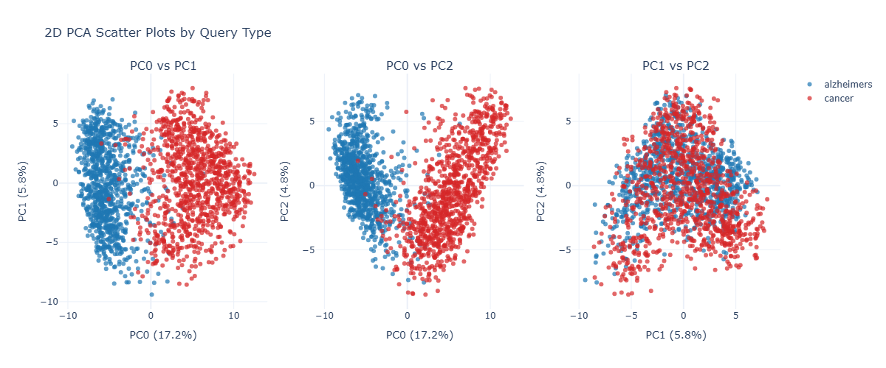
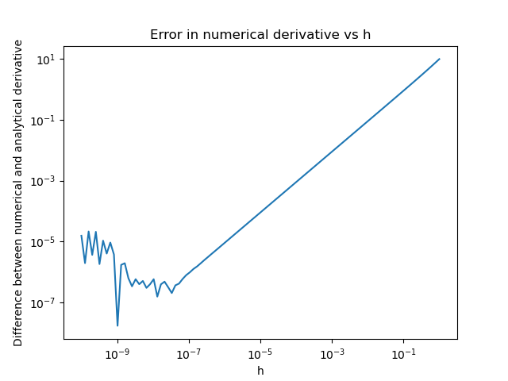
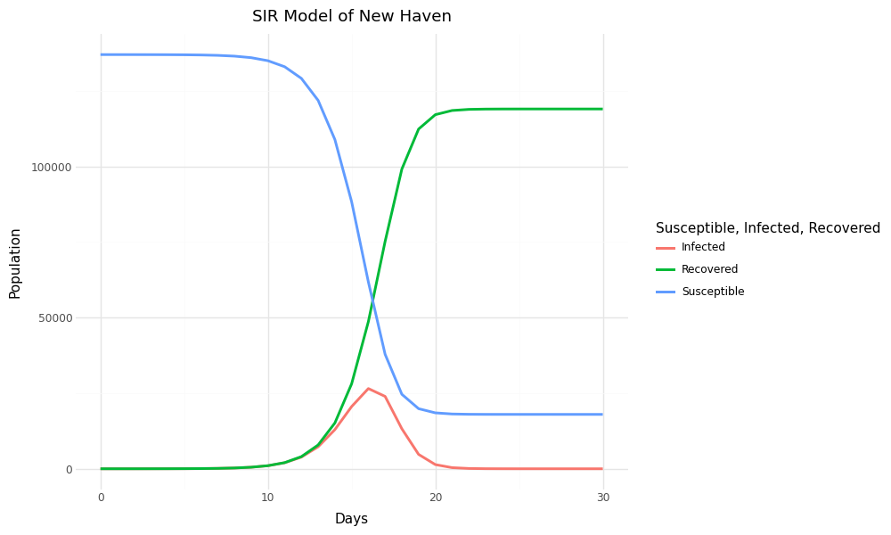
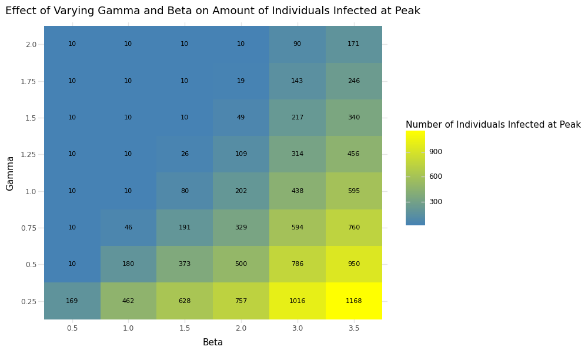
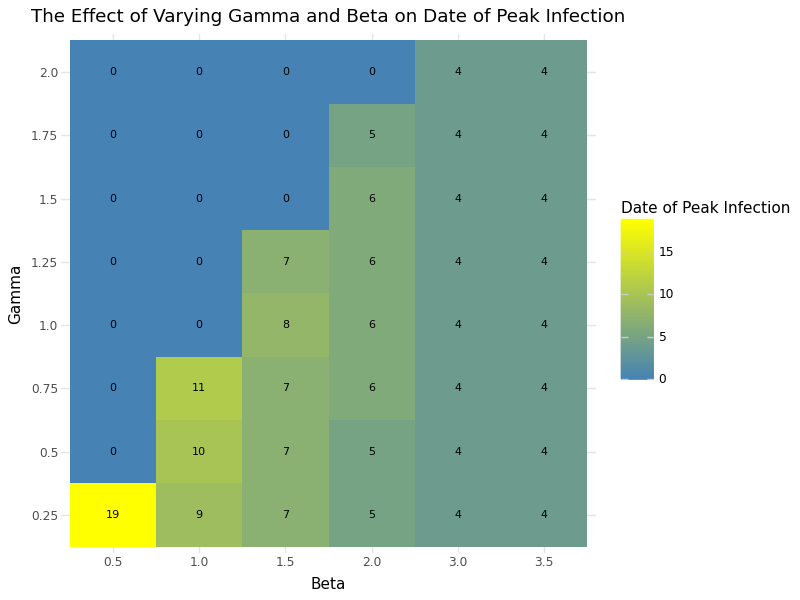
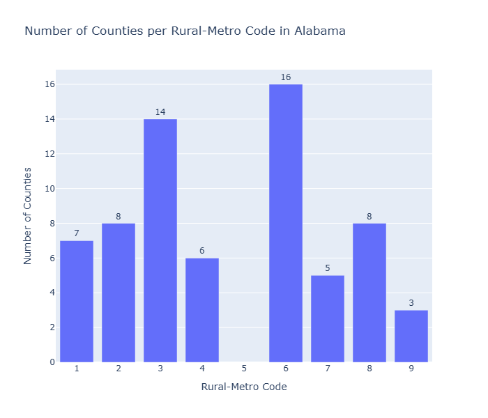
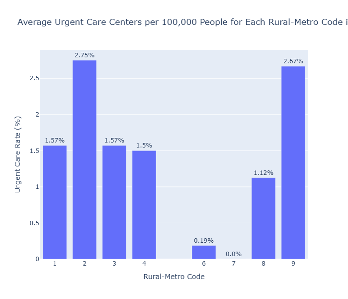

## Problem 1 ##
**a.** I used the API to fetch 1000 Alzheimer's papers and 1000 cancer papers from 2024. I stored all the PubMed ids for each in their own list. 

```python
# find 1000 alz articles 
base_url = "https://eutils.ncbi.nlm.nih.gov/entrez/eutils/esearch.fcgi"
params = {
    "db": "pubmed",
    "term": "Alzheimers AND 2024[pdat]",
    "retmax": "1000",
    "retmode": "xml"
}

response = requests.get(base_url, params=params)
root = ElementTree.fromstring(response.text)

alz_ids = [id_elem.text for id_elem in root.findall(".//Id")]
print(f"Found {len(alz_ids)} Alzheimers articles.")
print(alz_ids[:10])  # show first 10 IDs
```

```python
# found all 1000 cancer papers
base_url = "https://eutils.ncbi.nlm.nih.gov/entrez/eutils/esearch.fcgi"
params = {
    "db": "pubmed", # from PubMed
    "term": "cancer AND 2024[pdat]", #cancer
    "retmax": "1000", # only send 1000 articles
    "retmode": "xml" # sends in xml format
}

response = requests.get(base_url, params=params)
root = ElementTree.fromstring(response.text)

cancer_ids = [id_elem.text for id_elem in root.findall(".//Id")]
print(f"Found {len(cancer_ids)} cancer articles.")
print(cancer_ids[:10])  # show first 10 IDs
```

**b.**
I pulled the article title, the abstract text, journal title, Pubmed ID (PMID), and year of publication of each article. I made my code robust to be able to parse article titles that were in italics and bold and to pull all abstracts, even if they were structured. It runs on batches of 200 pulled PMIDs at a time with a 1 second sleep in between to respect pull rate limits. All the metadata stores in a list; any PMIDs that failed to be pulled are stored in a list; and all individual PMIDs are stored in a list for use in future problems. 
Originally, I had 1000 Alzheimer's articles being collected and only 999 cancer articles, so I included many sanity checks in case a PMID's metadata fails to be pulled (the one cancer paper was a book chapter so it was not classified as an article). I also have a f-string at the end that prints how many articles had metadata pulled and any PMIDs that failed.

```python
fetch_url = "https://eutils.ncbi.nlm.nih.gov/entrez/eutils/efetch.fcgi"
all_alz_metadata = []
failed_pmids = []
alz_pmids =[]

for i in range(0, len(alz_ids), 200):  # batches of 200
    batch_ids = ",".join(alz_ids[i:i+200])
    fetch_params = {
        "db": "pubmed",
        "id": batch_ids,
        "retmode": "xml"
    }
    try:
        fetch_response = requests.get(fetch_url, params=fetch_params, timeout=30)
        fetch_response.raise_for_status()
        root = ElementTree.fromstring(fetch_response.text)
    except Exception as e:
        print(f"Error fetching batch {i//200+1}: {e}")
        continue

    for article in root:
        try:
            title_elem = article.find(".//ArticleTitle")
            abstract_elems = article.findall(".//Abstract/AbstractText")
            journal_elem = article.find(".//Journal/Title")
            pmid_elem = article.find(".//PMID")
            date_elem = article.find(".//PubDate/Year")

            title_text = (
                ElementTree.tostring(title_elem, method="text", encoding="unicode").strip()
                if title_elem is not None
                else None
            )
            abstract_text = (
                " ".join(
                    ElementTree.tostring(elem, method="text", encoding="unicode").strip()
                    if elem.get("Label") else ElementTree.tostring(elem, method="text", encoding="unicode").strip()
                    for elem in abstract_elems
            )
            if abstract_elems
            else None
            )

            metadata = {
                "PMID": pmid_elem.text if pmid_elem is not None else None,
                "ArticleTitle": title_text,
                "AbstractText": abstract_text,
                "Journal": journal_elem.text if journal_elem is not None else None,
                "YearPublished": date_elem.text if date_elem is not None else None
            }
            all_alz_metadata.append(metadata)
            alz_pmids.append(metadata['PMID'])
        except Exception as e:
            pmid_text = pmid_elem.text if pmid_elem is not None else "UNKNOWN"
            print(f"Error parsing article PMID {pmid_text}: {e}")
            failed_pmids.append(pmid_text)
            continue

    time.sleep(1)

print(f"Retrieved metadata for {len(all_alz_metadata)} Alzheimers articles.")
print(f"Failed PMIDs in first pass: {len(failed_pmids)}")
```

```python
# fetch metadata for the 1000 cancer
fetch_url = "https://eutils.ncbi.nlm.nih.gov/entrez/eutils/efetch.fcgi"
all_cancer_metadata = []
failed_pmids = []
cancer_pmids =[]

for i in range(0, len(cancer_ids), 200):  # batches of 200
    batch_ids = ",".join(cancer_ids[i:i+200])
    fetch_params = {
        "db": "pubmed",
        "id": batch_ids,
        "retmode": "xml"
    }
    try:
        fetch_response = requests.get(fetch_url, params=fetch_params, timeout=30)
        fetch_response.raise_for_status()
        root = ElementTree.fromstring(fetch_response.text)
    except Exception as e:
        print(f"Error fetching batch {i//200+1}: {e}")
        continue

    for article in root:
        try:
            title_elem = article.find(".//ArticleTitle")
            abstract_elems = article.findall(".//Abstract/AbstractText")
            journal_elem = article.find(".//Journal/Title")
            pmid_elem = article.find(".//PMID")
            date_elem = article.find(".//PubDate/Year")

            title_text = (
                ElementTree.tostring(title_elem, method="text", encoding="unicode").strip()
                if title_elem is not None
                else None
            )
            abstract_text = (
                " ".join(
                    ElementTree.tostring(elem, method="text", encoding="unicode").strip()
                    if elem.get("Label") else ElementTree.tostring(elem, method="text", encoding="unicode").strip()
                    for elem in abstract_elems
            )
            if abstract_elems
            else None
            )

            metadata = {
                "PMID": pmid_elem.text if pmid_elem is not None else None,
                "ArticleTitle": title_text,
                "AbstractText": abstract_text,
                "Journal": journal_elem.text if journal_elem is not None else None,
                "YearPublished": date_elem.text if date_elem is not None else None
            }
            all_cancer_metadata.append(metadata)
            cancer_pmids.append(metadata['PMID'])
        except Exception as e:
            pmid_text = pmid_elem.text if pmid_elem is not None else "UNKNOWN"
            print(f"Error parsing article PMID {pmid_text}: {e}")
            failed_pmids.append(pmid_text)
            continue

    time.sleep(1)

print(f"Retrieved metadata for {len(all_cancer_metadata)} Cancer articles.")
print(f"Failed PMIDs in first pass: {len(failed_pmids)}")
```

I then saved the metadata for each set of papers in their own JSON dictionary and combined them all into one JSON dictionary

```python
# make alzheimer's metadata json

json_alz_metadata = json.dumps(all_alz_metadata, indent=2)
print(json_alz_metadata[:500])

# make cancer's metadata json

json_cancer_metadata = json.dumps(all_cancer_metadata, indent=2)
print(json_cancer_metadata[:500])
print(type(json_cancer_metadata))

# one big json of both metadata

all_paper_metadata = all_alz_metadata + all_cancer_metadata

json_all_metadata = json.dumps(all_paper_metadata, indent=2)
print(json_all_metadata[:500])
```

**c.**
To identify if there are any overlapping papers, I utilized the PMID lists made in the original pull of the metadata. I combined both lists into one variable then checked that variable for only unique instance. I also tested this by returning the PMIDs of the overlapping paper and ensuring one was in both lists. 
**Overall there were 1996 unique papers, meaning 4 overlapped. The PMIDs of the overlapping articles are: '40326981', '40800467', '40949928', '40395755',**

```python
# check for overlapping papers by combining all 

all_pmids = cancer_pmids + alz_pmids

all_pmids_unique = list(dict.fromkeys(all_pmids))

print(f"Total combined PMIDs: {len(all_pmids)}")
print(f"Unique PMIDs: {len(all_pmids_unique)}")
returned Total combined PMIDs: 2000
Unique PMIDs: 1996

# find specific pmids overlapping
cancer_set = set(cancer_pmids) # convert to set because they're ordered
alz_set = set(alz_pmids)

# Find overlapping PMIDs
overlapping_pmids = cancer_set.intersection(alz_set) # pulls out duplicated
print(overlapping_pmids) # print pmids found in both
returned {'40326981', '40800467', '40949928', '40395755'}

# check one of the pmids is in both 

print('40326981' in cancer_pmids)
print('40326981' in alz_pmids)
returned True and True
```

**d.**
I have in my original implementation of pulling metadata that it will pull all of the abstract, even if it is broken down into labeled sections. It will also include and keep the label included in the abstract. 
This does return none if there are papers without abstracts, which there are many. It should be robust to abstracts that include bold or italics letters because I built it the same as the titles. It should also be able to handle abstracts with multiple label tags and collect all of them. 
**Some limitations are that if the abstract does not use labels or calls the attribute something else, my code may miss them.**

**Sources**
[1] I used ChatGPT to edit the API call given on the class slides and make it useable for this problem [2] Asked ChatGPT how to make a for loop for getting the metadata for each article gathered earlier. Also used to ensure adding in elements of time.sleep, gathering of structured abstracts, and special titles. Used it to trouble shoot when one cancer article's metadata was missing - what the article was and what could be the problem (it was a book chapter, not an article) [3] Used ChatGPT to make the json dictionaries [4] Used ChatGPT to drop the duplicate pmid in the overall list

## Problem 2 ##
I installed Pytorch, huggingface, and the SPECTER model given. I pulled in the cancer and Alzheimer's papers just as was done in 1. 

```python
# pull in 1000 alz articles
base_url = "https://eutils.ncbi.nlm.nih.gov/entrez/eutils/esearch.fcgi"
params = {
    "db": "pubmed",
    "term": "Alzheimers AND 2024[pdat]",
    "retmax": "1000",
    "retmode": "xml"
}

response = requests.get(base_url, params=params)
root = ElementTree.fromstring(response.text)

alz_ids = [id_elem.text for id_elem in root.findall(".//Id")]
print(f"Found {len(alz_ids)} Alzheimers articles.")

# pull in 1000 cancer paper

base_url = "https://eutils.ncbi.nlm.nih.gov/entrez/eutils/esearch.fcgi"
params = {
    "db": "pubmed", # from PubMed
    "term": "cancer AND 2024[pdat]", #cancer
    "retmax": "1000", # only send 1000 articles
    "retmode": "xml" # sends in xml format
}

response = requests.get(base_url, params=params)
root = ElementTree.fromstring(response.text)

cancer_ids = [id_elem.text for id_elem in root.findall(".//Id")]
print(f"Found {len(cancer_ids)} cancer articles.")
```
Pulled in metadata again as well.
```python

# fetch metadata for the 1000 alzheimers
fetch_url = "https://eutils.ncbi.nlm.nih.gov/entrez/eutils/efetch.fcgi"
all_alz_metadata = []
failed_pmids = []
alz_pmids =[]

for i in range(0, len(alz_ids), 200):  # batches of 200
    batch_ids = ",".join(alz_ids[i:i+200])
    fetch_params = {
        "db": "pubmed",
        "id": batch_ids,
        "retmode": "xml"
    }
    try:
        fetch_response = requests.get(fetch_url, params=fetch_params, timeout=30)
        fetch_response.raise_for_status()
        root = ElementTree.fromstring(fetch_response.text)
    except Exception as e:
        print(f"Error fetching batch {i//200+1}: {e}")
        continue

    for article in root:
        try:
            title_elem = article.find(".//ArticleTitle")
            abstract_elems = article.findall(".//Abstract/AbstractText")
            journal_elem = article.find(".//Journal/Title")
            pmid_elem = article.find(".//PMID")
            date_elem = article.find(".//PubDate/Year")

            title_text = (
                ElementTree.tostring(title_elem, method="text", encoding="unicode").strip()
                if title_elem is not None
                else None
            )
            abstract_text = (
                " ".join(
                    ElementTree.tostring(elem, method="text", encoding="unicode").strip()
                    if elem.get("Label") else ElementTree.tostring(elem, method="text", encoding="unicode").strip()
                    for elem in abstract_elems
            )
            if abstract_elems
            else None
            )

            metadata = {
                "PMID": pmid_elem.text if pmid_elem is not None else None,
                "ArticleTitle": title_text,
                "AbstractText": abstract_text,
                "Journal": journal_elem.text if journal_elem is not None else None,
                "YearPublished": date_elem.text if date_elem is not None else None
            }
            all_alz_metadata.append(metadata)
            alz_pmids.append(metadata['PMID'])
        except Exception as e:
            pmid_text = pmid_elem.text if pmid_elem is not None else "UNKNOWN"
            print(f"Error parsing article PMID {pmid_text}: {e}")
            failed_pmids.append(pmid_text)
            continue

    time.sleep(1)

print(f"Retrieved metadata for {len(all_alz_metadata)} Alzheimers articles.")
print(f"Failed PMIDs in first pass: {len(failed_pmids)}")


# fetch metadata for the 1000 cancer
fetch_url = "https://eutils.ncbi.nlm.nih.gov/entrez/eutils/efetch.fcgi"
all_cancer_metadata = []
failed_pmids = []
cancer_pmids =[]

for i in range(0, len(cancer_ids), 200):  # batches of 200
    batch_ids = ",".join(cancer_ids[i:i+200])
    fetch_params = {
        "db": "pubmed",
        "id": batch_ids,
        "retmode": "xml"
    }
    try:
        fetch_response = requests.get(fetch_url, params=fetch_params, timeout=30)
        fetch_response.raise_for_status()
        root = ElementTree.fromstring(fetch_response.text)
    except Exception as e:
        print(f"Error fetching batch {i//200+1}: {e}")
        continue

    for article in root:
        try:
            title_elem = article.find(".//ArticleTitle")
            abstract_elems = article.findall(".//Abstract/AbstractText")
            journal_elem = article.find(".//Journal/Title")
            pmid_elem = article.find(".//PMID")
            date_elem = article.find(".//PubDate/Year")

            title_text = (
                ElementTree.tostring(title_elem, method="text", encoding="unicode").strip()
                if title_elem is not None
                else None
            )
            abstract_text = (
                " ".join(
                    ElementTree.tostring(elem, method="text", encoding="unicode").strip()
                    if elem.get("Label") else ElementTree.tostring(elem, method="text", encoding="unicode").strip()
                    for elem in abstract_elems
            )
            if abstract_elems
            else None
            )

            metadata = {
                "PMID": pmid_elem.text if pmid_elem is not None else None,
                "ArticleTitle": title_text,
                "AbstractText": abstract_text,
                "Journal": journal_elem.text if journal_elem is not None else None,
                "YearPublished": date_elem.text if date_elem is not None else None
            }
            all_cancer_metadata.append(metadata)
            cancer_pmids.append(metadata['PMID'])
        except Exception as e:
            pmid_text = pmid_elem.text if pmid_elem is not None else "UNKNOWN"
            print(f"Error parsing article PMID {pmid_text}: {e}")
            failed_pmids.append(pmid_text)
            continue

    time.sleep(1)

print(f"Retrieved metadata for {len(all_cancer_metadata)} Cancer articles.")
print(f"Failed PMIDs in first pass: {len(failed_pmids)}")
```

I added a column named 'query' to be used later in the application of PCA - all the Alzheimer's papers would be tagged with 'Alzheimer's' and all cancer papers would be tagged with 'cancer.'
```python
for paper in all_alz_metadata:
    paper["query"] = "alzheimers"

for paper in all_cancer_metadata:
    paper["query"] = "cancer"
```

I combined both lists of metadata into one big list and converted all elements of the metadata into a papers dictionary.
```python
all_paper_metadata = all_alz_metadata + all_cancer_metadata
print(all_paper_metadata[:500])
print(type(all_paper_metadata))

# convert list of all papers metadata into paper dictionary
papers = {
    paper["PMID"]: {
        "ArticleTitle": paper.get("ArticleTitle", ""),
        "AbstractText": paper.get("AbstractText", ""),
        "query": paper.get('query', "")
    }
    for paper in all_paper_metadata
    if paper.get("PMID")  # only include valid PMIDs
}

print(f"Prepared {len(papers)} papers for embedding generation.") # ensure all papers were processed
``` 
1996 unique papers were processed because of the 4 duplicate papers. 

I used the process given to find the SPECTER embeddings.
```python
def get_abstract(paper):
    return paper.get("AbstractText", "") or ""

embeddings = {}
for pmid, paper in tqdm.tqdm(papers.items()):
    data = [paper["ArticleTitle"] + tokenizer.sep_token + get_abstract(paper)]
    inputs = tokenizer(
        data, padding=True, truncation=True, return_tensors="pt", max_length=512
    )
    result = model(**inputs)
    # take the first token in the batch as the embedding
    embeddings[pmid] = result.last_hidden_state[:, 0, :].detach().numpy()[0]

# turn our dictionary into a list
embeddings = [embeddings[pmid] for pmid in papers.keys()]
```
I used the sklearn module to identify the first three principal components.
```python
pca = decomposition.PCA(n_components=3)
embeddings_pca = pd.DataFrame(
    pca.fit_transform(embeddings),
    columns=['PC0', 'PC1', 'PC2']
)
embeddings_pca["query"] = [paper["query"] for paper in papers.values()]
```

I plotted scatterplots for  PC0 vs PC1, PC0 vs PC2, and PC1 vs PC2. Throughout all graphs, the Alzheimer's articles are blue and the cancer articles are red. 



**We can see in the first graph,  comparing the PC0 and PC1, there is pretty clear seperation between the two papers with minimal overlap, meaning the first principal vector found differences between the paper's embeddings. From this, we can infer that the words or structure were substantially different between the two groups. When comparing PC0 to PC2, there is less overlap at the lower end of PC2 but there is still good seperation at the top, meaning the two groups were still different but less so. In the comparison between PC1 and PC2 we see the most overlap, meaning the PCA did not find many differences in their embeddings. From this analysis, the words and structures of the papers did not have substantial variation between the groups.**

**Sources**
[1] I asked ChatGPT how to ensure that PyTorch was installed successfully and ran a test print based on that. [2] I used the same coding to pull the articles and metadata as problem 1, so any interactions with ChatGPT mentioned there are the same. [3] When I implemented the embedding given, query was not defined, so I used ChatGPT to add a query column to the metadata. Paper was not defined so I also used ChatGPT to pull the needed elements from the metadata into their own dictionary [4] Used to chart scatterplot: # https://plotly.com/python/pca-visualization/. The plot suggested returned a matrix, with more than needed analysis, so I used ChatGPT to refine to only the comparisons needed and create a more visually appealing graph. [5] Used ChatGPT to understand how to read and analyze a PCA scatterplot

## Problem 3 ##
I plotted on a log-log graph the difference between the calcutating the derivative numerically and analytically. I labeled the x axis as h or steps and the y axis as the difference between the numerical and analytic approach.



Moving from right to left on the graph, you can see that as h (or the steps) decreases, the difference (or error) also decreases. This is good and expected in the calculus world - smaller the steps, the smaller the error. 

However, we begin to see the effects of this calculation being done in the computer world in that computers don't like small numbers. We see the graph begin to look funky around 10^-8 and actually start to increase in error again despite the steps continuing to get smaller. 

This is because computers don't like super small numbers. As h gets smaller, the functions are returning incredibly small numbers and it is creating compounding error issues that are then seen on our graph.

**Sources**
[1]Troubleshooted with ChatGPT to understand if code given in slides was useful for this problem and how to create what was needed. 

## Problem 4 ##
I created a function of Euler's method that was fit for the SIR model. 
```python
def euler_SIR(S0, I0, R0, beta, gamma, Tmax, h):
    t = np.arange(0, Tmax + h, h) # giving full length of time
    n = len(t) # number of time steps

    S = np.zeros(n) # dictating how many steps 
    I = np.zeros(n)
    R = np.zeros(n)

    S[0] = S0 # setting beginning of S etc as 0
    I[0] = I0
    R[0] = R0

    N = S0 + I0 + R0 # total population

    for k in range(n - 1): # looping through time steps and calulating new derivates for each 
        dS = -beta * S[k] * I[k] / N 
        dI = beta * S[k] * I[k] / N - gamma * I[k]
        dR = gamma * I[k]

        S[k + 1] = S[k] + h*dS # updating S, I, R values for each step
        I[k + 1] = I[k] + h*dI
        R[k + 1] = R[k] + h*dR

    return t, S, I, R # returns time traversed and complete variables
```

I ran the function with a population of 137,000, who on day 0 had one infected person (and thus 136,999 people who are sucsceptible) with a disease that has a beta of 2 and a gamma of 1. 
```python
if __name__ == "__main__":
    # Parameters
    S0 = 136_999     # initial susceptible
    I0 = 1      # initial infected
    R0 = 0       # initial recovered
    beta = 2   # infection rate
    gamma = 1  # recovery rate
    Tmax = 30   # days
    h = 1     # step size

    t, S, I, R = euler_SIR(S0, I0, R0, beta, gamma, Tmax, h)

results = pd.DataFrame({
    'Time': t,
    'Susceptible': S,
    'Infected': I,
    'Recovered': R
})
```

To graph the time course of the disease, I first had to melt the data and determine when the number of infected people dropped below 1 to set my x-axis. 
```python
results_plot = results.melt(id_vars=['Time'],value_vars=['Susceptible', 'Infected', 'Recovered'], var_name='SIR', value_name='Population')
print(results_plot.head())

results.loc[results['Infected'] <1, 'Time'].min()
# the Infected rate drops below 1 on Day 26 - this code is not robust to if the rate of infection falls to 1 then jumps back up
```


I determined when the peak was and how many people were infected on that day. **The peak was day 16 and 26,534 people were infected.** I made my code so it it rounded up the number of people infected because you cannot have a decimal of a person. I also made it robust for if there are multiple peak days. 

```python 
peak_day = results.loc[results['Infected'].idxmax(), 'Time']
print(f"Peak date: Day {peak_day}")

max_infected = results['Infected'].max()
peak_days = results.loc[results['Infected'] == max_infected, 'Time'].tolist()

print(f"Peak days: {peak_days}")

number_peak = results.loc[peak_day, 'Infected']
print(f"Number of infected individuals at peak:{number_peak: .2f}")

whole_number_peak=math.ceil(number_peak)
print(f"Rounding up, the number of individuals infected at the peak is {whole_number_peak}")
```
I varied beta and gamma: beta [0.5, 1.0, 1.5, 2.0, 1.5, 3.0, 3.5 ], gamma [0.25, 0.5, 0.75, 1.0, 1.25, 1.50, 1.75, 2.0]. Beta is the rate of infection and gamma is the rate of recovery. With a high beta, the infection is spreading fast so we see a relativley early infection peak but a lot of people getting infected. With a low beta, the infection is not spreading very fast and if this is combined with a high gamma meaning people are recovering fast, the disease will die out and peak on day 0 with that initial person. We see the highest number of infected inidividuals when the disease spreads fast (high beta) and the recovery rate is slow (low gamma). We see the longest disease course when the disease spreads slow (low gamma) and people recover slow (low gamma).





**Sources**
[1] Used ChatGPT and VSCode Copilot AI to create a function of Euler's method that was fit for the SIR model. [2] Used ChatGPT to ensure I melted my data correctly and correct errors [3] Used ChatGPT to fix numpy output of finding peak days and make it robust to if the peak occured twice. [4] Used ChatGPT to round up decimal places. [5] Used ChatGPT to ensure I was varying the beta and gammas and check they were all running. [6] Used ChatGPT to create a for loop that stored all combinations of beta and gamma varying with the date of peak and number infected at peak in their own dataframe. [7] https://enjoymachinelearning.com/blog/heatmap-python/. Uesd this to start heat map and refined with ChatGPT. 
 
## Problem 5 ##
I did data exploration on the dataset I identified previously - the SDOH from the AHRQ. **The AHRQ-SDOH collects data from many different surveys and compiles them in one place, but they are are government surveys and therefore freely available for use by the public.** I specifically explored the data from 2020 stratified by county. 

There was minimal data cleaning to do. All columns names were in a good format - they're not inherantly understandable but I have the codebook. All values were in correct units. I identified the variables I was likely to want to focus on and deleted unnecessary columns while it was in Excel format. I left about 100 columns that I could focus on for my project but I will not be able to analyze them all. 

I wanted to focus on one state so I picked Alabama. In Python, I dropped all rows that were not from Alabama and any unnesecarry columns, like region. Because there are limited missing values, I built a robust string that will track where the missing values are and fill with NA so I know for later measurements. For all counties in Alabama, there was only one missing value in the rate of mental providers per 100,000 people - I will likely not use this variable so missing data did not affect my analysis. 
```python
#drop every state that is not Alabama
data1 = data1[data1['STATE']=='Alabama']

data1 = data1.drop(columns=['COUNTYFIPS', 'STATEFIPS', 'REGION'])
data1.head()

# Count how many missing values exist before filling
missing_count = data1.isna().sum().sum()

# get location of each missing value
missing_locations = data1.isna()
rows, cols = np.where(missing_locations)
for r, c in zip(rows, cols):
    print(f"Missing value at row {r}, column '{data1.columns[c]}'")

# Fill all missing values with "NA"
data1 = data1.fillna("NA")

print(f"Filled {missing_count} missing values with 'NA'.")
```
I wanted to look at how many counties in Alabama were classified as each rural code. I made a bar graph to understand the distribution. We can see that the most common county classification in Alabama is 6 - 2,500 to 19,999 people and adjacent to a metro area. Within the classification system, 1-3 is considered metro and 3-9 is considered non-metro with 9 being the most rural classification. We can tell from the bar graph that there is pretty even distribution at both ends of the spectrum, but there are little to no counties in the middle. Specifically there are no counties with a 5 classification. 



I wanted to look at the availability in resources across each classification code. I made a bar graph to show the average urgent care rate per 100,000 population for each rural classification. I used the rate of urgent cares per 100,000 people in hopes of normalizing across the very different populations amounts and I averaged these rates to account for differing amounts of counties in each classification. One would expect that because rural counties have seen many of their inpatient hospitals close and the average distance needed to travel for healthcare services increase, the rate of urgent cares would also be less for rural populuations [1]. While the highest availability of urgent care centers is counties with a 2 classification, which is considered metro, it is closly followed by counties with a 9 classification, which is the most rural. 



**Sources**
[1] https://www.gao.gov/products/gao-21-93[2] I used ChatGPT to produce correct coding syntax of what I wanted to drop or specify within my data frames. [3] Used ChatGPT to help in creating plotly graphs.

## Code Appendix ##
**Problem 1**
```python
# %%
# !pip install requests

import requests
from xml.etree import ElementTree
import json
import pprint
import time
import aiohttp
import asyncio

# %%
#asked ChatGPT how to tweak the API call so it is useable in python

# find 1000 alz articles 
base_url = "https://eutils.ncbi.nlm.nih.gov/entrez/eutils/esearch.fcgi"
params = {
    "db": "pubmed",
    "term": "Alzheimers AND 2024[pdat]",
    "retmax": "1000",
    "retmode": "xml"
}

response = requests.get(base_url, params=params)
root = ElementTree.fromstring(response.text)

alz_ids = [id_elem.text for id_elem in root.findall(".//Id")]
print(f"Found {len(alz_ids)} Alzheimers articles.")
print(alz_ids[:10])  # show first 10 IDs

# %%
# found all 1000 cancer papers

base_url = "https://eutils.ncbi.nlm.nih.gov/entrez/eutils/esearch.fcgi"
params = {
    "db": "pubmed", # from PubMed
    "term": "cancer AND 2024[pdat]", #cancer
    "retmax": "1000", # only send 1000 articles
    "retmode": "xml" # sends in xml format
}

response = requests.get(base_url, params=params)
root = ElementTree.fromstring(response.text)

cancer_ids = [id_elem.text for id_elem in root.findall(".//Id")]
print(f"Found {len(cancer_ids)} cancer articles.")
print(cancer_ids[:10])  # show first 10 IDs


# %%
# asked ChatGPT how to now get metadata for each article ID fetched earlier
# used ChatGPT to add the time.sleep portion, add article id title being pulled for metadata

# fetch metadata for the 1000 alzheimers
fetch_url = "https://eutils.ncbi.nlm.nih.gov/entrez/eutils/efetch.fcgi"
all_alz_metadata = []
failed_pmids = []
alz_pmids =[]

for i in range(0, len(alz_ids), 200):  # batches of 200
    batch_ids = ",".join(alz_ids[i:i+200])
    fetch_params = {
        "db": "pubmed",
        "id": batch_ids,
        "retmode": "xml"
    }
    try:
        fetch_response = requests.get(fetch_url, params=fetch_params, timeout=30)
        fetch_response.raise_for_status()
        root = ElementTree.fromstring(fetch_response.text)
    except Exception as e:
        print(f"Error fetching batch {i//200+1}: {e}")
        continue

    for article in root:
        try:
            title_elem = article.find(".//ArticleTitle")
            abstract_elems = article.findall(".//Abstract/AbstractText")
            journal_elem = article.find(".//Journal/Title")
            pmid_elem = article.find(".//PMID")
            date_elem = article.find(".//PubDate/Year")

            title_text = (
                ElementTree.tostring(title_elem, method="text", encoding="unicode").strip()
                if title_elem is not None
                else None
            )
            abstract_text = (
                " ".join(
                    ElementTree.tostring(elem, method="text", encoding="unicode").strip()
                    if elem.get("Label") else ElementTree.tostring(elem, method="text", encoding="unicode").strip()
                    for elem in abstract_elems
            )
            if abstract_elems
            else None
            )

            metadata = {
                "PMID": pmid_elem.text if pmid_elem is not None else None,
                "ArticleTitle": title_text,
                "AbstractText": abstract_text,
                "Journal": journal_elem.text if journal_elem is not None else None,
                "YearPublished": date_elem.text if date_elem is not None else None
            }
            all_alz_metadata.append(metadata)
            alz_pmids.append(metadata['PMID'])
        except Exception as e:
            pmid_text = pmid_elem.text if pmid_elem is not None else "UNKNOWN"
            print(f"Error parsing article PMID {pmid_text}: {e}")
            failed_pmids.append(pmid_text)
            continue

    time.sleep(1)

print(f"Retrieved metadata for {len(all_alz_metadata)} Alzheimers articles.")
print(f"Failed PMIDs in first pass: {len(failed_pmids)}")


# %%
# asked ChatGPT how to now get metadata for each article ID fetched earlier
# used ChatGPT to add the time.sleep portion, add article id title being pulled for metadata

# fetch metadata for the 1000 cancer
fetch_url = "https://eutils.ncbi.nlm.nih.gov/entrez/eutils/efetch.fcgi"
all_cancer_metadata = []
failed_pmids = []
cancer_pmids =[]

for i in range(0, len(cancer_ids), 200):  # batches of 200
    batch_ids = ",".join(cancer_ids[i:i+200])
    fetch_params = {
        "db": "pubmed",
        "id": batch_ids,
        "retmode": "xml"
    }
    try:
        fetch_response = requests.get(fetch_url, params=fetch_params, timeout=30)
        fetch_response.raise_for_status()
        root = ElementTree.fromstring(fetch_response.text)
    except Exception as e:
        print(f"Error fetching batch {i//200+1}: {e}")
        continue

    for article in root:
        try:
            title_elem = article.find(".//ArticleTitle")
            abstract_elems = article.findall(".//Abstract/AbstractText")
            journal_elem = article.find(".//Journal/Title")
            pmid_elem = article.find(".//PMID")
            date_elem = article.find(".//PubDate/Year")

            title_text = (
                ElementTree.tostring(title_elem, method="text", encoding="unicode").strip()
                if title_elem is not None
                else None
            )
            abstract_text = (
                " ".join(
                    ElementTree.tostring(elem, method="text", encoding="unicode").strip()
                    if elem.get("Label") else ElementTree.tostring(elem, method="text", encoding="unicode").strip()
                    for elem in abstract_elems
            )
            if abstract_elems
            else None
            )

            metadata = {
                "PMID": pmid_elem.text if pmid_elem is not None else None,
                "ArticleTitle": title_text,
                "AbstractText": abstract_text,
                "Journal": journal_elem.text if journal_elem is not None else None,
                "YearPublished": date_elem.text if date_elem is not None else None
            }
            all_cancer_metadata.append(metadata)
            cancer_pmids.append(metadata['PMID'])
        except Exception as e:
            pmid_text = pmid_elem.text if pmid_elem is not None else "UNKNOWN"
            print(f"Error parsing article PMID {pmid_text}: {e}")
            failed_pmids.append(pmid_text)
            continue

    time.sleep(1)

print(f"Retrieved metadata for {len(all_cancer_metadata)} Cancer articles.")
print(f"Failed PMIDs in first pass: {len(failed_pmids)}")


# %%
# make alzheimer's metadata json

json_alz_metadata = json.dumps(all_alz_metadata, indent=2)
print(json_alz_metadata[:500])

# %%
# make cancer's metadata json

json_cancer_metadata = json.dumps(all_cancer_metadata, indent=2)
print(json_cancer_metadata[:500])
print(type(json_cancer_metadata))

# %%
# one big json of both metadata

all_paper_metadata = all_alz_metadata + all_cancer_metadata

json_all_metadata = json.dumps(all_paper_metadata, indent=2)
print(json_all_metadata[:500])


# %%
# Used ChatGPT to drop the duplicate pmid in the overall list
# check for overlapping papers by combining all 

all_pmids = cancer_pmids + alz_pmids

all_pmids_unique = list(dict.fromkeys(all_pmids))

print(f"Total combined PMIDs: {len(all_pmids)}")
print(f"Unique PMIDs: {len(all_pmids_unique)}")
print(all)

# %%
# find specific pmids overlapping
cancer_set = set(cancer_pmids) # conver to set because they're ordered
alz_set = set(alz_pmids)

# Find overlapping PMIDs
overlapping_pmids = cancer_set.intersection(alz_set) # pulls out duplicated
print(overlapping_pmids) # print pmids found in both

# %%
# check one of the pmids is in both 

print('40326981' in cancer_pmids)
print('40326981' in alz_pmids)
```

**Problem 2**
```python
# %%
# ! pip install -U kaleido
# !pip install -U plotly

# %%
import requests
from xml.etree import ElementTree
import json
import pprint
import time
import aiohttp
import asyncio
import tqdm
from sklearn import decomposition
import pandas as pd
import plotly.express as px
from sklearn.decomposition import PCA

# %%
# installed PyTorch
# ! pip install torch torchvision

# %%
# insured torch installed correctly
# asked ChatGPT how to guarentee it worked
import torch
print(torch.__version__)
print("CUDA available:", torch.cuda.is_available())


# %%
# installed huggingfacefrom transformers import AutoTokenizer, AutoModel

# ! pip install transformers

# %%
# from McDougal

from transformers import AutoTokenizer, AutoModel

# load model and tokenizer
tokenizer = AutoTokenizer.from_pretrained('allenai/specter')
model = AutoModel.from_pretrained('allenai/specter')

# %%
# pull in 1000 alz articles
base_url = "https://eutils.ncbi.nlm.nih.gov/entrez/eutils/esearch.fcgi"
params = {
    "db": "pubmed",
    "term": "Alzheimers AND 2024[pdat]",
    "retmax": "1000",
    "retmode": "xml"
}

response = requests.get(base_url, params=params)
root = ElementTree.fromstring(response.text)

alz_ids = [id_elem.text for id_elem in root.findall(".//Id")]
print(f"Found {len(alz_ids)} Alzheimers articles.")

# %%
# pull in 1000 cancer paper

base_url = "https://eutils.ncbi.nlm.nih.gov/entrez/eutils/esearch.fcgi"
params = {
    "db": "pubmed", # from PubMed
    "term": "cancer AND 2024[pdat]", #cancer
    "retmax": "1000", # only send 1000 articles
    "retmode": "xml" # sends in xml format
}

response = requests.get(base_url, params=params)
root = ElementTree.fromstring(response.text)

cancer_ids = [id_elem.text for id_elem in root.findall(".//Id")]
print(f"Found {len(cancer_ids)} cancer articles.")

# %%
# asked ChatGPT how to now get metadata for each article ID fetched earlier
# used ChatGPT to add the time.sleep portion, add article id title being pulled for metadata

# fetch metadata for the 1000 alzheimers
fetch_url = "https://eutils.ncbi.nlm.nih.gov/entrez/eutils/efetch.fcgi"
all_alz_metadata = []
failed_pmids = []
alz_pmids =[]

for i in range(0, len(alz_ids), 200):  # batches of 200
    batch_ids = ",".join(alz_ids[i:i+200])
    fetch_params = {
        "db": "pubmed",
        "id": batch_ids,
        "retmode": "xml"
    }
    try:
        fetch_response = requests.get(fetch_url, params=fetch_params, timeout=30)
        fetch_response.raise_for_status()
        root = ElementTree.fromstring(fetch_response.text)
    except Exception as e:
        print(f"Error fetching batch {i//200+1}: {e}")
        continue

    for article in root:
        try:
            title_elem = article.find(".//ArticleTitle")
            abstract_elems = article.findall(".//Abstract/AbstractText")
            journal_elem = article.find(".//Journal/Title")
            pmid_elem = article.find(".//PMID")
            date_elem = article.find(".//PubDate/Year")

            title_text = (
                ElementTree.tostring(title_elem, method="text", encoding="unicode").strip()
                if title_elem is not None
                else None
            )
            abstract_text = (
                " ".join(
                    ElementTree.tostring(elem, method="text", encoding="unicode").strip()
                    if elem.get("Label") else ElementTree.tostring(elem, method="text", encoding="unicode").strip()
                    for elem in abstract_elems
            )
            if abstract_elems
            else None
            )

            metadata = {
                "PMID": pmid_elem.text if pmid_elem is not None else None,
                "ArticleTitle": title_text,
                "AbstractText": abstract_text,
                "Journal": journal_elem.text if journal_elem is not None else None,
                "YearPublished": date_elem.text if date_elem is not None else None
            }
            all_alz_metadata.append(metadata)
            alz_pmids.append(metadata['PMID'])
        except Exception as e:
            pmid_text = pmid_elem.text if pmid_elem is not None else "UNKNOWN"
            print(f"Error parsing article PMID {pmid_text}: {e}")
            failed_pmids.append(pmid_text)
            continue

    time.sleep(1)

print(f"Retrieved metadata for {len(all_alz_metadata)} Alzheimers articles.")
print(f"Failed PMIDs in first pass: {len(failed_pmids)}")


# %%
# asked ChatGPT how to now get metadata for each article ID fetched earlier
# used ChatGPT to add the time.sleep portion, add article id title being pulled for metadata

# fetch metadata for the 1000 cancer
fetch_url = "https://eutils.ncbi.nlm.nih.gov/entrez/eutils/efetch.fcgi"
all_cancer_metadata = []
failed_pmids = []
cancer_pmids =[]

for i in range(0, len(cancer_ids), 200):  # batches of 200
    batch_ids = ",".join(cancer_ids[i:i+200])
    fetch_params = {
        "db": "pubmed",
        "id": batch_ids,
        "retmode": "xml"
    }
    try:
        fetch_response = requests.get(fetch_url, params=fetch_params, timeout=30)
        fetch_response.raise_for_status()
        root = ElementTree.fromstring(fetch_response.text)
    except Exception as e:
        print(f"Error fetching batch {i//200+1}: {e}")
        continue

    for article in root:
        try:
            title_elem = article.find(".//ArticleTitle")
            abstract_elems = article.findall(".//Abstract/AbstractText")
            journal_elem = article.find(".//Journal/Title")
            pmid_elem = article.find(".//PMID")
            date_elem = article.find(".//PubDate/Year")

            title_text = (
                ElementTree.tostring(title_elem, method="text", encoding="unicode").strip()
                if title_elem is not None
                else None
            )
            abstract_text = (
                " ".join(
                    ElementTree.tostring(elem, method="text", encoding="unicode").strip()
                    if elem.get("Label") else ElementTree.tostring(elem, method="text", encoding="unicode").strip()
                    for elem in abstract_elems
            )
            if abstract_elems
            else None
            )

            metadata = {
                "PMID": pmid_elem.text if pmid_elem is not None else None,
                "ArticleTitle": title_text,
                "AbstractText": abstract_text,
                "Journal": journal_elem.text if journal_elem is not None else None,
                "YearPublished": date_elem.text if date_elem is not None else None
            }
            all_cancer_metadata.append(metadata)
            cancer_pmids.append(metadata['PMID'])
        except Exception as e:
            pmid_text = pmid_elem.text if pmid_elem is not None else "UNKNOWN"
            print(f"Error parsing article PMID {pmid_text}: {e}")
            failed_pmids.append(pmid_text)
            continue

    time.sleep(1)

print(f"Retrieved metadata for {len(all_cancer_metadata)} Cancer articles.")
print(f"Failed PMIDs in first pass: {len(failed_pmids)}")


# %%
for paper in all_alz_metadata:
    paper["query"] = "alzheimers"

for paper in all_cancer_metadata:
    paper["query"] = "cancer"

# %%
# combine all metadata
all_paper_metadata = all_alz_metadata + all_cancer_metadata
print(all_paper_metadata[:500])
print(type(all_paper_metadata))


# %%
# ensure none are missing and everything was pulled over correctly - helpful when troubleshooting
# not needed if don't need to tuen into  json

# Missing titles
missing_titles = [p for p in all_paper_metadata if not p.get("ArticleTitle")]

# Missing abstracts
missing_abstracts = [p for p in all_paper_metadata if not p.get("AbstractText")]

# Missing PMIDs
missing_pmids = [p for p in all_paper_metadata if not p.get("PMID")]

print(f"Missing titles: {len(missing_titles)}")
print(f"Missing abstracts: {len(missing_abstracts)}")
print(f"Missing PMIDs: {len(missing_pmids)}")


# %%
# convert list of all papers metadata into paper dictionary

papers = {
    paper["PMID"]: {
        "ArticleTitle": paper.get("ArticleTitle", ""),
        "AbstractText": paper.get("AbstractText", ""),
        "query": paper.get('query', "")
    }
    for paper in all_paper_metadata
    if paper.get("PMID")  # only include valid PMIDs
}

print(f"Prepared {len(papers)} papers for embedding generation.") # ensure all papers were processed

# %%
# technically not needed anymore, was helpful for troubleshooting when weren't all pulling

missing_title = [p for p in papers.values() if not p.get("ArticleTitle")]
missing_abs = [p for p in papers.values() if not p.get("AbstractText")]

print(f"Missing titles: {len(missing_title)}")
print(f"Missing abstracts: {len(missing_abs)}")

# %%
# used ChatGPT to add the get_abstract function because error threw first time

# we can use a persistent dictionary (via shelve) so we can stop and restart if needed
# alternatively, do the same but with embeddings starting as an empty dictionary
def get_abstract(paper):
    return paper.get("AbstractText", "") or ""

embeddings = {}
for pmid, paper in tqdm.tqdm(papers.items()):
    data = [paper["ArticleTitle"] + tokenizer.sep_token + get_abstract(paper)]
    inputs = tokenizer(
        data, padding=True, truncation=True, return_tensors="pt", max_length=512
    )
    result = model(**inputs)
    # take the first token in the batch as the embedding
    embeddings[pmid] = result.last_hidden_state[:, 0, :].detach().numpy()[0]

# turn our dictionary into a list
embeddings = [embeddings[pmid] for pmid in papers.keys()]

# %%
pca = decomposition.PCA(n_components=3)
embeddings_pca = pd.DataFrame(
    pca.fit_transform(embeddings),
    columns=['PC0', 'PC1', 'PC2']
)
embeddings_pca["query"] = [paper["query"] for paper in papers.values()]

# %%
# https://plotly.com/python/pca-visualization/

labels = {
    str(i): f"PC {i+1} ({var:.1f}%)"
    for i, var in enumerate(pca.explained_variance_ratio_ * 100)
}

color_map = {
    "alzheimers": "#1f77b4",
    "cancer": "#d62728"
}

fig = px.scatter_matrix(
    embeddings_pca,
    labels=labels,
    dimensions=['PC0', 'PC1', 'PC2'],
    color='query',
    color_discrete_map=color_map
)

fig.update_traces(diagonal_visible=False)
fig.show()

# %%
# I did the above graphs and because they have extra comparisons, I asked ChatGPT to refine to only the needed analysis 

import plotly.express as px
from plotly.subplots import make_subplots
import plotly.graph_objects as go

# Define color map
color_map = {
    "alzheimers": "#1f77b4",
    "cancer": "#d62728"
}

# Define variance labels for axes
labels = {
    f"PC{i}": f"PC{i} ({var:.1f}%)"
    for i, var in enumerate(pca.explained_variance_ratio_ * 100)
}

# Create subplots — 1 row, 3 columns
fig = make_subplots(rows=1, cols=3, subplot_titles=(
    "PC0 vs PC1", "PC0 vs PC2", "PC1 vs PC2"
))

# --- Plot 1: PC0 vs PC1 ---
for query, color in color_map.items():
    df = embeddings_pca[embeddings_pca["query"] == query]
    fig.add_trace(
        go.Scatter(
            x=df["PC0"], y=df["PC1"],
            mode='markers',
            name=query,
            marker=dict(color=color, size=6, opacity=0.7)
        ),
        row=1, col=1
    )

# --- Plot 2: PC0 vs PC2 ---
for query, color in color_map.items():
    df = embeddings_pca[embeddings_pca["query"] == query]
    fig.add_trace(
        go.Scatter(
            x=df["PC0"], y=df["PC2"],
            mode='markers',
            name=query,
            marker=dict(color=color, size=6, opacity=0.7),
            showlegend=False  # avoid duplicate legends
        ),
        row=1, col=2
    )

# --- Plot 3: PC1 vs PC2 ---
for query, color in color_map.items():
    df = embeddings_pca[embeddings_pca["query"] == query]
    fig.add_trace(
        go.Scatter(
            x=df["PC1"], y=df["PC2"],
            mode='markers',
            name=query,
            marker=dict(color=color, size=6, opacity=0.7),
            showlegend=False
        ),
        row=1, col=3
    )

# Layout
fig.update_layout(
    height=500,
    width=1200,
    title_text="2D PCA Scatter Plots by Query Type",
    template="plotly_white"
)

# Axis labels
fig.update_xaxes(title_text=labels["PC0"], row=1, col=1)
fig.update_yaxes(title_text=labels["PC1"], row=1, col=1)

fig.update_xaxes(title_text=labels["PC0"], row=1, col=2)
fig.update_yaxes(title_text=labels["PC2"], row=1, col=2)

fig.update_xaxes(title_text=labels["PC1"], row=1, col=3)
fig.update_yaxes(title_text=labels["PC2"], row=1, col=3)

fig.write_image('PCA_analysis.png')
fig.show()


# %%
```

**Problem 3**
```python
# %%
import numpy as np
import plotnine 
from plotnine import *
import matplotlib.pyplot as plt


# %%
# troubleshooted with chatgpt to understand problem based off code given in the slides

f = lambda x: x**3
true_derivative = 27
h = np.logspace(-10, 0, 100)
error = (f(3 + h) - f(3)) / h
difference = np.abs(error-true_derivative)


# %%
plt.loglog(h, difference)
plt.xlabel("h")
plt.ylabel("Difference between numerical and analytical derivative")
plt.title("Error in numerical derivative vs h")

plt.savefig('derivative.png')
plt.show()


# %%
# h gets smaller and smaller because as you decrease step size you get error
# we are seeing this as  approaches 10^-7 but then it begins to increase again because computers do not like small numbers. So, while the erorr decreases as steps decrease there is a threshold of the error becoming so small (which is good for calculus) but the computer does not like it and it leads to compounding error 
```

**Problem 4**
```python
# %%
import numpy as np
import matplotlib.pyplot as plt
import plotnine as p9 
from plotnine import *
import pandas as pd
import math
import itertools


# %%
# Used ChatGPT and VSCode copilot AI to create a function of Euler's method that was fit for the SIR model 

def euler_SIR(S0, I0, R0, beta, gamma, Tmax, h):
    t = np.arange(0, Tmax + h, h) # giving full length of time
    n = len(t) # number of time steps

    S = np.zeros(n) # dictating how many steps 
    I = np.zeros(n)
    R = np.zeros(n)

    S[0] = S0 # setting beginning of S etc as 0
    I[0] = I0
    R[0] = R0

    N = S0 + I0 + R0 # total population

    for k in range(n - 1): # looping through time steps and calulating new derivates for each 
        dS = -beta * S[k] * I[k] / N 
        dI = beta * S[k] * I[k] / N - gamma * I[k]
        dR = gamma * I[k]

        S[k + 1] = S[k] + h*dS # updating S, I, R values for each step
        I[k + 1] = I[k] + h*dI
        R[k + 1] = R[k] + h*dR

    return t, S, I, R # returns time traversed and complete variables

# %%
# called with fake data. changed and played with to ensure it was working and better understand the relationship between the rates

if __name__ == "__main__":
    # Parameters
    S0 = 990     # initial susceptible
    I0 = 10      # initial infected
    R0 = 0       # initial recovered
    beta = .3   # infection rate
    gamma =.2  # recovery rate
    Tmax = 160   # days
    h = 1     # step size

    t, S, I, R = euler_SIR(S0, I0, R0, beta, gamma, Tmax, h)

results = pd.DataFrame({
    'Time': t,
    'Susceptible': S,
    'Infected': I,
    'Recovered': R
})

print(results.head())

# %%
# New Haven population = 137,000.
# On day 0, 1 person is infected
# Everyone is susceptible 
# Beta = 2, Gamma = 1
if __name__ == "__main__":
    # Parameters
    S0 = 136_999     # initial susceptible
    I0 = 1      # initial infected
    R0 = 0       # initial recovered
    beta = 2   # infection rate
    gamma = 1  # recovery rate
    Tmax = 30   # days
    h = 1     # step size

    t, S, I, R = euler_SIR(S0, I0, R0, beta, gamma, Tmax, h)

results = pd.DataFrame({
    'Time': t,
    'Susceptible': S,
    'Infected': I,
    'Recovered': R
})

print(results.tail())

# %%
# melt the results dataframe so it can be plotted with S, I, and R being individual lines
# ChatGPT how to name elements for melt and correct errors

results_plot = results.melt(id_vars=['Time'],value_vars=['Susceptible', 'Infected', 'Recovered'], var_name='SIR', value_name='Population')
print(results_plot.head())

# %%
p = (
    ggplot(results_plot, aes(x='Time', y='Population', color='SIR'))
   + geom_line(size=1.2)
    + labs(
        title="SIR Model of New Haven",
        x="Days",
        y="Population",
        color="Susceptible, Infected, Recovered",
    )
    + theme_minimal()
    + theme(figure_size=(10, 6))
)

p.save('SIR_model.png')
p


# %%
# Ensure plotting past when infected falls below 1
results.loc[results['Infected'] <1, 'Time'].min()
# the Infected rate drops below 1 on Day 26 - this code is not robust to if the rate of infection falls to 1 then jumps back up

# %%
# When does the number of infected people peak?
# Used ChatGPT to answer errors - output was as a numpy 
# Used ChatGPT to make the code robust to if it peak twice

peak_day = results.loc[results['Infected'].idxmax(), 'Time']
print(f"Peak date: Day {peak_day}")

max_infected = results['Infected'].max()
peak_days = results.loc[results['Infected'] == max_infected, 'Time'].tolist()

print(f"Peak days: {peak_days}")


# %%
# How many people are infected at peak?
number_peak = results.loc[peak_day, 'Infected']
print(f"Number of infected individuals at peak:{number_peak: .2f}")

# %%
# Number of individuals arguably cannot be decimals so I rounded up to get a  better capture of how many are infected
whole_number_peak=math.ceil(number_peak)
print(f"Rounding up, the number of individuals infected at the peak is {whole_number_peak}")

# %%
# Vary Beta and Gamma
# Asked ChatGPT how I could vary the beta and gamma with a list of given values that tries every combination
 
if __name__ == "__main__":
    # Parameters
    S0 = 136_999    # initial susceptible
    I0 = 1      # initial infected
    R0 = 0       # initial recovered
    Tmax = 160   # days 
    h = 1     # step size
    beta_values = [0.5, 1.0, 1.5, 2.0, 1.5, 3.0, 3.5] # varied beta values
    gamma_values = [0.25, 0.5, 0.75, 1.0, 1.25, 1.50, 1.75, 2.0] # varied gamma values

    all_results=[] # list to hold each run

    for beta, gamma in itertools.product(beta_values, gamma_values): # itertools.products allows iteration over all combinations of gamma and beta
        t, S, I, R = euler_SIR(S0, I0, R0, beta, gamma, Tmax, h)
        ind_results=pd.DataFrame({ # data frame of each iteration
            "Time": t,
            "Susceptible": S,
            "Infected": I,
            "Recovered": R,
            "Beta": beta,
            "Gamma": gamma
        })
        all_results.append(ind_results)

    pooled_results = pd.concat(all_results, ignore_index=True) # makes the list of all runs into a useable data frame

    print(pooled_results.head())
    print(pooled_results.tail())

# %%
print(pooled_results[['Beta','Gamma',]].drop_duplicates()) # print beta gamme combinations to ensure all ran 

# %%
# From ChatGPT - how to retain peak date and number peaked for each iteration 
peak_dates = []

for (beta, gamma), group in pooled_results.groupby(['Beta', 'Gamma']): # for each combination of beta gamma
    peak_day = group.loc[group['Infected'].idxmax(), 'Time']
    number_peak = group.loc[group['Time'] == peak_day, 'Infected'].values[0]
    whole_number_peak=math.ceil(number_peak)
    peak_dates.append({
        'Beta': beta,
        'Gamma': gamma,
        'Peak_Day': peak_day,
        'Peak_Infected': whole_number_peak
    })
peak_dates_df = pd.DataFrame(peak_dates)  
print(peak_dates_df)  


# %%
l = (ggplot(peak_dates_df, aes(x='factor(Beta)', y='factor(Gamma)', fill='Peak_Day'))
+ geom_tile()
+ geom_text(aes(label='Peak_Day'), color='black', size=8)
+ scale_fill_gradient(low='steelblue', high='yellow', name='Date of Peak Infection')
+ labs (
    title ='The Effect of Varying Gamma and Beta on Date of Peak Infection',
    x = 'Beta',
    y ='Gamma',
)
+ theme_minimal()
+ theme(figure_size = (8,6))
)


l.save('peak_days_heatmap.png')
l


# %%
# used ChatGPT to 

m = (ggplot(peak_dates_df, aes(x='factor(Beta)', y='factor(Gamma)', fill='Peak_Infected'))
+ geom_tile()
+ geom_text(aes(label='Peak_Infected'), color='black', size=8)
+ scale_fill_gradient(low='steelblue', high='yellow', name='Number of Individuals Infected at Peak')
+ labs (
    title ='Effect of Varying Gamma and Beta on Amount of Individuals Infected at Peak',
    x = 'Beta',
    y ='Gamma',
)
+ theme_minimal()
+ theme(figure_size=(10,6))
)

m.save('peak_number_heatmap.png')
m

# %%
# testing .5 gamma and .5 beta to ensure the peak is at day 0

if __name__ == "__main__":
    # Parameters
    S0 = 136_999     # initial susceptible
    I0 = 1      # initial infected
    R0 = 0       # initial recovered
    beta = .5   # infection rate
    gamma = 1  # recovery rate
    Tmax = 30   # days
    h = 1     # step size

    t, S, I, R = euler_SIR(S0, I0, R0, beta, gamma, Tmax, h)

results = pd.DataFrame({
    'Time': t,
    'Susceptible': S,
    'Infected': I,
    'Recovered': R
})

print(results.head())

# %%
```
**Problem 5**
```python
# %%
import pandas as pd
import plotly.express as px
from plotly.express import *

# %%
# import Excel sheet
data1 = pd.read_excel("SDOH_2020_COUNTY_Cleaned.xlsx", sheet_name="Data")

# %%
# visualize head to understand column names
data1.head()

# %%
# drop every state that is not Alabama
data1 = data1[data1['STATE']=='Alabama']

# %%
# Winston Co is the last county of Alabama
data1.tail()

# %%
# drop unneeded columns, visualize again

data1 = data1.drop(columns=['COUNTYFIPS', 'STATEFIPS', 'REGION'])
data1.head()

# %%
# Count how many missing values exist before filling
missing_count = data1.isna().sum().sum()

# get location of each missing value
missing_locations = data1.isna()
rows, cols = np.where(missing_locations)
for r, c in zip(rows, cols):
    print(f"Missing value at row {r}, column '{data1.columns[c]}'")

# Fill all missing values with "NA"
data1 = data1.fillna("NA")

print(f"Filled {missing_count} missing values with 'NA'.")


# %%
# see how many counties are each count of the rural categories 
# 1-3 is metro areas of 250,000+ people
# 3-9 are seperated in groups of 20,000 or more, adjacent to a metro or not; 2,500-19,999 adjacent or not to a metro area; less than 2,500 adjacent or not to a metro area
# 9 is the most rural with less than 2,500 people and not adjacent to a rural area
# there are no counties with a 5 designation

# for Alabama, the most common type of county is 6 - 2,500-19,999 and adjacent to a metro area. Followed by 3 - fewer than 250,000 population

counts = data1["AHRF_USDA_RUCC_2013"].value_counts().sort_index()
print(counts)

# making sure counties are not being double counted or can be given two values
print(counts.sum())
print(f"There are {len(data1)} counties")


# %%
# Convert counts to a DataFrame for plotting
counts_df = counts.reset_index()
counts_df.columns = ["Rural_Metro_Code", "County_Count"]
    
# Make the bar chart
fig = px.bar(
    counts_df,
    x="Rural_Metro_Code",
    y="County_Count",
    title="Number of Counties per Rural-Metro Code in Alabama",
    labels={"Rural_Metro_Code": "Rural-Metro Code", "County_Count": "Number of Counties"},
    text="County_Count"  # show count on top of bars
)

# Move text above bars
fig.update_traces(textposition="outside")


fig.update_layout(height=600)

fig.write_image('AL_counties_code.png')
fig.show()


# %%
# visualize the rate of urgent care center per 100,000 population column to understand data
# this is the rate of urgent care centers per 100,000 population - should be a percentage

print(data1["HIFLD_UC_RATE"].head())


# %%
# average rate of urgent care centers per each rural-metro code
# i want to stratify based on rural-metro code and then get the average of the column

avg_urgent_by_code = (
    data1
    .groupby("AHRF_USDA_RUCC_2013", as_index=False)["HIFLD_UC_RATE"]
    .mean()
)

print(avg_urgent_by_code)


# %%
# multiply urgent care rate by 100 bc it is a percent
avg_urgent_by_code["HIFLD_UC_RATE"] = avg_urgent_by_code["HIFLD_UC_RATE"] * 100

print(avg_urgent_by_code)


# %%
fig = px.bar(
    avg_urgent_by_code,
    x=[1,2,3,4,6,7,8,9],
    y="HIFLD_UC_RATE",
    title="Average Urgent Care Centers per 100,000 People for Each Rural-Metro Code in Alabama",
    labels={"AHRF_USDA_RUCC_2013": "Rural-Metro Code", "HIFLD_UC_RATE": "Urgent Care Rate (%)"},
    text=avg_urgent_by_code["HIFLD_UC_RATE"].round(2).astype(str) + "%",
)

# Skip 5 on x-axis
tick_vals = [1, 2, 3, 4, 6, 7, 8, 9]
fig.update_xaxes(
    tickvals=tick_vals,
    ticktext=[str(v) for v in tick_vals],
    title="Rural-Metro Code"
)

# Move all bar texts above the bars
fig.update_traces(textposition='outside')

fig.update_layout(
    height=600,  # taller figure
)

fig.write_image('AL_urgent_per_code.png')
fig.show()


# %% [markdown]
# 	From AHRF User Guide 2020
#     
#     CODE				METROPOLITAN COUNTIES (1-3)
# 
# 	01		Counties in metro areas of 1 million population or more
# 	02		Counties in metro areas of 250,000 – 1,000,000 population
# 	03		Counties in metro areas of fewer than 250,000 population
# 	
# 						NONMETROPOLITAN COUNTIES (4-9)
# 						
# 	04		Urban population of 20,000 or more, adjacent to a metro area
# 	05		Urban population of 20,000 or more, not adjacent to a metro area
# 	06		Urban population of 2,500-19,999, adjacent to a metro area
# 	07		Urban population of 2,500-19,999, not adjacent to a metro area
# 	08		Completely rural or less than 2,500 urban population, adjacent to a metro area
# 	09		Completely rural or less than 2,500 urban population, not adjacent to a metro area
# 

# %%
```
