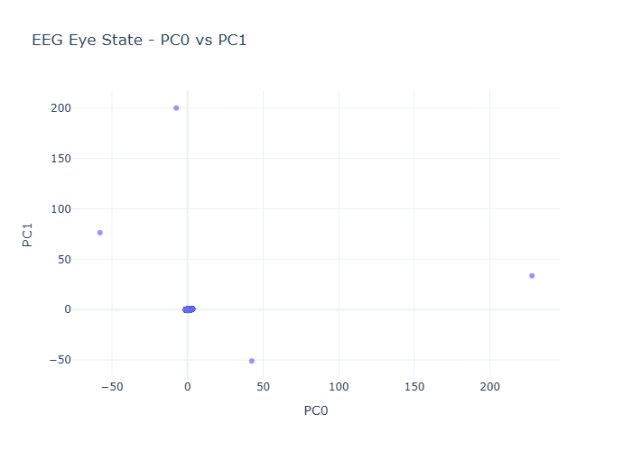
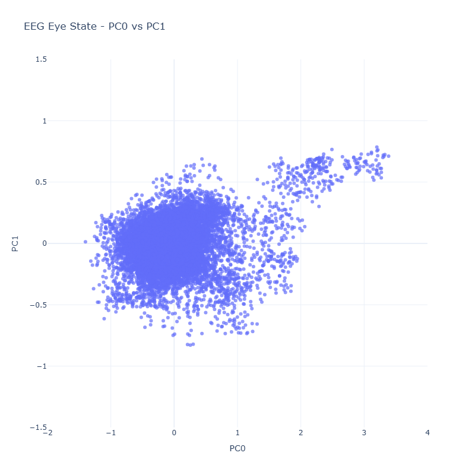
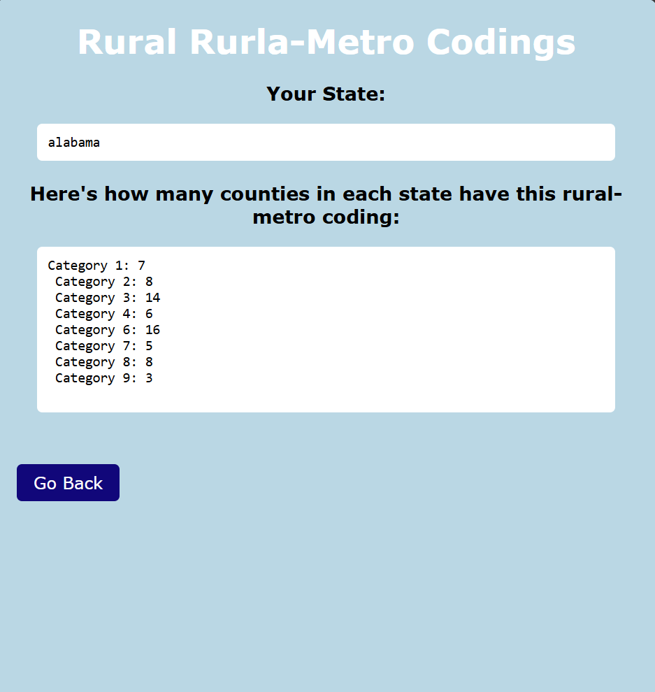
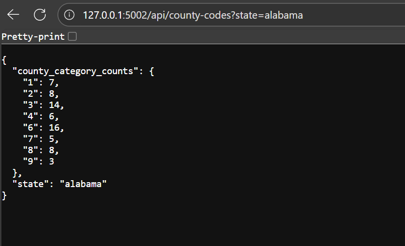
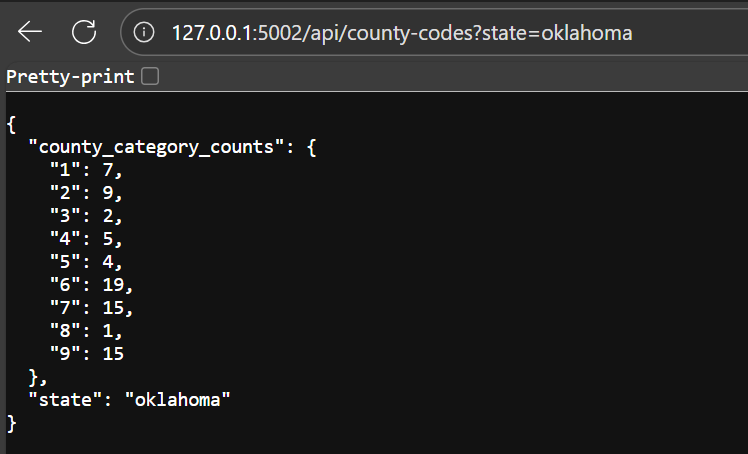
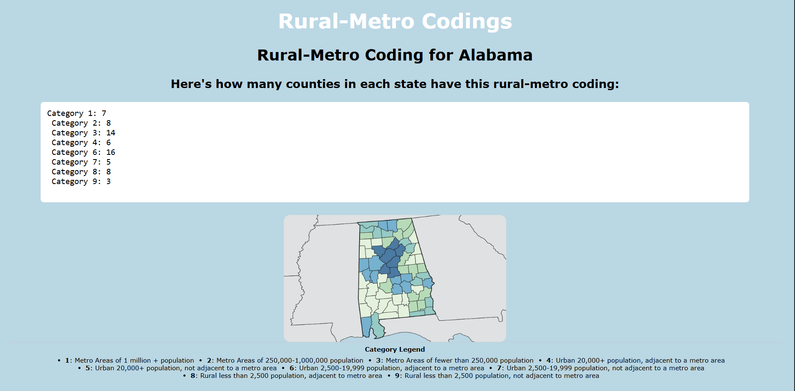
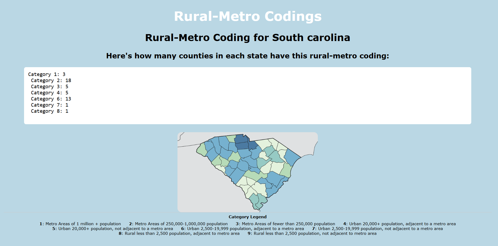

## Problem Set 4 ##

## Problem 1 - Gradient Descent
**Is this a clean URL and why** No, this is not a Clean URL because it is querying and it is passing parameters into it to function e.g. searching for a=0.4 rather than stating a file path like a Clean URL would. 

I implemented a 2-D verision of the gradient descent that allows you to find the optimal choice of a and b by minimizing error. It defines fprime_a, fprime_b, and f, which calls to the API. H and Gamma are hardcoded as well as the starting point of a and b. I chose epsilon and an error tolerance as stopping criteria which are also hard coded. **It then cycles for a wanted range, calculating the fprime of a and b, updating that as the new a and b, then calculating fprime of those new values. This is how you are able to find the gradient despite not being able to directly compute it.** 
```python 
def f(a, b):
    a = round(a, 6) # sending shorter floats to be nicer to server 
    b = round(b, 6)
    r = (requests.get(f"http://ramcdougal.com/cgi-bin/error_function.py?a={a}&b={b}", headers={"User-Agent": "MyScript"}).text)
    return float(r)
def fprime_a(a, b):
    return (f(a+h, b) - f(a, b)) / h 
def fprime_b(a, b):
    return (f(a, b+h) - f(a, b)) / h 

h= .01 # did not want too small of error to avoid computational errors
gamma = .25 # gamma controls how big of step
epsilon = 1e-4 # stopping criteria of stopping when updates being too small
error_tolerance = 1e-4

a, b = .5, .8 # initial guess for  both
current_run = []
previous_error = None

for i in range(15):
    current_error = f(a, b)
    current_run.append({"a":a, "b":b, "error":current_error}) 

    if previous_error is not None and abs(previous_error - current_error) < error_tolerance:
        print("Error change too small")
        break
 
    new_a = a - gamma * fprime_a(a, b) # doing gradient descent and determining new a and b
    new_b = b - gamma * fprime_b(a, b) 

    if np.sqrt((new_a-a) **2 + (new_b - b)**2) < epsilon: # stopping criteria of when updates are too small 
        print("Updates too small")
        break

    a, b = new_a, new_b
    print(f"a:{a}, b:{b}, error:{current_error}")
print(f"lowest error run: {min(current_run, key=lambda x:x['error'])}") # prints run with smallest error 
```
I chose the following numerical choices: 

Gamma controls the speed of the steps: too large and it could overshoot the minimum; too small and it will converge slowly. I found the best convergence to be at 0.25 because .5-1 gave too varying of values thus that were far off from the correct minimum and smaller number like .01-.1 were too small of updates risking never finding the minimum.

H or step size controls the accuracy so too large and you risk being inaccurate and too small you risk numerical precision errors by the computer. I chose 0.01 as I found this got me the closest to converging on a minimum.

I chose epsilon as a stopping criteria because it breaks if the change in variables is minimal. If this criteria is too large you risk stopping too early and if it's too small you will run through lots of iterations. I chose 1e-4 because there were no notificable benefits after 1e-5. 

I also implemented a stopping criteria of error between runs being too small and breaking. This ensured that I was being nice to the server and decreased my risk of numerical precision errors. I chose 1e-4 because that is a small difference between errors but allows enough difference if needed to continue convergence. 

I chose to do 15 runs because I found my stopping criteria would kick in very close to 15 so I need more than 10 but more than 15 wuold be unnecessary. I also found without stopping criteria that runs after 15 were similar to each other and close to convergence.

**local minimum with starting a=.5 b=.8**
**a: 0.21551550000000153, b: 0.685812499999993, error: 1.1000103976**

To find the global, I changed my starting point.
**global minimum with starting a =.4, b=.2**
**a: 0.7058004997500086, b: 0.16414099975000634, error: 1.00010396249**

I knew the second run was the global error because it had the smallest level of error. There is less error associated with global minimums. 

**If you had not known how many mimima there are, you would do multiple starting points and track their convergences. Global would be the one with the smallest error and you could track other convergences that could be local minima**

Sources: [1] used ChatGPT to ensure adjustment of code from slide(8) to 2D version and understand stopping criteria and implement error as a returned value 

## Problem 2
I implemented a Smith-Waterman function that takes in two sequences and aligns them with a default of 1 for match, mismatch, and gap penalty. 
```python 
def smith_waterman(seq1, seq2, match_score=1, mismatch_penalty=1, gap_penalty=1): 
    max_score = 0
    max_pos = (0,0)
    
    rows = len(seq2) + 1 #matrix size 
    cols = len(seq1) + 1 
    matrix = [[0 for _ in range(cols)] for _ in range(rows)] # Create scoring matrix filled with zeros
       
    # Score
    for i in range(1, rows): # first row/column is 0 so starts in second
        for j in range(1, cols):
            if seq1[j-1] == seq2[i-1]:
                diag = matrix[i-1][j-1] + match_score # if two align get match point
            else:
                diag = matrix[i-1][j-1] - mismatch_penalty # if two do not align, mismatch penalty

            up = matrix[i-1][j] - gap_penalty # puts gap penalty in seq1
            left = matrix[i][j-1] - gap_penalty # puts gap penalty in seq2

            matrix[i][j] = max(0, diag, up, left) # highest score 
            if matrix[i][j] > max_score:
                max_score = matrix[i][j] # keeps track of highest score
                max_pos = (i, j) # where highest score is 
    # now the matrix is scored 
    # reconstructs which two aligned make best match
    aligned_seq1 = ""
    aligned_seq2 = ""
    i, j = max_pos # start from cell with highest score 

    while matrix[i][j] != 0: # trace backwards until reach a 0 ie a stop does not match
        score_current = matrix[i][j] # score of current
        score_diag = matrix[i-1][j-1] # score of diagonal
        score_up = matrix[i-1][j] # score of above
        score_left = matrix[i][j-1] # score of left - which could have to this one

        if seq1[j-1] == seq2[i-1]:
            match = match_score
        else:
            match = -mismatch_penalty # is diagonal a match or mismatch, subtracts for mismatch 
        # how did we arrive at the cell - diagonal, left (gap in seq2), or up (gap in seq1)
        if score_current == score_diag + match:
            aligned_seq1 = seq1[j-1] + aligned_seq1
            aligned_seq2 = seq2[i-1] + aligned_seq2
            i -= 1
            j -= 1 # match was diagnoal; add to strink and move diagonally up and left 
        elif score_current == score_left - gap_penalty: # subtract for gap
            aligned_seq1 = seq1[j-1] + aligned_seq1
            aligned_seq2 = "-" + aligned_seq2
            j -= 1 # came from left meaning seq2 has a gap, add - in a seq2 and move left 
        elif score_current == score_up - gap_penalty:
            aligned_seq1 = "-" + aligned_seq1
            aligned_seq2 = seq2[i-1] + aligned_seq2
            i -= 1
        else: break

    # Print full matrix
    for row in matrix:
        print(row) 

    return aligned_seq1, aligned_seq2, max_score # return the aligned sequence and max score 
```
This function scores the given sequences, aligning them to the optimal local alignment and inserting a - as a gap when needed. It returns a matrix that is calculated by backtracking from biggest values and going left, up, or diagonally based on what will give the best score and alignment. 

I tested it with a small sequence that has obvious alignment at the beginning only.
```python 
smith_waterman('TACA', 'TATG')
('TA', 'TA', 2)
```
I also tested it using the sequences given in the problem set. The first being a longer sequence that has a score of 8.
```python 
smith_waterman('tgcatcgagaccctacgtgac', 'actagacctagcatcgac')

returns
('agacccta-cgt-gac', 'aga-cctagcatcgac', 8)
```

The second being the same sequence but with a gap penalty of 2 instead leading to a best score of 7 and a more aligned sequence in the middle being the best. 
```python
smith_waterman('tgcatcgagaccctacgtgac', 'actagacctagcatcgac', gap_penalty=2)

returns 
('gcatcga', 'gcatcga', 7)
```

I also tested it on totally identical sequences. 
```python 
smith_waterman('gggg', 'gggg')

returns
('gggg', 'gggg', 4)
```
and two totally difference sequences.
```python
smith_waterman('cccc', 'gggg')

returns
('', '', 0)
```
I then tested the same sequence first with a gap penalty of 0 that ended with a score of 6 and best alignment had a gap in the middle. 
```python
smith_waterman('ACGATCG', 'ACGGTCG', gap_penalty=0)

returns 
('AC-GATCG', 'ACGG-TCG', 6)
```

I tested the same sequence with a gap penalty of 2 and it ended with a score of 5 because with the higher gap penalty it perferred the mismatch in the middle instead.
```python
smith_waterman('ACGATCG', 'ACGGTCG', gap_penalty=2)

returns
('ACGATCG', 'ACGGTCG', 5)
```

Through these tests, I can see that my function works on short and long sequences, easy and difficult alignment choices, and differing penalties. 

**paralellize for extra credit**

Source: [1] https://www.delftstack.com/howto/python/smith-waterman-algorithm-python/ - used as starting point [2] Used ChatGPT to tweak code given in article

## Problem 3
I implemented a quad tree that will store my data (x, y, label) and a k nearest neighbors that will search this tree and return nearest points and  labels and predicted class the query point based on the wanted # of k and search distance. 
```python
class QuadTree: 
    def __init__(self, points, boundary, capacity=4, parent=None):  # capacity = max points before splitting
        self.parent = parent
        self.xmin, self.ymin, self.xmax, self.ymax = boundary # uses point to make boundery
        self.children = None # becomes list of 4 children if subdivided

        # Decide whether to make a leaf or subdivide
        if len(points) <= capacity or self.degenerate():
            self.points = points  # leaf node stores points
            self.size = len(points)
        else:
            self.points = None # only leafs store points
            self.subdivide(points, capacity)
            self.size = sum(child.size for child in self.children)

    def degenerate(self): # prevent self recursion
        return self.xmin == self.xmax or self.ymin == self.ymax

    def subdivide(self, points, capacity):
        mx = (self.xmin + self.xmax) / 2 # midpoint of x
        my = (self.ymin + self.ymax) / 2 # mispoint of y

        quads = [ 
            (self.xmin, self.ymin, mx, my),  # SW
            (mx, self.ymin, self.xmax, my),  # SE
            (self.xmin, my, mx, self.ymax),  # NW
            (mx, my, self.xmax, self.ymax)   # NE
        ]

        buckets = [[] for _ in range(4)] # hold points assigned to each quadrant 
        for x, y, label in points: # unpack points 
            for i, (xmin, ymin, xmax, ymax) in enumerate(quads):
                if xmin <= x <= xmax and ymin <= y <= ymax: # if in quadrant adds to list and does not check other quadrants
                    buckets[i].append((x, y, label))
                    break

        # Recursively build children
        self.children = [QuadTree(bucket, quads[i], capacity, parent=self) for i, bucket in enumerate(buckets)]

    def all_points(self):
        if self.points is not None:
            return self.points # if it is a leaf return all poinsts
        pts = []
        for child in self.children:
            pts.extend(child.all_points()) # gather all children points and return 
        return pts

    def quadrant_for_point(self, x, y):
        if self.children is None:
            return None
        for child in self.children:
            if child.xmin <= x <= child.xmax and child.ymin <= y <= child.ymax:
                return child
        return None
            
    def descend_for_k(self, x, y, k): # uses helper function to choose next child  
        node = self  
        while node.children is not None:
            child = node.quadrant_for_point(x,y)
            if child.size <k: # stops descending if child has fewer than k points
                return node
            node = child
        return node # returns deepest node that still has k points 
    
    def contains(self, x, y): # does this node's bounding box contain x,y
        return (self.xmin <= x <= self.xmax) and (self.ymin <= y <= self.ymax)
    
    def small_containing_quadtree(self, x, y): # return smallest quadtree with x, y 
        if not self.contains(x,y): # if does not contain point return empty 
            return None
        if self.children is None:
            return self
        for child in self.children:
            if child.contains(x,y):
                return child.small_containing_quadtree(x, y)
        return self 
    
    def within_distance(self, x, y, d):
        dx = 0
        if x < self.xmin:
            dx = self.xmin - x
        elif x > self.xmax:
            dx = x - self.xmax
        
        dy = 0 
        if y < self.ymin:
            dy = self.ymin - y
        elif y > self.ymax:
            dy = y - self.ymax
        return (dx*dx + dy*dy) <= d*d # if point is inside box, will return - if outside will be positive
    
    def leaves_within_distance(self, x, y, d, found=None):
        if found is None:
            found = []
        if not self.within_distance(x, y, d):
            return found
        if self.children is None:
            found.append(self)
            return found 
        for child in self.children:
            child.leaves_within_distance(x, y, d, found)
        return found 
    
def k_nearest_neighbors(tree, x0, y0, k, search_distance):
    leaves = tree.leaves_within_distance(x0, y0, d=search_distance) # leaves within search distance
    
    candidate_points = []
    for leaf in leaves:
        candidate_points.extend(leaf.all_points()) # gather all points from candidates
    if len(candidate_points) == 0:
        return [], [], None # if no points found 
    
    candidate_points = np.array(candidate_points)
    coords = candidate_points[:, :2].astype(float)

    dx = coords[:, 0] - x0 # distance using euclidean distances 
    dy = coords[:, 1] - y0
    distances = dx**2 + dy**2

    k_actual = min(k, len(candidate_points))
    min_i = np.argpartition(distances, k_actual-1)[:k_actual] # find k smallest distances 

    nearest_points = candidate_points[min_i]
    nearest_distances = distances[min_i]

    labels = [p[2] for p in nearest_points] # determine most common class label 
    predicted_class = Counter(labels).most_common(1)[0][0]

    return nearest_points, nearest_distances, predicted_class
```
I tested this with a known data set for k=3 and search distance of 20.
```python
points = [
    (10, 10, 'A'),
    (20, 15, 'B'),
    (42, 5, 'C'),
    (30, 25, 'D'),
    (50, 40, 'E')
]

# Define the boundary of your QuadTree: (xmin, ymin, xmax, ymax)
boundary = (0, 0, 60, 60)

# Create the QuadTree instance
tree = QuadTree(points, boundary, capacity=2)

nearest_pts, nearest_dists, predicted_class = k_nearest_neighbors(tree, 42, 6, 3, 20)

print("k nearest points:", nearest_pts)
print("Predicted class:", predicted_class)

returns 
k nearest points: [['42' '5' 'C']
 ['30' '25' 'D']
 ['20' '15' 'B']]
Predicted class: C
```
I then called in the raw data and standardized the 7 quantitative columns. 
```python
def standardize(series):
    return (series - series.mean()) / series.std()

rice_standard = rice.copy()
cols_to_standardize = [c for c in rice.columns if c !='Class']
rice_standard[cols_to_standardize] = rice[cols_to_standardize].apply(standardize)

rice_standard.head()
```
I applied PCA to the 7 standardized columns then added back the class column.
```python
pca_raw = decomposition.PCA() # performed on all components
pca_df = pd.DataFrame(
    pca_raw.fit_transform(rice_standard[cols_to_standardize])
)
pca_df = pca_df.rename(columns={0: 'PCA0', 1: 'PCA1'})
pca_df['Class'] = rice_standard['Class'].values

pca_df.head()
```
I plotted this PCA on a scatterplot


**What does the graph suggest about effectiveness of using k-neraest neighbors on 2-D reduction of data to predict type of rice** The graph shows that there is clear variation for the outliers of the data but there is general overlap in the middle that might confuse the k nearest neighbors. If querying for a point on the edge, k nearest neighbors will likely be very effective but querying for a point in the middle risks less effectiveness. 

I shuffled the PCA data and split it into features (points) and labels (class) then split each to train on 70% of the data and test on the remaining. I then computed the mean and standard deviation of the training data as the metric of standardization then applied PCA to both the training and test data.
```python
# Shuffle first
pca_df_shuffled = pca_df.sample(frac=1, random_state=42).reset_index(drop=True)

# Split into features and labels
features = pca_df_shuffled.drop(columns='Class') # input values to use to predict
labels = pca_df_shuffled['Class'] # labels that are predicted

# 70/30 split - training on 70%, test on 30% data 
split_idx = int(0.7 * len(pca_df_shuffled))
X_train_raw = features.iloc[:split_idx].values
y_train = labels.iloc[:split_idx].values
X_test_raw = features.iloc[split_idx:].values
y_test = labels.iloc[split_idx:].values


# must train because KNN is a lazy alg - training is really just defining what points it can reference/giving comparison data to use 
# split into training to reference/compare and test which will check how well predicts for unseen points 

# Compute training mean and std
train_mean = X_train_raw.mean(axis=0)
train_std = X_train_raw.std(axis=0)

# Standardize
X_train = (X_train_raw - train_mean) / train_std
X_test = (X_test_raw - train_mean) / train_std  # IMPORTANT: use training mean/std

# Fit PCA only on training set
pca = decomposition.PCA(n_components=2)
X_train_pca = pca.fit_transform(X_train)

# Apply same PCA transformation to test set
X_test_pca = pca.transform(X_test)
```
I recombined the x and y to make a comprehensive list of training points to determine the boundary of my QuadTree and built the QuadTree with a capacity of 2. 
```python
# Combine X_train and y_train into list of (x, y, label)
train_points = [(x[0], x[1], label) for x, label in zip(X_train, y_train)]

# Determine the boundary of the QuadTree
xmin, ymin = X_train_pca.min(axis=0)
xmax, ymax = X_train_pca.max(axis=0)
boundary = (xmin, ymin, xmax, ymax)

# Build QuadTree
tree = QuadTree(train_points, boundary, capacity=2)
```
I looked at the min and max of the pca to determine a good search window for my k-nearest neighbors. I ran the k-nearest neighbors with a k=1 and search window=3. This then produced a confusion matrix that I then converted to a dataframe for cleaner viewing. The columns are what was predicted and the rows are what the class actually was so I added labels for better understanding. 

```python
y_pred = []
for x0, y0 in X_test_pca:
    _, _, pred = k_nearest_neighbors(tree, x0, y0, 1, 3)
    if pred is None:
        pred = 'Unknown'
    y_pred.append(pred)
y_pred = np.array(y_pred)

all_labels = np.unique(np.concatenate([y_test, y_pred]))

# Compute confusion matrix
cm_1 = confusion_matrix(y_test, y_pred, labels=all_labels)

# Make a nice DataFrame
cm_1_df = pd.DataFrame(cm_1, index=all_labels, columns=all_labels)
cm_1_df = cm_1_df.add_prefix('Predicted ').rename(index=lambda x: f'Was {x}')
print(cm_1_df)

returned 

                Predicted Cammeo  Predicted Osmancik
Was Cammeo                 306                 175
Was Osmancik               245                 417
```
This confusion matrix suggested that of all the rice tested on, k-nearest neighbors was correct in predicting a class Cammeo when it was a class Cammeo 306 times, correct in predicting a class Osmancik when it was a class Osmancik 417 times, and incorrectly predicted class Cammeo when it was truly Class Osmacik 245 times and incorrected predicted class Osmancik when it was a class Cammeo 175 times.

This confusion matrix comments on the true positives and false positive of our k-nearest neighbors and can further be used to develop the sensitivity and specificity of the tool. When using a k=1 and search distance=3, our k-nearest neighbors was pretty good at correctly predicting the correct label; it was a little more prone to predicting Cammeo when it was truly Osmacik compared to predicting Osmacik when it was Cammeo. 

I ran the k-nearest neighbors again with k=5 and retained search distance=3.

```python
y_pred = []
for x0, y0 in X_test_pca:
    _, _, pred = k_nearest_neighbors(tree, x0, y0, 5, 3)
    if pred is None:
        pred = 'Unknown'
    y_pred.append(pred)
y_pred = np.array(y_pred)

all_labels = np.unique(np.concatenate([y_test, y_pred]))

# Compute confusion matrix
cm_2 = confusion_matrix(y_test, y_pred, labels=all_labels)

# Make a nice DataFrame
cm_2_df = pd.DataFrame(cm_2, index=all_labels, columns=all_labels)
cm_2_df = cm_2_df.add_prefix('Predicted ').rename(index=lambda x: f'Was {x}')
print(cm_2_df)

returned 
              Predicted Cammeo  Predicted Osmancik
Was Cammeo                 319                 162
Was Osmancik               242                 420
```
When using a k=5, the k-nearest neighbors distribution was very similar. It was correct in predicting a class Cammeo when it was a class Cammeo 319 times, correct in predicting a class Osmancik when it was a class Osmancik 420 times, and incorrectly predicted class Cammeo when it was truly Class Osmacik 242 times and incorrected predicted class Osmancik when it was a class Cammeo 162 times. We see a very similar conclusion as above that the k-nearest neighbors was pretty good at correctly predicting the labels,

I also repeated the k-nearest neighbors when a smaller search distance to see how that would affect the k-nearest neighbors.
```python
# used ChatGPT to debug unknowns and add labels

y_pred = []
for x0, y0 in X_test_pca:
    _, _, pred = k_nearest_neighbors(tree, x0, y0, 1, 1)
    if pred is None:
        pred = 'Unknown'
    y_pred.append(pred)
y_pred = np.array(y_pred)

all_labels = np.unique(np.concatenate([y_test, y_pred]))

# Compute confusion matrix
cm_3 = confusion_matrix(y_test, y_pred, labels=all_labels)

# Make a nice DataFrame
cm_3_df = pd.DataFrame(cm_3, index=all_labels, columns=all_labels)
cm_3_df = cm_3_df.add_prefix('Predicted ').rename(index=lambda x: f'Was {x}')
print(cm_3_df)

returned 
              Predicted Cammeo  Predicted Osmancik  Predicted Unknown
Was Cammeo                 306                 174                  1
Was Osmancik               245                 411                  6
Was Unknown                  0                   0                  0

# used ChatGPT to debug unknowns and add labels

y_pred = []
for x0, y0 in X_test_pca:
    _, _, pred = k_nearest_neighbors(tree, x0, y0, 5, 1)
    if pred is None:
        pred = 'Unknown'
    y_pred.append(pred)
y_pred = np.array(y_pred)

all_labels = np.unique(np.concatenate([y_test, y_pred]))

# Compute confusion matrix
cm_3 = confusion_matrix(y_test, y_pred, labels=all_labels)

# Make a nice DataFrame
cm_3_df = pd.DataFrame(cm_3, index=all_labels, columns=all_labels)
cm_3_df = cm_3_df.add_prefix('Predicted ').rename(index=lambda x: f'Was {x}')
print(cm_3_df)

returned 
              Predicted Cammeo  Predicted Osmancik  Predicted Unknown
Was Cammeo                 319                 161                  1
Was Osmancik               243                 413                  6
Was Unknown                  0                   0                  0
```
Having a smaller search distance, it returned some classes as unknown, no matter the neighbors wanted. Overall there were similar distribution in the ability to correctly predict the classes. Expanding the search distance did not affect the results of the confusion matrix. 

Sources: [1] Used ChatGPT to implement each section of the hints given in problem set. [2]Used ChatGPT to test tree and each section as added [3] Used ChatGPT to standardize all the quantitative data and have to the class column remain once PCA dataframe was made [4] Use ChatGPT to fix errors thrown by using categorical data in plotly [5] Use ChatGPT to understand reason for training and testing and ensure standardization of only training data for implementing PCA [6] Used ChatGPT to debug errors thrown when making confusion matrix and add specific labels for more clarity 

## Problem 4 
I loaded all the data from the csv file and droped the eyeDetection column full of categorical data. I visualized the rest of the data to better understand the file. 

I then created a standardize variable I could apply to the data and stored this values in a new variable named data_standard.I visualized this dataframe. 
```python
def standardize(series):
    return (series - series.mean()) / series.std()
data_standard = data.apply(standardize)
data_standard.head()
```
I then did a PCA on the standardized data and plotted the comparison between PCA0 and PCA1.
```python
pca_raw = decomposition.PCA() # performed on all components
pca = pd.DataFrame(
    pca_raw.fit_transform(data_standard))
```


I then zoomed in on this data at the origin to better visualize the main components.


I performed K-means clustering using the sklearn's kmeans on the data to cluster into 7 clusters with a random init.
```python
kmeans = KMeans(n_clusters=7, init="random", random_state=0).fit(data_standard)
```

In order to plot I added a column named 'cluster' to the data frame of the kmeans labels. I also created the centers of the PCA and added them to their own data frame for plotting of the center points. 

I plotted the zoomed in standardized data, color-coding by cluster and included X's on the center of the clusters.
```python
pca["cluster"] = kmeans.labels_
pca["cluster"] = pca["cluster"].astype(str) 
cluster_order = [str(i) for i in range(7)] 
centers_pca = pca_raw.transform(kmeans.cluster_centers_)
centers_df = pd.DataFrame(centers_pca[:, :2], columns=['PCA0', 'PCA1'])
```
['Color Coded Scatterplot of K-Means Clustering with X on the Center of the Clusters'](x_centers.png)

**We only see 6 clusters instead of 7 because we have reduced it to 2 dimensions so some of the clusters are behind the others**
**They are behind each other**
**This is not a representative view of the clusters because we are representing data in only 2 dimensions. If the points were smaller, we might see some of the ones that are behind but we still wouldn't fully appreciate the relationships of the data because it has been reduced to 2 dimensions**

I only saw 5 crosses for 7 clusters so I printed the pca centers dataframe and saw cluser 1 has a high PCA 0 and cluster 5 has a high PCA1, so those clusers are off the screen, which can also be seen on the zoomed out version of the centers dataframe. 
['Scatterplot of zoomed out Centers PCA dataframe'](zoomed_out_centers.png)

I repeated the k-means clustering again with 7 clusters but different random states (2 and 5) and did not see any noticeable differences - there were still only 5 crosses in the zoomed in plane and a similar differential pattern. 
['Scatterplot of PCA K-Means with Random State 2'](x_centers_1.png)
['Scatterplot of PCA K-Means with Random State 5'](x_centers_2.png)

I then did clustering with only 3 clusters and thus 3 centers. With this test we saw noticebale difference in the clustering of the group and the centers all being within the frame. 
['Scatterplot of PCA K-Means with Clustering of 3'](x_centers_3.png)

I then did a clustering with 10 clusters. There is a lot more differentiation in groups on the zoomed in portion with 7 distinct colors being seen and 7 centers, meaning 3 clusters and centers were outside the zoomed in portion. In the full scatterplot, we can then see these clusters and centers. 
['Scatterplot of PCA K-Means with Clustering of 10 Zoomed in'](x_centers_4.png)
['Scatterplot of PCA K-Means with Clustering of 10 Zoomed out'](x_centers_5.png)

Sources: [1] Used to implement K means clustering and understand the sklearn library [2] Used ChatGPT to order the legend of clusers and add cluster centers [3] Asked ChatGPT how to make k means plottable 

## Problem 5
I have watched the entire video and asked the TAs any of my questions.

**Who presented the lecture?** Robert McDougal presented the lecture. 

**What framework was demonstrated for building web servers?** Flask was demonstrated for building web servers. 

**How does the approach of the framework differ from "classical" servers that simply provide static web content?** This differs from the classic servers in that it is dynamic. The static servers would would require you to load the data everytime. This now allows you to load the data once and the computer will keep it. 

**Briefly explain how you might use the "Developer tools" to debug JavaScript issues in your web pages.** You can go back to the Developer Tools to see the elements and determine if things need to be edited. You can do this to simple edits without having to make large commits. 

**Explain briefly how the app.route decorator is used to implement a RESTful API.** As exhibited in the server.py script, decorators are used to implement RESTful APIs because they listen for calls and implement what they are told but they use the HTTP status codes. 


## Problem 6
**What does each file do?** The server.py is a file that uses Flask and decorators and keeps track of what functions should trigger. Index is an html file that creates the initial webpage that is seen and offers a textbox that the user can type in a word to be analyzed. Analyze is a html file that follows index and restates what the user entered to be analyzed and the analysis (how many times a letter appears in the word analyzed).

**How are they interconnected?** In the server.py, you define the index and analyze functions and their route by using the flask decorator. 
Index and Analyze in templates is called by server.py. Index will also lead to analyze when someone wants their word analyzed. 

**Are there any key parts of the files for making the server do something?** Yes, the routes established in Flask that call index and analyze have those webpages show. Analyze is also defined in server.py and that takes in the users text, counts the letters and returns how many times each item appears. Calling server.py has the whole server run. 

Using my data, I want to be able answer the question of how counties in a state are classified according to the rural-metro code. In using staes I felt a drop down menu was more user-friendly than a text box. For example, if someone selected Alabama, it would return counties in coding 1-x, 2-x, 3-x... To do this, I am taking the column of code classification (RUCC codes) from my dataset and returning the values count in order of the wanted state.

I used flask to create an interactive website that accomplishes this analysis. 
Here is the input page. There is a full dropdown list of all 50 states.


Here is the output page for Alabama.


I also created an API which I tested with Alabama and verified against the results page.


I tested the API again for Oklahoma.


I also instituted a css style page (in GitHub final_project/static and in code appendix). 

I added a static image of a breakdown of the entire US counties rural-metro coding.


I also added images of each state that would generate on the analyze page when that state was queried for the rural-metro county breakdown. Before ultimate submission, I will add the colors that correspond to each category. 



Choosing a drop down menu to display the states was a method of error handling in that it dramatically decrease the amount and type of error the user can make. I also had to handle errors in the calling of my dataset from the dropdown menu, for example, Alaska had some counties that did not have codings because they were defined  after 2013 when the RUCC codes were assigned. I also clarified on the front page that only the 50 contiguous US state would be analyzed to handle anyone erraneously wanting data about Puerto Rico, DC, or another US territory. 

Sources: [1] I adapted code by Robert McDougal demonstrating flask [2] Photos are from https://www.shepscenter.unc.edu/wp-content/uploads/2015/12/ruralurbancodes2013c.pdf and https://www.cdc.gov/nchs/data-analysis-tools/urban-rural.html [3] Used ChatGPT to develop API call [4] Used https://www.w3schools.com/Css/css_editor.asp as a template for the CSS and used ChatGPT to edit to my needs [4] Used ChatGPT to understand how to call in a CSS sheet and have buttons go to other pages

## Code Appendix 
## Problem 1 - Code
```python
# %%
import math
import numpy as np
import requests

# %%
# implement 2D version of gradient descent algorithm to find optimal choices of a and b
# used ChatGPT to ensure adjustment of code from slide(8) to 2D version and understand stopping criteria and implement error as a returned value 

def f(a, b):
    a = round(a, 6) # sending shorter floats to be nicer to server 
    b = round(b, 6)
    r = (requests.get(f"http://ramcdougal.com/cgi-bin/error_function.py?a={a}&b={b}", headers={"User-Agent": "MyScript"}).text)
    return float(r)
def fprime_a(a, b):
    return (f(a+h, b) - f(a, b)) / h 
def fprime_b(a, b):
    return (f(a, b+h) - f(a, b)) / h 

h= .01 # did not want too small of error to avoid computational errors
gamma = .25 # gamma controls how big of step
epsilon = 1e-4 # stopping criteria of stopping when updates being too small
error_tolerance = 1e-4

a, b = .4, .2 # initial guess for  both
current_run = []
previous_error = None

for i in range(15):
    current_error = f(a, b)
    current_run.append({"a":a, "b":b, "error":current_error}) 

    if previous_error is not None and abs(previous_error - current_error) < error_tolerance:
        print("Error change too small")
        break
 
    new_a = a - gamma * fprime_a(a, b) # doing gradient descent and determining new a and b
    new_b = b - gamma * fprime_b(a, b) 

    if np.sqrt((new_a-a) **2 + (new_b - b)**2) < epsilon: # stopping criteria of when updates are too small 
        print("Updates too small")
        break

    a, b = new_a, new_b
    print(f"a:{a}, b:{b}, error:{current_error}")
print(f"lowest error run: {min(current_run, key=lambda x:x['error'])}") # prints run with smallest error 


# %%
# EXPAIN HOW ESTIMATE GRADIENT

# gamma - how much move along gradient each iteration - controls speed - too large: overshoot; too small: slow convergence
# GAMMA - best convergence at .25; far off at 1 and .5 and too small at .01 and .1

# h - error, estimating derivative numerically - controls accuracy - too large: inaccurate; too small: numerical precision errors
# ERROR - .01 got us the closest 

# epsilon - minimum change in varibales to stop iteration - too large: stops too early, too small: too many iterations 
# EPSILON - chose 1e-4 becuase no noticeable difference after (1e-5 etc)

# range - how many iterations - too many: unnecessary , too few: don't see convergence
# RANGE -  minimal differences past .000 decimal place after 8 runs, rounded up to 10
```

## Problem 2 - Code

## Problem 3 - Code
```python
# %%
import numpy as np
from collections import Counter
import pandas as pd
from sklearn import decomposition
from sklearn.metrics import confusion_matrix
import plotly.express as px
from plotly.subplots import make_subplots
import plotly.graph_objects as go
import math 


# %%
# Implement a two-dimensional k-nearest neighbors classifier 
# asked ChatGPT how to implement code in slides to fit problem needs
# from the slides - this is naive and testing against every point 


def knn_no_quad(test_pt, training_pts, training_types, k): # takes in point want to classify, list of known data points, class labels, how many nearest neighbors
    test_pt = np.array(test_pt) # takes in test points and turns into numpy array
    distances = [np.linalg.norm(test_pt - pt) for pt in training_pts] # calculates Eculidean distance from test point to each training point
    k_smallest_indices = np.argpartition(distances, k)[:k] # finds smallest distance/which training points are clostest to target
    k_nearest_labels = [training_types[i] for i in k_smallest_indices] # returns class label of nearest points
    most_common_label = Counter(k_nearest_labels).most_common(1)[0][0] # gives vote to closest neighbors
    return most_common_label

# %%
class QuadTree: 
    def __init__(self, points, boundary, capacity=4, parent=None):  # capacity = max points before splitting
        self.parent = parent
        self.xmin, self.ymin, self.xmax, self.ymax = boundary # uses point to make boundery
        self.children = None # becomes list of 4 children if subdivided

        # Decide whether to make a leaf or subdivide
        if len(points) <= capacity or self.degenerate():
            self.points = points  # leaf node stores points
            self.size = len(points)
        else:
            self.points = None # only leafs store points
            self.subdivide(points, capacity)
            self.size = sum(child.size for child in self.children)

    def degenerate(self): # prevent self recursion
        return self.xmin == self.xmax or self.ymin == self.ymax

    def subdivide(self, points, capacity):
        mx = (self.xmin + self.xmax) / 2 # midpoint of x
        my = (self.ymin + self.ymax) / 2 # mispoint of y

        quads = [ 
            (self.xmin, self.ymin, mx, my),  # SW
            (mx, self.ymin, self.xmax, my),  # SE
            (self.xmin, my, mx, self.ymax),  # NW
            (mx, my, self.xmax, self.ymax)   # NE
        ]

        buckets = [[] for _ in range(4)] # hold points assigned to each quadrant 
        for x, y, label in points: # unpack points 
            for i, (xmin, ymin, xmax, ymax) in enumerate(quads):
                if xmin <= x <= xmax and ymin <= y <= ymax: # if in quadrant adds to list and does not check other quadrants
                    buckets[i].append((x, y, label))
                    break

        # Recursively build children
        self.children = [QuadTree(bucket, quads[i], capacity, parent=self) for i, bucket in enumerate(buckets)]

    def all_points(self):
        if self.points is not None:
            return self.points # if it is a leaf return all poinsts
        pts = []
        for child in self.children:
            pts.extend(child.all_points()) # gather all children points and return 
        return pts

    def quadrant_for_point(self, x, y):
        if self.children is None:
            return None
        for child in self.children:
            if child.xmin <= x <= child.xmax and child.ymin <= y <= child.ymax:
                return child
        return None
            
    def descend_for_k(self, x, y, k): # uses helper function to choose next child  
        node = self  
        while node.children is not None:
            child = node.quadrant_for_point(x,y)
            if child.size <k: # stops descending if child has fewer than k points
                return node
            node = child
        return node # returns deepest node that still has k points 
    
    def contains(self, x, y): # does this node's bounding box contain x,y
        return (self.xmin <= x <= self.xmax) and (self.ymin <= y <= self.ymax)
    
    def small_containing_quadtree(self, x, y): # return smallest quadtree with x, y 
        if not self.contains(x,y): # if does not contain point return empty 
            return None
        if self.children is None:
            return self
        for child in self.children:
            if child.contains(x,y):
                return child.small_containing_quadtree(x, y)
        return self 
    
    def within_distance(self, x, y, d):
        dx = 0
        if x < self.xmin:
            dx = self.xmin - x
        elif x > self.xmax:
            dx = x - self.xmax
        
        dy = 0 
        if y < self.ymin:
            dy = self.ymin - y
        elif y > self.ymax:
            dy = y - self.ymax
        return (dx*dx + dy*dy) <= d*d # if point is inside box, will return - if outside will be positive
    
    def leaves_within_distance(self, x, y, d, found=None):
        if found is None:
            found = []
        if not self.within_distance(x, y, d):
            return found
        if self.children is None:
            found.append(self)
            return found 
        for child in self.children:
            child.leaves_within_distance(x, y, d, found)
        return found 
    
def k_nearest_neighbors(tree, x0, y0, k, search_distance):
    leaves = tree.leaves_within_distance(x0, y0, d=search_distance) # leaves within search distance
    
    candidate_points = []
    for leaf in leaves:
        candidate_points.extend(leaf.all_points()) # gather all points from candidates
    if len(candidate_points) == 0:
        return [], [], None # if no points found 
    
    candidate_points = np.array(candidate_points)
    coords = candidate_points[:, :2].astype(float)

    dx = coords[:, 0] - x0 # distance using euclidean distances 
    dy = coords[:, 1] - y0
    distances = dx**2 + dy**2

    k_actual = min(k, len(candidate_points))
    min_i = np.argpartition(distances, k_actual-1)[:k_actual] # find k smallest distances 

    nearest_points = candidate_points[min_i]
    nearest_distances = distances[min_i]

    labels = [p[2] for p in nearest_points] # determine most common class label 
    predicted_class = Counter(labels).most_common(1)[0][0]

    return nearest_points, nearest_distances, predicted_class


# %%
# Used to test my tree - generated by ChatGPT
# Example points and boundary
points = [
    (10, 10, 'A'),
    (20, 15, 'B'),
    (42, 5, 'C'),
    (30, 25, 'D'),
    (50, 40, 'E')
]

# Define the boundary of your QuadTree: (xmin, ymin, xmax, ymax)
boundary = (0, 0, 60, 60)

# Create the QuadTree instance
tree = QuadTree(points, boundary, capacity=2)

# Now you can safely call leaves_within_distance
leaves = tree.leaves_within_distance(42, 17, d=20)

for leaf in leaves:
    print("Leaf size:", leaf.size)
    print("Points:", leaf.all_points())


# %%
nearest_pts, nearest_dists, predicted_class = k_nearest_neighbors(tree, 42, 6, 3, 20)

print("k nearest points:", nearest_pts)
print("Predicted class:", predicted_class)


# %%
# call in rice
rice = pd.read_excel("Rice_Cammeo_Osmancik.xlsx")

# %%
rice.head()

# %%
# standardize 7 quantitative rice data
# used ChatGPT to standardize all except class one while retaining the class 

def standardize(series):
    return (series - series.mean()) / series.std()

rice_standard = rice.copy()
cols_to_standardize = [c for c in rice.columns if c !='Class']
rice_standard[cols_to_standardize] = rice[cols_to_standardize].apply(standardize)

rice_standard.head()

# %%
pca_raw = decomposition.PCA() # performed on all components
pca_df = pd.DataFrame(
    pca_raw.fit_transform(rice_standard[cols_to_standardize])
)
pca_df = pca_df.rename(columns={0: 'PCA0', 1: 'PCA1'})
pca_df['Class'] = rice_standard['Class'].values

pca_df.head()

# %%
# plot PCA0 vs PCA1
# Used ChatGPT to fix errors thrown of using categorical classes in plotly

fig = px.scatter(
    x=pca_df['PCA0'],
    y=pca_df['PCA1'],
    color=rice['Class'],
    title="Rice Data (PC0 vs PC1)",
    labels={'x': 'PC0', 'y': 'PC1'},
    template='plotly_white'
)

fig.write_image('Original_PCA.png')
fig.show()


# %%
# asked chatGPT how to implement a test train split 
# used ChatGPT to only standardize for training, not test and understand to implement PCA after 

# Shuffle first
pca_df_shuffled = pca_df.sample(frac=1, random_state=42).reset_index(drop=True)

# Split into features and labels
features = pca_df_shuffled.drop(columns='Class') # input values to use to predict
labels = pca_df_shuffled['Class'] # labels that are predicted

# 70/30 split - training on 70%, test on 30% data 
split_idx = int(0.7 * len(pca_df_shuffled))
X_train_raw = features.iloc[:split_idx].values
y_train = labels.iloc[:split_idx].values
X_test_raw = features.iloc[split_idx:].values
y_test = labels.iloc[split_idx:].values


# must train because KNN is a lazy alg - training is really just defining what points it can reference/giving comparison data to use 
# split into training to reference/compare and test which will check how well predicts for unseen points 

# Compute training mean and std
train_mean = X_train_raw.mean(axis=0)
train_std = X_train_raw.std(axis=0)

# Standardize
X_train = (X_train_raw - train_mean) / train_std
X_test = (X_test_raw - train_mean) / train_std  # IMPORTANT: use training mean/std

# Fit PCA only on training set
pca = decomposition.PCA(n_components=2)
X_train_pca = pca.fit_transform(X_train)

# Apply same PCA transformation to test set
X_test_pca = pca.transform(X_test)


# %%
# Combine X_train and y_train into list of (x, y, label)
train_points = [(x[0], x[1], label) for x, label in zip(X_train, y_train)]

# Determine the boundary of the QuadTree
xmin, ymin = X_train_pca.min(axis=0)
xmax, ymax = X_train_pca.max(axis=0)
boundary = (xmin, ymin, xmax, ymax)

# Build QuadTree
tree = QuadTree(train_points, boundary, capacity=2)


# %%
# looked at min and max of pca to choose good search distance 
print(pca_df.max())
print(pca_df.min())

# %%
# used ChatGPT to debug unknowns and add labels

y_pred = []
for x0, y0 in X_test_pca:
    _, _, pred = k_nearest_neighbors(tree, x0, y0, 1, 3)
    if pred is None:
        pred = 'Unknown'
    y_pred.append(pred)
y_pred = np.array(y_pred)

all_labels = np.unique(np.concatenate([y_test, y_pred]))

# Compute confusion matrix
cm_1 = confusion_matrix(y_test, y_pred, labels=all_labels)

# Make a nice DataFrame
cm_1_df = pd.DataFrame(cm_1, index=all_labels, columns=all_labels)
cm_1_df = cm_1_df.add_prefix('Predicted ').rename(index=lambda x: f'Was {x}')
print(cm_1_df)

# %%
# used ChatGPT to debug unknowns and add labels

y_pred = []
for x0, y0 in X_test_pca:
    _, _, pred = k_nearest_neighbors(tree, x0, y0, 5, 3)
    if pred is None:
        pred = 'Unknown'
    y_pred.append(pred)
y_pred = np.array(y_pred)

all_labels = np.unique(np.concatenate([y_test, y_pred]))

# Compute confusion matrix
cm_2 = confusion_matrix(y_test, y_pred, labels=all_labels)

# Make a nice DataFrame
cm_2_df = pd.DataFrame(cm_2, index=all_labels, columns=all_labels)
cm_2_df = cm_2_df.add_prefix('Predicted ').rename(index=lambda x: f'Was {x}')
print(cm_2_df)

# %%
# used ChatGPT to debug unknowns and add labels

y_pred = []
for x0, y0 in X_test_pca:
    _, _, pred = k_nearest_neighbors(tree, x0, y0, 1, 1)
    if pred is None:
        pred = 'Unknown'
    y_pred.append(pred)
y_pred = np.array(y_pred)

all_labels = np.unique(np.concatenate([y_test, y_pred]))

# Compute confusion matrix
cm_3 = confusion_matrix(y_test, y_pred, labels=all_labels)

# Make a nice DataFrame
cm_3_df = pd.DataFrame(cm_3, index=all_labels, columns=all_labels)
cm_3_df = cm_3_df.add_prefix('Predicted ').rename(index=lambda x: f'Was {x}')
print(cm_3_df)

# %%
# used ChatGPT to debug unknowns and add labels

y_pred = []
for x0, y0 in X_test_pca:
    _, _, pred = k_nearest_neighbors(tree, x0, y0, 5, 1)
    if pred is None:
        pred = 'Unknown'
    y_pred.append(pred)
y_pred = np.array(y_pred)

all_labels = np.unique(np.concatenate([y_test, y_pred]))

# Compute confusion matrix
cm_3 = confusion_matrix(y_test, y_pred, labels=all_labels)

# Make a nice DataFrame
cm_3_df = pd.DataFrame(cm_3, index=all_labels, columns=all_labels)
cm_3_df = cm_3_df.add_prefix('Predicted ').rename(index=lambda x: f'Was {x}')
print(cm_3_df)

# %%
# used ChatGPT to debug unknowns and add labels

y_pred = []
for x0, y0 in X_test_pca:
    _, _, pred = k_nearest_neighbors(tree, x0, y0, 1, 10)
    if pred is None:
        pred = 'Unknown'
    y_pred.append(pred)
y_pred = np.array(y_pred)

all_labels = np.unique(np.concatenate([y_test, y_pred]))

# Compute confusion matrix
cm_3 = confusion_matrix(y_test, y_pred, labels=all_labels)

# Make a nice DataFrame
cm_3_df = pd.DataFrame(cm_3, index=all_labels, columns=all_labels)
cm_3_df = cm_3_df.add_prefix('Predicted ').rename(index=lambda x: f'Was {x}')
print(cm_3_df)

# %%
```

## Problem 4 - Code
```python
# %%
import pandas as pd
from sklearn import decomposition
import plotly.express as px
from plotly.subplots import make_subplots
import plotly.graph_objects as go
from sklearn.cluster import KMeans
import numpy as np
from plotnine import *
import warnings
from matplotlib import *


# %%
warnings.filterwarnings("ignore", message="Could not find the number of physical cores")


# %%
# import Excel sheet
data = pd.read_csv("eeg-eye-state.csv")

# %%
# drop categorical column
data = data.drop(columns=["eyeDetection"])

# %%
# visualize data 
data.head()

# %%
# define variable that will standardize a series
def standardize(series):
    return (series - series.mean()) / series.std()

# %%
# standardize data set
data_standard = data.apply(standardize)
data_standard.head() # visualize to ensure all standard

# %%
# no need to do embeddings like previous problem set because csv is already numbers
pca_raw = decomposition.PCA() # performed on all components
pca = pd.DataFrame(
    pca_raw.fit_transform(data_standard)
)
pca = pca.rename(columns={0: 'PCA0', 1: 'PCA1'})

# %%
pca.head()

# %%
print(pca.columns.tolist())


# %%
# plot PCA0 vs PCA1

fig = make_subplots(rows=1, cols=1)

fig.add_trace(
    go.Scatter(
        x=pca['PCA0'],
        y=pca['PCA1'],
        mode='markers',
        marker=dict(size=6, opacity=0.7),
        name="PCA Points"
    ),
    row=1, col=1
)

fig.update_layout(
    title="EEG Eye State - PC0 vs PC1",
    xaxis_title="PC0",
    yaxis_title="PC1",
    template="plotly_white"
)

fig.write_image('Original_PCA.png')
fig.show()


# %%
# zoom in near origin
fig = make_subplots(rows=1, cols=1)

fig.add_trace(
    go.Scatter(
        x=pca['PCA0'],
        y=pca['PCA1'],
        mode='markers',
        marker=dict(size=6, opacity=0.7),
        name="PCA Points"
    ),
    row=1, col=1
)

fig.update_layout(
    title="EEG Eye State - PC0 vs PC1",
    xaxis_title="PC0",
    yaxis_title="PC1",
    template="plotly_white",
    xaxis_range=[-2, 4],
    yaxis_range=[-1.5,1.5],
    width=800,
    height=800
)

fig.write_image('Zoom_PCA.png')
fig.show()


# %%
# implement k-means clustering with sklearn library. 
# k=7; init=random
# https://scikit-learn.org/stable/modules/generated/sklearn.cluster.KMeans.html

kmeans = KMeans(n_clusters=7, init="random", random_state=1).fit(data_standard)

# %%
centers_df =  (
    pca.groupby('cluster')[['PCA0','PCA1']]
    .mean()
    .reset_index()

)

# %%
centers_df

# %%
# # Asked ChatGPT how to make scatterplot of kmeans, order the legend and add center of clusters
# add cluster to PCA dataframe
# makes string so can be plotted as discrete and not continuous

pca["cluster"] = kmeans.labels_
pca["cluster"] = pca["cluster"].astype(str) # makes string so can be plotted as discrete and not continuous


cluster_order = [str(i) for i in range(7)]  # Specifying order of clusters for legend


# %%
# adds center 
# asked ChatGPT how to make it plottable
centers_pca = pca_raw.transform(kmeans.cluster_centers_)
centers_df = pd.DataFrame(centers_pca[:, :2], columns=['PCA0', 'PCA1'])

# %%
centers_df

# %%
# testing to determine what clusters are being plotted in viewing plane
from scipy.spatial.distance import pdist, squareform
dists=squareform(pdist(centers_df[['PCA0','PCA1']]))
np.set_printoptions(precision=4, suppress=True)
print(dists)

# %%
pca.head()

# %%

# seeing if any pca centers are being dropped due to na
pca.isna().sum()

# %%
import matplotlib.pyplot as plt


# %%
# two centers outside df
plt.scatter(centers_df["PCA0"], centers_df["PCA1"])
plt.savefig('zoomed_out_centers.png')


# %%
graph = (
    ggplot(pca, aes(x='PCA0', y='PCA1', color='cluster')) 
    + geom_point(size=2, alpha=0.7) 
    + geom_point(
        data=centers_df,
        mapping=aes(x='PCA0', y='PCA1'),
        shape='x', 
        size=3,  
        color='black' 
    ) 
    + labs(
    x='PCA0',
    y='PCA1',
    title = 'K-Means Clustering on EEG Eye State - PCA0 vs PCA1'
) + theme_minimal()
+ xlim(-2, 3.5)
+ ylim(-1.5, 1.5)
)

graph.save('x_centers.png')
graph


# %%
# implement kmeans multiple times

kmeans_1 = KMeans(n_clusters=7, init="random", random_state=2).fit(data_standard)

pca["cluster_1"] = kmeans_1.labels_
pca["cluster_1"] = pca["cluster_1"].astype(str) # makes string so can be plotted as discrete and not continuous


cluster_order_1 = [str(i) for i in range(7)]  # Specifying order of clusters for legend

centers_pca_1 = pca_raw.transform(kmeans_1.cluster_centers_)
centers_df_1 = pd.DataFrame(centers_pca_1[:, :2], columns=['PCA0', 'PCA1'])

graph = (
    ggplot(pca, aes(x='PCA0', y='PCA1', color='cluster_1')) 
    + geom_point(size=2, alpha=0.7) 
    + geom_point(
        data=centers_df_1,
        mapping=aes(x='PCA0', y='PCA1'),
        shape='x', 
        size=3,  
        color='black' 
    ) 
    + labs(
    x='PCA0',
    y='PCA1',
    title = 'K-Means Clustering on EEG Eye State - PCA0 vs PCA1 - Random State 2'
) + theme_minimal()
+ xlim(-2, 3.5)
+ ylim(-1.5, 1.5)
)

graph.save('x_centers_1.png')
graph

# %%
# implement kmeans multiple times

kmeans_2 = KMeans(n_clusters=7, init="random", random_state=5).fit(data_standard)

pca["cluster_2"] = kmeans_2.labels_
pca["cluster_2"] = pca["cluster_2"].astype(str) # makes string so can be plotted as discrete and not continuous


cluster_order_2 = [str(i) for i in range(7)]  # Specifying order of clusters for legend

centers_pca_2 = pca_raw.transform(kmeans_2.cluster_centers_)
centers_df_2 = pd.DataFrame(centers_pca_2[:, :2], columns=['PCA0', 'PCA1'])

graph = (
    ggplot(pca, aes(x='PCA0', y='PCA1', color='cluster_2')) 
    + geom_point(size=2, alpha=0.7) 
    + geom_point(
        data=centers_df_2,
        mapping=aes(x='PCA0', y='PCA1'),
        shape='x', 
        size=3,  
        color='black' 
    ) 
    + labs(
    x='PCA0',
    y='PCA1',
    title = 'K-Means Clustering on EEG Eye State - PCA0 vs PCA1 - Random State 5'
) + theme_minimal()
+ xlim(-2, 3.5)
+ ylim(-1.5, 1.5)
)

graph.save('x_centers_2.png')
graph

# %%
# implement kmeans multiple times

kmeans_3 = KMeans(n_clusters=3, init="random", random_state=0).fit(data_standard)

pca["cluster_3"] = kmeans_3.labels_ #labels_
pca["cluster_3"] = pca["cluster_3"].astype(str) # makes string so can be plotted as discrete and not continuous

cluster_order_3 = [str(i) for i in range(3)]  # Specifying order of clusters for legend

centers_pca_3 = pca_raw.transform(kmeans_3.cluster_centers_)
centers_df_3 = pd.DataFrame(centers_pca_3[:, :2], columns=['PCA0', 'PCA1'])

graph = (
    ggplot(pca, aes(x='PCA0', y='PCA1', color='cluster_3')) 
    + geom_point(size=2, alpha=0.7) 
    + geom_point(
        data=centers_df_3,
        mapping=aes(x='PCA0', y='PCA1'),
        shape='x', 
        size=3,  
        color='black' 
    ) 
    + labs(
    x='PCA0',
    y='PCA1',
    title = 'K-Means Clustering on EEG Eye State - PCA0 vs PCA1 - Cluster 3'
) + theme_minimal()
+ xlim(-2, 3.5)
+ ylim(-1.5, 1.5)
)

graph.save('x_centers_3.png')
graph

# %%
# implement kmeans multiple times

kmeans_4 = KMeans(n_clusters=10, init="random", random_state=0).fit(data_standard)

pca["cluster_4"] = kmeans_4.labels_ #labels_
pca["cluster_4"] = pca["cluster_4"].astype(str) # makes string so can be plotted as discrete and not continuous

cluster_order_4 = [str(i) for i in range(3)]  # Specifying order of clusters for legend

centers_pca_4 = pca_raw.transform(kmeans_4.cluster_centers_)
centers_df_4 = pd.DataFrame(centers_pca_4[:, :2], columns=['PCA0', 'PCA1'])

graph = (
    ggplot(pca, aes(x='PCA0', y='PCA1', color='cluster_4')) 
    + geom_point(size=2, alpha=0.7) 
    + geom_point(
        data=centers_df_4,
        mapping=aes(x='PCA0', y='PCA1'),
        shape='x', 
        size=3,  
        color='black' 
    ) 
    + labs(
    x='PCA0',
    y='PCA1',
    title = 'K-Means Clustering on EEG Eye State - PCA0 vs PCA1 - Cluster 10'
) + theme_minimal()
+ xlim(-2, 3.5)
+ ylim(-1.5, 1.5)
)

graph.save('x_centers_4.png')
graph

# %%
# implement kmeans multiple times

kmeans_5 = KMeans(n_clusters=10, init="random", random_state=0).fit(data_standard)

pca["cluster_5"] = kmeans_5.labels_ #labels_
pca["cluster_5"] = pca["cluster_5"].astype(str) # makes string so can be plotted as discrete and not continuous

cluster_order_5 = [str(i) for i in range(10)]  # Specifying order of clusters for legend

centers_pca_5 = pca_raw.transform(kmeans_5.cluster_centers_)
centers_df_5 = pd.DataFrame(centers_pca_5[:, :2], columns=['PCA0', 'PCA1'])

graph = (
    ggplot(pca, aes(x='PCA0', y='PCA1', color='cluster_5')) 
    + geom_point(size=2, alpha=0.7) 
    + geom_point(
        data=centers_df_5,
        mapping=aes(x='PCA0', y='PCA1'),
        shape='x', 
        size=3,  
        color='black' 
    ) 
    + labs(
    x='PCA0',
    y='PCA1',
    title = 'K-Means Clustering on EEG Eye State - PCA0 vs PCA1 - Cluster 10'
) + theme_minimal()
#+ xlim(-2, 3.5)
#+ ylim(-1.5, 1.5)
)

graph.save('x_centers_5.png')
graph
```

## Problem 6 - Code 